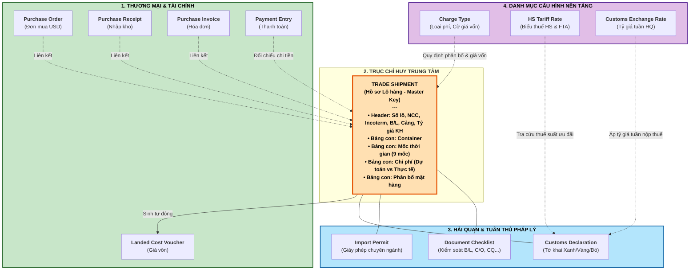
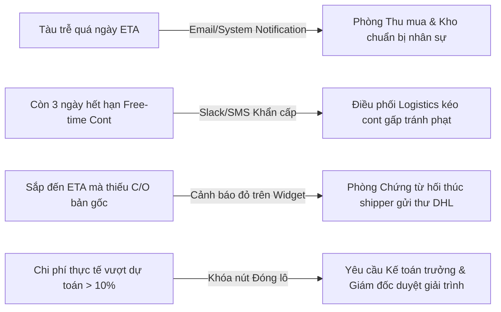

# 🏛️ BẢN THIẾT KẾ HỆ THỐNG QUẢN TRỊ XUẤT NHẬP KHẨU TOÀN DIỆN TRÊN ERPNEXT
*(Comprehensive Architecture & Design Specification - Import Management System on ERPNext v15)*

---

## 📌 1. TỔNG QUAN & NGUYÊN TẮC THIẾT KẾ CỐT LÕI

Hệ thống được thiết kế để giải quyết trọn vẹn bài toán **Quản trị Chuỗi cung ứng Nhập khẩu (Import Supply Chain Management)**, khắc phục triệt để 7 khoảng trống lớn của ERPNext nguyên bản, chuyển dịch từ việc "quản lý đơn mua hàng thuần túy" sang "điều phối và kiểm soát đa thực thể": Nhà cung cấp, Hãng tàu/Forwarder, Hải quan, Cơ quan thuế, Ngân hàng, Kho bãi và Ban điều hành.

### 3 Nguyên tắc thiết kế bất biến:
1. **Hồ sơ Lô hàng (`Trade Shipment`) làm trục nối duy nhất:** Mọi chứng từ phát sinh (đơn mua hàng, vận đơn, tờ khai hải quan, hóa đơn chi phí, phiếu thanh toán) đều phải trỏ về mã Lô hàng trung tâm.
2. **Bảo toàn chuẩn mực kế toán ERPNext gốc:** Tuyệt đối không can thiệp thô bạo vào bảng hạch toán sổ cái của ERPNext. Toàn bộ chi phí cấu thành giá vốn bắt buộc kết xuất thông qua chứng từ chuẩn `Landed Cost Voucher`.
3. **Tách biệt kiểm soát & Tự động hóa thông minh:** 
   * Người đề xuất mã HS không được tự duyệt mã HS.
   * Người nhập chi phí không được tự duyệt đóng lô khi chi phí thực tế đội > 10%.
   * Phân bổ chi phí đa tiêu chí (cước tàu theo CBM/Gross weight, thuế và bảo hiểm theo giá trị) được tự động hóa bằng thuật toán.

---

## 🏛️ 2. ĐẶC TẢ CHI TIẾT CÁC DOCTYPE & TRƯỜNG DỮ LIỆU

### 2.1. Doctype Trung tâm: `Trade Shipment` (Hồ sơ Lô hàng)
* **Module:** `Logistics Wizard`
* **Naming Series:** `TS-.YYYY.-.#####` (VD: `TS-2026-00001`)

| Tên trường (Fieldname) | Nhãn hiển thị (Label) | Kiểu dữ liệu (Type) | Bắt buộc | Ghi chú & Tùy chọn |
| :--- | :--- | :---: | :---: | :--- |
| `naming_series` | Quy tắc đánh số | Select | Có | `TS-.YYYY.-.#####` |
| `shipment_name` | Tên gợi nhớ lô hàng | Data | Có | VD: *Lô 1000 iPhone 16 Pro Max T9/2026* |
| `supplier` | Nhà cung cấp chính | Link | Có | Link: `Supplier` |
| `incoterm` | Điều kiện Incoterms | Link | Có | Link: `Incoterm` (FOB, CIF, EXW, DDP...) |
| `named_place` | Địa điểm giao hàng chỉ định | Data | Không | VD: *Shenzhen Port / Cat Lai Port* |
| `transport_mode` | Phương thức vận tải | Select | Có | `Ocean FCL`, `Ocean LCL`, `Air Freight`, `Road` |
| `forwarder` | Đơn vị giao nhận / Forwarder | Link | Không | Link: `Supplier` (Lọc: `supplier_group = 'Forwarder'`) |
| `shipping_line` | Hãng vận chuyển (Carrier) | Link | Không | Link: `Supplier` (Lọc: `supplier_group = 'Shipping Line'`) |
| `master_bl` | Số vận đơn chủ (Master B/L / AWB) | Data | Không | Vận đơn do hãng tàu cấp (VD: `MAEU987654321`) |
| `house_bl` | Số vận đơn thứ (House B/L) | Data | Không | Vận đơn do Forwarder cấp cho chủ hàng |
| `origin_port` | Cảng / Sân bay đi | Data | Có | Cảng xếp hàng (Port of Loading - POL) |
| `destination_port` | Cảng / Sân bay đến | Data | Có | Cảng dỡ hàng (Port of Discharge - POD) |
| `status` | Trạng thái hành trình | Select | Có | `Planning` $\rightarrow$ `Cargo Ready` $\rightarrow$ `In Transit` $\rightarrow$ `Customs Clearance` $\rightarrow$ `Completed` $\rightarrow$ `Cancelled` |
| `cost_status` | Trạng thái quyết toán chi phí | Select | Có | `Open` *(Đang mở)*, `Pending Review` *(Chờ duyệt đóng)*, `Closed` *(Đã quyết toán)* |
| `planned_currency` | Tiền tệ dự toán | Link | Có | Link: `Currency` (Mặc định: `USD`) |
| `planned_exchange_rate` | Tỷ giá dự toán ban đầu | Float | Có | Tỷ giá USD/VND tại thời điểm lập kế hoạch |
| `total_budgeted_cost` | Tổng chi phí dự toán (VND) | Currency | Readonly | Tự động tính tổng từ bảng chi phí |
| `total_actual_cost` | Tổng chi phí thực tế (VND) | Currency | Readonly | Tự động tính tổng từ bảng chi phí |
| `cost_variance_amount` | Chênh lệch chi phí (VND) | Currency | Readonly | `total_actual_cost - total_budgeted_cost` |
| `cost_variance_pct` | Tỷ lệ vượt ngân sách (%) | Percent | Readonly | `(Variance / Budget) * 100` |

---

### 2.2. Bảng con 1: `Trade Shipment Milestone` (Bảng Mốc Thời Gian Kiểm Soát)
* **Parent Doctype:** `Trade Shipment` | **Table Fieldname:** `milestones`

| Tên trường | Nhãn hiển thị | Kiểu | Ghi chú & Logic |
| :--- | :--- | :---: | :--- |
| `milestone_code` | Mã mốc kiểm soát | Select | Danh mục 9 mốc bắt buộc (xem bên dưới) |
| `milestone_name` | Tên mốc nghiệp vụ | Data | Tự động điền theo mã mốc |
| `planned_date` | Ngày dự kiến (Estimated) | Date | Ngày kế hoạch ban đầu |
| `actual_date` | Ngày thực tế diễn ra (Actual) | Date | **Bắt buộc nhập khi sự kiện hoàn thành** |
| `variance_days` | Số ngày lệch tiến độ | Int | `actual_date - planned_date` (Dương: Trễ, Âm: Sớm) |
| `status` | Trạng thái mốc | Select | `Pending`, `In Progress`, `Completed`, `Delayed` |
| `updated_by` | Người ghi nhận | Link | Link: `User` |
| `remarks` | Ghi chú hiện trường | Small Text| Lý do trễ, tình trạng container... |

> **Danh mục 9 Mốc Kiểm Soát Chuẩn:**
> 1. `M01_PO_ISSUED`: Phát hành đơn hàng ngoại thương
> 2. `M02_CARGO_READY`: Hàng sẵn sàng tại kho xuất khẩu
> 3. `M03_RISK_TRANSFER`: Chuyển giao rủi ro theo Incoterm (On board)
> 4. `M04_ETD`: Tàu rời cảng xuất phát
> 5. `M05_ETA`: Tàu cập cảng đích
> 6. `M06_CUSTOMS_REG`: Đăng ký mở tờ khai hải quan
> 7. `M07_CUSTOMS_CLEAR`: Thông quan thành công
> 8. `M08_DEM_DET_DEADLINE`: **Hạn chót miễn phí lưu cont/bãi (Free-time Deadline)**
> 9. `M09_WH_RECEIPT`: Hàng nhập kho an toàn

---

### 2.3. Bảng con 2: `Trade Shipment Container` (Quản lý Vỏ Container & Niêm Chì)
* **Parent Doctype:** `Trade Shipment` | **Table Fieldname:** `containers`

| Tên trường | Nhãn hiển thị | Kiểu | Ghi chú |
| :--- | :--- | :---: | :--- |
| `container_no` | Số container | Data | Chuẩn 4 chữ + 7 số (VD: `MSKU1234567`) |
| `container_type` | Loại container | Select | `20ft GP`, `40ft GP`, `40ft HC`, `20ft RF (Lạnh)`, `40ft RF`, `Flat Rack` |
| `seal_no` | Số niêm chì (Seal No) | Data | Số seal của hãng tàu / hải quan bấm |
| `gross_weight_kg` | Trọng lượng cả vỏ (KGS) | Float | Dùng làm cơ sở phân bổ chi phí theo trọng lượng |
| `volume_cbm` | Thể tích kiện (CBM) | Float | Dùng làm cơ sở phân bổ chi phí theo thể tích |
| `demurrage_free_days` | Số ngày miễn phí lưu bãi (DEM) | Int | Thường 5 - 7 ngày |
| `detention_free_days` | Số ngày miễn phí lưu cont (DET) | Int | Thường 7 - 14 ngày |
| `empty_return_deadline`| Hạn chót trả vỏ container rỗng | Date | Tính cảnh báo phạt lưu vỏ |
| `empty_returned_date` | Ngày thực tế trả vỏ | Date | Đối chiếu thanh lý tiền cược cont |

---

### 2.4. Bảng con 3: `Trade Shipment Cost Item` (Dự toán & Đối soát Chi phí Chi tiết)
* **Parent Doctype:** `Trade Shipment` | **Table Fieldname:** `cost_items`

| Tên trường | Nhãn hiển thị | Kiểu | Ghi chú |
| :--- | :--- | :---: | :--- |
| `charge_type` | Loại chi phí | Link | Link: `Charge Type` |
| `service_provider` | Nhà cung cấp dịch vụ | Link | Link: `Supplier` (Hãng tàu, Cảng, Forwarder...) |
| `currency` | Tiền tệ phát sinh | Link | Link: `Currency` (USD, VND, EUR...) |
| `budget_rate` | Đơn giá dự toán | Float | Dự toán ban đầu |
| `budget_exchange_rate`| Tỷ giá dự toán | Float | Tỷ giá kế hoạch |
| `budget_amount_vnd` | Chi phí dự toán (VND) | Currency | `= budget_rate * budget_exchange_rate` |
| `actual_rate` | Đơn giá thực tế | Float | Lấy từ Hóa đơn dịch vụ của đối tác |
| `actual_exchange_rate`| Tỷ giá thực tế | Float | Tỷ giá tại ngày xuất hóa đơn / thanh toán |
| `actual_amount_vnd` | Chi phí thực tế (VND) | Currency | `= actual_rate * actual_exchange_rate` |
| `variance_price_vnd` | **Chênh lệch do Đơn giá dịch vụ** | Currency | `(actual_rate - budget_rate) * budget_exchange_rate` |
| `variance_fx_vnd` | **Chênh lệch do Biến động Tỷ giá** | Currency | `actual_rate * (actual_exchange_rate - budget_exchange_rate)` |
| `purchase_invoice` | Hóa đơn dịch vụ liên kết | Link | Link: `Purchase Invoice` |
| `customs_declaration` | Tờ khai hải quan liên kết | Link | Link: `Customs Declaration` (Cho dòng tiền thuế) |
| `status` | Trạng thái đối soát | Select | `Draft/Budget`, `Incurred (Đã về hóa đơn)`, `Audited (Đã đối soát)` |

---

### 2.5. Danh mục: `Charge Type` (Danh mục Phân loại Chi phí)
* **Module:** `Logistics Wizard` | **Naming:** Theo tên phí (VD: `Cước biển O/F`, `Phí THC`, `Thuế NK`)

| Tên trường | Nhãn hiển thị | Kiểu | Ghi chú |
| :--- | :--- | :---: | :--- |
| `charge_name` | Tên loại chi phí | Data | Tên dịch vụ |
| `cost_category` | Nhóm chi phí | Select | `Vận tải quốc tế`, `Phí cảng bến bãi`, `Thuế & Lệ phí`, `Vận chuyển nội địa`, `Bảo hiểm`, `Giám định chuyên ngành`, `Phí tài chính/ngân hàng` |
| `include_in_valuation` | **Cộng vào giá vốn hàng tồn kho?** | Check | Tick chọn nếu là chi phí cấu thành giá gốc (IAS 2 / VAS 02) |
| `include_in_customs_val`| **Cộng vào trị giá tính thuế HQ?** | Check | Chi phí phát sinh trước cửa khẩu nhập (FOB $\rightarrow$ CIF) |
| `allocation_criterion` | **Tiêu chuẩn phân bổ chi phí** | Select | `Theo Giá trị (Value)`, `Theo Trọng lượng (Gross Weight)`, `Theo Thể tích (Volume CBM)`, `Theo Số lượng (Quantity)`, `Chỉ định dòng mặt hàng` |
| `default_expense_account`| Tài khoản chi phí trung gian | Link | Link: `Account` (Mặc định: `Expenses Included In Valuation - CK`) |

---

### 2.6. Doctype: `Customs Declaration` (Tờ khai Hải quan)
* **Module:** `Logistics Wizard` | **Naming:** `CD-.YYYY.-.#####`

| Tên trường | Nhãn hiển thị | Kiểu | Ghi chú |
| :--- | :--- | :---: | :--- |
| `declaration_no` | **Số tờ khai hải quan** | Data | 11 số (Chuẩn VNACCS/VCIS) |
| `declaration_date` | Ngày đăng ký tờ khai | Date | Căn cứ xác định tuần tỷ giá hải quan |
| `shipment` | Lô hàng liên kết | Link | Link: `Trade Shipment` |
| `declaration_type` | Loại hình xuất nhập khẩu | Select | `A11 - Nhập kinh doanh tiêu dùng`, `A12 - Nhập sản xuất kinh doanh`, `E21 - Nhập gia công`, `A41 - Nhập tạm nợ thuế` |
| `customs_channel` | **Phân luồng hải quan** | Select | `Luồng Xanh (Green - Thông quan ngay)`, `Luồng Vàng (Yellow - Kiểm tra hồ sơ)`, `Luồng Đỏ (Red - Kiểm tra thực tế hàng)` |
| `customs_office` | Chi cục hải quan mở tờ khai | Data | VD: *Chi cục HQ Cửa khẩu Cảng Sài Gòn Khu vực 1* |
| `customs_exchange_rate`| Tỷ giá tính thuế theo tuần | Link | Link: `Customs Exchange Rate` (Tự động tra cứu) |
| `total_customs_value_vnd`| Tổng trị giá tính thuế (VND)| Currency | Trị giá CIF quy đổi VNĐ |
| `import_duty_amount` | **Tiền thuế nhập khẩu phải nộp** | Currency | Cộng vào giá vốn hàng hóa |
| `vat_amount` | **Tiền thuế VAT hàng nhập khẩu** | Currency | Khấu trừ thuế đầu vào (không vào giá vốn) |
| `clearance_status` | Trạng thái thông quan | Select | `Đã đăng ký`, `Đang kiểm tra hồ sơ`, `Chờ kiểm hóa`, `Đã thông quan`, `Giải phóng hàng chờ thông quan` |
| `clearance_date` | Ngày thông quan chính thức | Date | Căn cứ chốt hoàn thành mốc hải quan |
| `tax_payment_entry` | Phiếu nộp thuế kho bạc | Link | Link: `Payment Entry` |

---

### 2.7. Doctype: `HS Tariff Rate` (Biểu thuế & Hiệp định Thương mại)
* **Module:** `Logistics Wizard` | **Naming:** Theo mã HS (VD: `8517.13.00`)

| Tên trường | Nhãn hiển thị | Kiểu | Ghi chú |
| :--- | :--- | :---: | :--- |
| `hs_code` | Mã phân loại HS Code | Data | 8 hoặc 10 chữ số |
| `description` | Tên mô tả theo biểu thuế | Text | Tên hàng hóa tiếng Việt & tiếng Anh |
| `technical_specs` | Đặc tính & công dụng kỹ thuật | Small Text | Dữ liệu cơ sở cho RAG AI tư vấn áp mã |
| `general_duty_rate` | Thuế suất thông thường (%) | Percent | MFN Rate |
| `preferential_tariffs` | Bảng thuế suất hiệp định FTA | Table | Bảng con: Hiệp định (ACFTA, EVFTA, VKFTA, CPTPP...), Thuế suất ưu đãi (%), Yêu cầu Form C/O |
| `vat_rate` | Thuế suất VAT nhập khẩu (%) | Percent | Thường 8% hoặc 10% |
| `requires_permit` | Yêu cầu giấy phép chuyên ngành? | Check | Kiểm tra hợp chuẩn hợp quy (Bộ TT&TT, Bộ Y tế...) |
| `valid_from` / `valid_to` | Ngày hiệu lực văn bản | Date | Đảm bảo tính pháp lý tại thời điểm mở tờ khai |

---

## 👥 3. MA TRẬN 8 VAI TRÒ & NGUYÊN TẮC KIỂM SOÁT NỘI BỘ (SOD)

| STT | Tên Vai trò (Role) | Chức năng nghiệp vụ trên ERPNext | Quyền hạn Phê duyệt (Approval) |
| :-: | :--- | :--- | :--- |
| **1** | **Thu mua quốc tế** *(Sourcing/Purchasing)* | Tạo PO, khởi tạo hồ sơ `Trade Shipment`, lập bảng dự toán chi phí ban đầu. | Được đề xuất mã HS ban đầu trên PO. |
| **2** | **Tuân thủ XNK** *(Compliance Officer)* | Quản lý biểu thuế `HS Tariff Rate`, theo dõi chính sách mặt hàng & giấy phép. | **Phê duyệt chính thức Mã HS**. *(Người mua hàng không được tự duyệt mã của mình)*. |
| **3** | **Chứng từ XNK** *(Documentation Specialist)* | Quản lý `Document Checklist`, tiếp nhận và kiểm tra tính hợp lệ của B/L, Invoice, Packing List, C/O Form E/D. | Xác nhận bộ chứng từ đạt chuẩn để mở tờ khai. |
| **4** | **Điều phối Logistics** *(Logistics Coordinator)* | Quản lý danh sách container, cập nhật tọa độ tàu, theo dõi các mốc ETD/ETA và hạn Free-time. | Xác nhận hoàn thành các mốc vận tải. |
| **5** | **Khai báo Hải quan** *(Customs Specialist)* | Nhập dữ liệu tờ khai `Customs Declaration`, cập nhật luồng Xanh/Vàng/Đỏ và số thuế phải nộp. | Xác nhận trạng thái Thông quan hàng hóa. |
| **6** | **Kế toán Giá thành** *(Cost Accountant)* | Nhập hóa đơn chi phí dịch vụ thực tế, chạy thuật toán **Phân bổ chi phí đa tiêu chí**, sinh LCV. | Lập yêu cầu đóng chi phí lô hàng (`Close Cost`). |
| **7** | **Kế toán Thanh toán** *(Treasury/AP)* | Lập phiếu chi tạm ứng cọc 30%, nộp thuế kho bạc, tất toán 70% nợ ngoại tệ, hạch toán lãi lỗ tỷ giá. | Xác nhận chi tiền và tất toán công nợ nhà cung cấp. |
| **8** | **Giám đốc / Kế toán trưởng** *(Executive Management)* | Xem báo cáo Dashboard phân tích toàn cảnh chuỗi cung ứng nhập khẩu. | **Phê duyệt Đóng chi phí Lô hàng** khi chi phí thực tế vượt dự toán > 10%. |

---

## 🔔 4. HỆ THỐNG CẢNH BÁO TỰ ĐỘNG CHỐNG THẤT THOÁT (AUTOMATED ALERTS)

1. **Cảnh báo Trễ hạn ETA (Vessel Delay Alert):** Kích hoạt nếu ngày hiện tại > `planned_date` của mốc ETA mà trạng thái mốc vẫn chưa `Completed`.
2. **Cảnh báo Cháy cước lưu cont/bãi (Demurrage & Detention Alert):** Tự động quét hàng ngày; nếu `Hạn chót trả cont rỗng - Ngày hiện tại <= 3 ngày`, gửi tin nhắn khẩn cấp cho bộ phận điều vận để tránh tiền phạt bến bãi (lên tới $50 - $100/cont/ngày).
3. **Cảnh báo Thiếu chứng từ thông quan (Missing Document Alert):** Nếu chỉ còn 2 ngày tàu cập cảng mà `Document Checklist` vẫn còn chứng từ bắt buộc chưa ở trạng thái `Received`.
4. **Chốt chặn Kiểm soát Ngân sách (Budget Overrun Guard):** Nếu `cost_variance_pct > 10%`, trường `cost_status` bị khóa không cho chuyển sang `Closed` trừ khi có chữ ký số/duyệt của Ban Giám đốc.

---

## 📈 5. HỆ THỐNG 5 BÁO CÁO QUẢN TRỊ ĐIỀU HÀNH (MANAGEMENT REPORTS)

1. **Báo cáo Đối soát Dự toán vs Thực tế theo Lô (Shipment Budget vs Actual Analysis):**
   * So sánh chi tiết từng khoản mục chi phí (cước biển, THC, hải quan, kiểm định...).
   * Tách bạch rõ 2 cột nguyên nhân biến động: Chênh lệch do Đơn giá dịch vụ tăng hay do Biến động Tỷ giá ngoại tệ.
2. **Báo cáo Giá vốn thực tế đơn vị (Landed Cost per Unit Trend):**
   * Phân tích lịch sử giá vốn về kho của từng mặt hàng qua các lô hàng khác nhau trong năm.
   * Tính toán biên lợi nhuận gộp thực tế (Real Gross Profit) sau khi đã gánh đủ mọi chi phí phụ trợ.
3. **Báo cáo Giá trị Hàng đang trôi nổi trên biển (Goods in Transit Value):**
   * Tổng hợp giá trị tiền hàng và số lượng container đang trong quá trình vận chuyển theo từng điều kiện Incoterm để phục vụ quản trị dòng tiền kho bạc.
4. **Báo cáo Đánh giá Hiệu quả Forwarder / Hãng tàu (Logistics Service Provider Scorecard):**
   * Đo lường tỷ lệ đúng giờ (On-time Delivery Rate), số lần trễ ETA, và độ lệch giữa báo giá ban đầu so với hóa đơn quyết toán thực tế.
5. **Báo cáo Chất lượng Dữ liệu Lô hàng (Data Quality Audit Report):**
   * Rà soát các lô hàng có rủi ro: Thiếu thông tin số tờ khai, chưa cập nhật ngày trả rỗng container, hoặc hàng đã bán ra khỏi kho nhưng chi phí vận chuyển của lô vẫn chưa được quyết toán.
