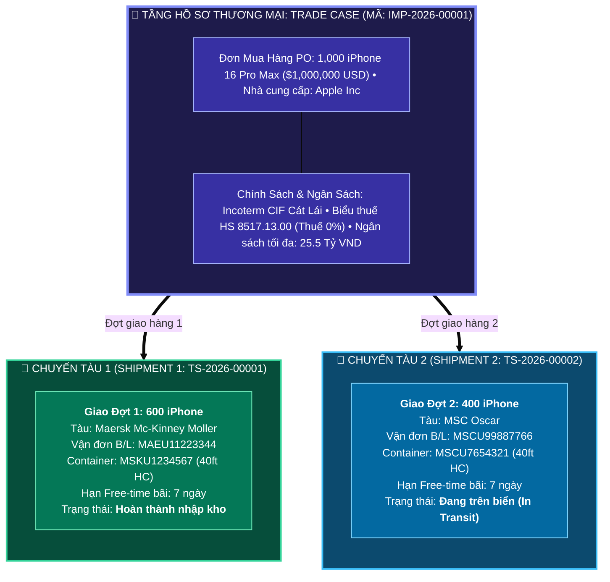
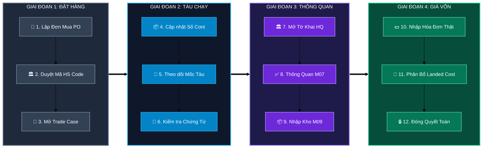
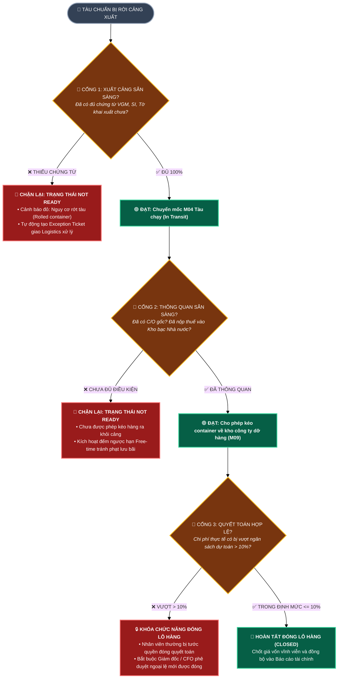

# 🏛️ BẢN THIẾT KẾ KIẾN TRÚC HỆ THỐNG QUẢN TRỊ XUẤT NHẬP KHẨU (GLOBAL TRADE ERP)
*(Enterprise Architecture Blueprint — Chuẩn TOGAF & Phân Tách Trade Case vs Shipment)*

---

## 💎 1. NGUYÊN TẮC THIẾT KẾ CỐT LÕI (CORE ARCHITECTURAL PRINCIPLES)

```
┌────────────────────────────────────────────────────────────────────────────────────────┐
│  1. CLEAN CORE       : Giữ nguyên 100% lõi ERPNext v15; tính năng nằm trong Custom App │
│  2. TWO-TIER HUB     : Phân tách Trade Case (Hồ sơ thương mại) vs Shipment (Vận tải)   │
│  3. PARTIAL SHIPMENT : 1 Trade Case có thể có 1 hoặc nhiều Shipment giao từng phần     │
│  4. STAGE GATE       : Kiểm soát điều kiện tiên quyết (Readiness) trước khi chuyển mốc │
│  5. VAS 02 / IAS 2   : Phân bổ giá vốn đa tiêu chí chuẩn xác, bóc tách rạch ròi chi phí│
└────────────────────────────────────────────────────────────────────────────────────────┘
```

---

## 📐 2. BẢN VẼ 1: KIẾN TRÚC PHÂN TẦNG TỔNG THỂ (LAYERED ENTERPRISE ARCHITECTURE)

*(Khắc phục hoàn toàn lỗi đè chữ bằng cách chuẩn hóa tiêu đề đơn dòng, phân khối độc lập, độ tương phản cao)*

```mermaid
%%{init: {'theme': 'base', 'themeVariables': { 'fontFamily': 'Arial, sans-serif', 'fontSize': '13px'}}}%%
flowchart TD
    %% TẦNG 1: ACTORS
    subgraph TANG_1["TẦNG 1: NGƯỜI DÙNG & VAI TRÒ (ROLES)"]
        direction LR
        U_BUY["🛒 Thu Mua (Buyer)"]
        U_LOG["🚢 Logistics (Điều Phối)"]
        U_CUS["🏛️ Hải Quan (Tuân Thủ)"]
        U_WH["📦 Thủ Kho (Giao Nhận)"]
        U_ACC["💰 Kế Toán (Giá Vốn)"]
        U_CFO["👑 Giám Đốc (Phê Duyệt)"]
    end

    %% TẦNG 2: GIAO DIỆN
    subgraph TANG_2["TẦNG 2: TRẠM ĐIỀU HÀNH & GIAO DIỆN (PRESENTATION)"]
        direction LR
        DASH["📊 THÁP CHỈ HUY CONTROL TOWER<br>Cảnh báo phạt bãi cont • Báo cáo trễ tàu • Biểu đồ chi phí"]
        WORK["📋 WORKSPACE NGHIỆP VỤ CHUYÊN BIỆT<br>Giao diện làm việc riêng cho từng phòng ban (Role-based Views)"]
    end

    %% TẦNG 3: TRADE CASE & SHIPMENT
    subgraph TANG_3["TẦNG 3: TRUNG TÂM QUẢN TRỊ XNK (LOGISTICS WIZARD)"]
        direction TB
        
        TC["📂 <b>TRADE CASE: HỒ SƠ THƯƠNG MẠI NGOẠI THƯƠNG (IMP / EXP)</b><br>Quản lý Hợp đồng • Đơn mua PO / Đơn bán SO • Nhà cung cấp • Incoterms • Tổng ngân sách Case"]
        
        SHP["🚢 <b>TRADE SHIPMENT: CHUYẾN VẬN TẢI VẬT LÝ (1 HOẶC NHIỀU ĐỢT GIAO)</b><br>Hãng tàu • Vận đơn B/L • Cảng đi/đến • 9 Mốc hành trình • Container & Free-time • Chi phí"]

        TC ==>|"1 Case có thể có 1 hoặc nhiều Shipment"| SHP
    end

    %% TẦNG 4: THUẬT TOÁN
    subgraph TANG_4["TẦNG 4: ĐỘNG CƠ THUẬT TOÁN & BẢO VỆ CHÍNH SÁCH"]
        direction LR
        E_ALLOC["🧮 PHÂN BỔ GIÁ VỐN<br>Cước tàu chia CBM<br>Phí khác chia Trị giá"]
        E_VAR["📐 BÓC TÁCH CHÊNH LỆCH<br>Lệch do Giá cước hãng tàu<br>Lệch do Tỷ giá USD/VND"]
        E_GATE["🛡️ KHÓA CHẶN QUẢN TRỊ<br>Chặn đóng lô khi vượt > 10%<br>Chặn kho khi chưa thông quan"]
        E_RAG["🤖 DỊCH VỤ AI / RAG<br>Tra cứu căn cứ pháp lý<br>Gợi ý phân loại mã HS"]
    end

    %% TẦNG 5: ERPNEXT & DB
    subgraph TANG_5["TẦNG 5: LÕI ERPNEXT GỐC & CƠ SỞ DỮ LIỆU"]
        direction LR
        ERP_DOCS["💼 CHỨNG TỪ LÕI ERPNEXT<br>Purchase Order • Purchase Receipt • Landed Cost Voucher • General Ledger"]
        INFRA_DB["🐳 HẠ TẦNG KỸ THUẬT<br>Docker Compose (9 Containers) • Frappe v15 • MariaDB • Redis Cache"]
    end

    %% LIÊN KẾT GIỮA CÁC TẦNG
    TANG_1 ==> TANG_2
    TANG_2 ==> TANG_3
    TANG_3 <==> TANG_4
    TANG_4 ==> TANG_5

    %% MÀU SẮC ĐỘ TƯƠNG PHẢN CAO (NỀN ĐẬM - CHỮ TRẮNG 100%)
    style TANG_1 fill:#0F172A,stroke:#38BDF8,stroke-width:2px,color:#FFFFFF
    style TANG_2 fill:#0F172A,stroke:#0284C7,stroke-width:2px,color:#FFFFFF
    style TANG_3 fill:#1E1B4B,stroke:#818CF8,stroke-width:2px,color:#FFFFFF
    style TANG_4 fill:#18181B,stroke:#F59E0B,stroke-width:2px,color:#FFFFFF
    style TANG_5 fill:#064E3B,stroke:#10B981,stroke-width:2px,color:#FFFFFF

    style U_BUY fill:#0284C7,stroke:#38BDF8,color:#FFFFFF
    style U_LOG fill:#0284C7,stroke:#38BDF8,color:#FFFFFF
    style U_CUS fill:#0284C7,stroke:#38BDF8,color:#FFFFFF
    style U_WH fill:#0284C7,stroke:#38BDF8,color:#FFFFFF
    style U_ACC fill:#0284C7,stroke:#38BDF8,color:#FFFFFF
    style U_CFO fill:#D97706,stroke:#FBBF24,color:#FFFFFF

    style DASH fill:#0369A1,stroke:#38BDF8,color:#FFFFFF
    style WORK fill:#0369A1,stroke:#38BDF8,color:#FFFFFF

    style TC fill:#4338CA,stroke:#C7D2FE,color:#FFFFFF,stroke-width:3px
    style SHP fill:#6D28D9,stroke:#DDD6FE,color:#FFFFFF,stroke-width:2px

    style E_ALLOC fill:#B45309,stroke:#FCD34D,color:#FFFFFF
    style E_VAR fill:#B45309,stroke:#FCD34D,color:#FFFFFF
    style E_GATE fill:#B91C1C,stroke:#FCA5A5,color:#FFFFFF
    style E_RAG fill:#4F46E5,stroke:#C7D2FE,color:#FFFFFF

    style ERP_DOCS fill:#047857,stroke:#6EE7B7,color:#FFFFFF
    style INFRA_DB fill:#047857,stroke:#6EE7B7,color:#FFFFFF
```



---

## 🎯 3. BẢN VẼ 2: MÔ HÌNH PHÂN TÁCH `TRADE CASE` VS `TRADE SHIPMENT`

*Minh họa trường hợp thực tế: Một Đơn hàng mua lớn (PO) được chia làm 2 chuyến tàu khác nhau (Partial Shipment):*



---

## 🌊 4. BẢN VẼ 3: QUY TRÌNH DÒNG CHẢY NGHIỆP VỤ 4 GIAI ĐOẠN



---

## 🚦 5. BẢN VẼ 4: CƠ CHẾ CỔNG KIỂM SOÁT ĐIỀU KIỆN (STAGE GATE GOVERNANCE)



---

## 👥 6. BẢN VẼ 5: MA TRẬN PHÂN QUYỀN TRÁCH NHIỆM RACI (GOVERNANCE MATRIX)

| Chứng Từ / Khâu Nghiệp Vụ | 🛒 Thu Mua (`buyer`) | 🏛️ Tuân Thủ (`customs`) | 🚢 Logistics (`logistics`) | 📦 Thủ Kho (`warehouse`) | 💰 Kế Toán (`accountant`) | 👑 Giám Đốc (`cfo`) |
| :--- | :---: | :---: | :---: | :---: | :---: | :---: |
| **Đơn mua hàng (PO)** | 🟢 **R** *(Lập)* | ⚪ C *(Tham vấn)* | 🔵 I *(Xem)* | 🔵 I *(Xem)* | ⚪ C *(Kiểm tra tiền)* | 🟡 **A** *(Duyệt)* |
| **Duyệt Mã HS & Biểu Thuế** | 🔵 I *(Đề xuất)* | 🟢 **R** *(Duyệt)* | 🔵 I *(Xem)* | ─ | 🔵 I *(Xem thuế)* | 🟡 **A** |
| **Hành trình Tàu & Cont (M01-M05)** | 🔵 I *(Theo dõi)* | 🔵 I *(Theo dõi)* | 🟢 **R** *(Điều phối)* | ─ | ─ | 🟡 **A** |
| **Tờ khai Hải quan (M06-M07)** | ─ | 🟢 **R** *(Khai báo)* | ⚪ C *(Phối hợp)* | ─ | ⚪ C *(Nộp thuế)* | 🟡 **A** |
| **Phiếu Nhập kho (PR) (M09)** | ─ | ─ | 🔵 I *(Giao cont)* | 🟢 **R** *(Đếm hàng)* | 🔵 I *(Số lượng)* | 🟡 **A** |
| **Phân bổ Giá vốn (Landed Cost)** | ─ | ─ | ─ | ─ | 🟢 **R** *(Chạy LCV)* | 🟡 **A** |
| **Duyệt đóng lô VƯỢT NGÂN SÁCH** | ─ | ─ | ─ | ─ | 🔵 I *(Trình duyệt)* | 🔴 **R / A *(Ký duyệt)*** |

### 💡 Chú giải ký hiệu RACI chuẩn quốc tế:
* 🟢 **R (Responsible):** Người trực tiếp thao tác thực hiện công việc trên phần mềm.
* 🟡/🔴 **A (Accountable):** Người phê duyệt và chịu trách nhiệm tối cao *(Mỗi khâu chỉ có duy nhất 1 người A)*.
* ⚪ **C (Consulted):** Chuyên gia cần được hỏi ý kiến tham vấn trước khi quyết định.
* 🔵 **I (Informed):** Người nhận thông báo tự động từ hệ thống để nắm tình hình.
