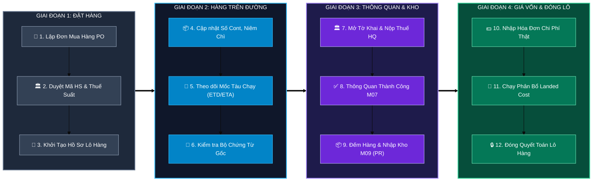
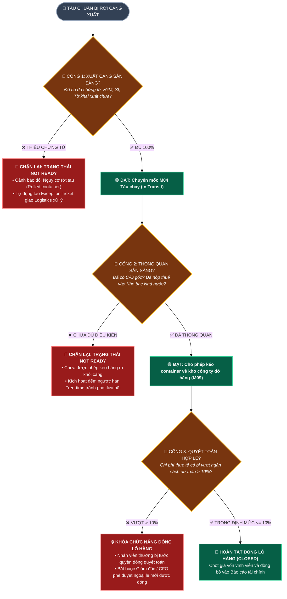

# 🏛️ BẢN THIẾT KẾ KIẾN TRÚC HỆ THỐNG QUẢN TRỊ XUẤT NHẬP KHẨU (GLOBAL TRADE ERP)
*(Enterprise Architecture Blueprint — Bản Vẽ Trực Quan Độ Tương Phản Cao, Dễ Đọc)*

---

## 💎 TRIẾT LÝ THIẾT KẾ CỐT LÕI (CORE PRINCIPLES)

* **1. Lõi Sạch (Clean Core):** Không can thiệp, không sửa mã nguồn gốc ERPNext v15; 100% tính năng mới nằm trong app `logistics_wizard`.
* **2. Trục Chỉ Huy Duy Nhất (Single Source of Truth):** Mọi nghiệp vụ, chứng từ, chi phí đều quy tụ về `Trade Shipment`.
* **3. Cổng Kiểm Soát Điều Kiện (Stage Gate):** Chỉ cho phép chuyển mốc hành trình khi đã đủ 100% chứng từ và điều kiện thông quan.
* **4. Tuân Thủ Chuẩn Mực VAS 02 / IAS 2:** Phân bổ giá vốn đa tiêu chí chuẩn xác, bóc tách rạch ròi chi phí phạt lưu cont/bãi.

---

## 📐 BẢN VẼ 1: KIẾN TRÚC PHÂN TẦNG TỔNG THỂ (LAYERED ENTERPRISE ARCHITECTURE)

```mermaid
%%{init: {'theme': 'base', 'themeVariables': { 'fontFamily': 'Arial, sans-serif', 'fontSize': '14px', 'lineColor': '#64748B'}}}%%
flowchart TD
    %% TẦNG 1: NGƯỜI DÙNG & VAI TRÒ
    subgraph L1["👥 TẦNG 1: NGƯỜI DÙNG & VAI TRÒ TÁC NGHIỆP (ROLES)"]
        direction LR
        U1["🛒 Thu Mua (Buyer)"]
        U2["🚢 Logistics (Điều Phối)"]
        U3["🏛️ Hải Quan (Tuân Thủ)"]
        U4["📦 Thủ Kho (Giao Nhận)"]
        U5["💰 Kế Toán (Giá Vốn)"]
        U6["👑 Giám Đốc (Phê Duyệt)"]
    end

    %% TẦNG 2: GIAO DIỆN & TRẠM ĐIỀU HÀNH
    subgraph L2["🖥️ TẦNG 2: GIAO DIỆN & THÁP CHỈ HUY (CONTROL TOWER & WORKSPACES)"]
        direction LR
        UI1["📊 THÁP CHỈ HUY CONTROL TOWER<br>Cảnh báo rủi ro bến bãi cont • Báo cáo trễ tàu • Biểu đồ chi phí"]
        UI2["📋 WORKSPACE NGHIỆP VỤ CHUYÊN BIỆT<br>Giao diện làm việc riêng cho từng phòng ban (Role-based Views)"]
    end

    %% TẦNG 3: TRUNG TÂM QUẢN TRỊ XNK
    subgraph L3["⚙️ TẦNG 3: PHÂN HỆ QUẢN TRỊ XNK (CUSTOM APP: LOGISTICS WIZARD)"]
        direction TB
        
        HUB["🚢 TRỤC CHỈ HUY: TRADE SHIPMENT (HỒ SƠ LÔ HÀNG)<br>Mã Lô • Nhà cung cấp • Incoterms • Cảng đi/đến • B/L • Ngân sách"]

        subgraph CHILD["📦 4 BẢNG CON QUẢN TRỊ CHI TIẾT"]
            direction LR
            C1["⏱️ 9 Mốc Tiến Độ (Milestones)"]
            C2["📦 Container & Free-time Hạn Bãi"]
            C3["💵 Chi Phí Dự Toán vs Thực Tế"]
            C4["🧮 Phân Bổ Mặt Hàng & Giá Vốn"]
        end

        subgraph COMP["🏛️ PHÂN HỆ HẢI QUAN & PHÁP LÝ CHỨNG TỪ"]
            direction LR
            CP1["📄 Tờ Khai Hải Quan (Luồng Xanh/Vàng/Đỏ)"]
            CP2["📜 Giấy Phép Chuyên Ngành (Hợp Chuẩn/QCVN)"]
            CP3["📑 Checklist Chứng Từ (Đủ/Thiếu C/O, B/L, Inv)"]
        end

        HUB --> CHILD
        HUB <--> COMP
    end

    %% TẦNG 4: BỘ NÃO THUẬT TOÁN
    subgraph L4["🧠 TẦNG 4: ĐỘNG CƠ THUẬT TOÁN & BẢO VỆ CHÍNH SÁCH (LOGIC ENGINES)"]
        direction LR
        E1["🧮 PHÂN BỔ GIÁ VỐN<br>Cước tàu chia theo CBM<br>Bảo hiểm/Thuế theo Trị giá"]
        E2["📐 BÓC TÁCH CHÊNH LỆCH<br>Lệch do Giá cước hãng tàu<br>Lệch do Tỷ giá USD/VND"]
        E3["🛡️ KHÓA CHẶN QUẢN TRỊ<br>Chặn đóng lô khi chi phí vượt > 10%<br>Chặn nhập kho khi chưa thông quan"]
        E4["🤖 DỊCH VỤ AI / RAG<br>Tra cứu căn cứ pháp lý Hải quan<br>Đề xuất phân loại mã HS Code"]
    end

    %% TẦNG 5: LÕI ERPNEXT & HẠ TẦNG
    subgraph L5["🏢 TẦNG 5: LÕI ERPNEXT GỐC & CƠ SỞ DỮ LIỆU"]
        direction LR
        ERP["💼 CHỨNG TỪ LÕI ERPNEXT: Purchase Order • Purchase Receipt • Landed Cost Voucher • General Ledger"]
        DB["🐳 HẠ TẦNG KỸ THUẬT: Docker Compose (9 Containers) • Frappe v15 • MariaDB • Redis Cache"]
    end

    %% LIÊN KẾT ĐA TẦNG
    L1 ==> L2
    L2 ==> L3
    L3 <==> L4
    L4 ==> L5

    %% MÀU SẮC ĐỘ TƯƠNG PHẢN CAO (NỀN ĐẬM RÕ NÉT - CHỮ TRẮNG 100%)
    style L1 fill:#1E293B,stroke:#38BDF8,stroke-width:2px,color:#F8FAFC
    style L2 fill:#0F172A,stroke:#0284C7,stroke-width:2px,color:#F8FAFC
    style L3 fill:#1E1B4B,stroke:#818CF8,stroke-width:2px,color:#F8FAFC
    style L4 fill:#18181B,stroke:#F59E0B,stroke-width:2px,color:#F8FAFC
    style L5 fill:#064E3B,stroke:#10B981,stroke-width:2px,color:#F8FAFC

    style U1 fill:#0284C7,stroke:#38BDF8,color:#FFFFFF,stroke-width:1px
    style U2 fill:#0284C7,stroke:#38BDF8,color:#FFFFFF,stroke-width:1px
    style U3 fill:#0284C7,stroke:#38BDF8,color:#FFFFFF,stroke-width:1px
    style U4 fill:#0284C7,stroke:#38BDF8,color:#FFFFFF,stroke-width:1px
    style U5 fill:#0284C7,stroke:#38BDF8,color:#FFFFFF,stroke-width:1px
    style U6 fill:#D97706,stroke:#FBBF24,color:#FFFFFF,stroke-width:2px

    style UI1 fill:#0369A1,stroke:#38BDF8,color:#FFFFFF,stroke-width:2px
    style UI2 fill:#0369A1,stroke:#38BDF8,color:#FFFFFF,stroke-width:2px

    style HUB fill:#4338CA,stroke:#A5B4FC,color:#FFFFFF,stroke-width:3px
    style C1 fill:#3730A3,stroke:#818CF8,color:#FFFFFF
    style C2 fill:#3730A3,stroke:#818CF8,color:#FFFFFF
    style C3 fill:#3730A3,stroke:#818CF8,color:#FFFFFF
    style C4 fill:#3730A3,stroke:#818CF8,color:#FFFFFF

    style CP1 fill:#0284C7,stroke:#38BDF8,color:#FFFFFF
    style CP2 fill:#0284C7,stroke:#38BDF8,color:#FFFFFF
    style CP3 fill:#0284C7,stroke:#38BDF8,color:#FFFFFF

    style E1 fill:#B45309,stroke:#FCD34D,color:#FFFFFF,stroke-width:2px
    style E2 fill:#B45309,stroke:#FCD34D,color:#FFFFFF,stroke-width:2px
    style E3 fill:#B91C1C,stroke:#FCA5A5,color:#FFFFFF,stroke-width:2px
    style E4 fill:#4F46E5,stroke:#C7D2FE,color:#FFFFFF,stroke-width:2px

    style ERP fill:#047857,stroke:#6EE7B7,color:#FFFFFF,stroke-width:2px
    style DB fill:#047857,stroke:#6EE7B7,color:#FFFFFF,stroke-width:2px
```

---

## 🎯 BẢN VẼ 2: TRỤC CHỈ HUY TRUNG TÂM VÀ 4 VỆ TINH (HUB & SPOKE MODEL)

```mermaid
%%{init: {'theme': 'base', 'themeVariables': { 'fontFamily': 'Arial, sans-serif', 'fontSize': '14px'}}}%%
flowchart LR
    %% TRÁI TIM HỆ THỐNG
    HUB(("🚢 <b>TRADE SHIPMENT</b><br>──────────<br><b>TRỤC CHỈ HUY TRUNG TÂM</b><br><i>Hồ Sơ Lô Hàng XNK</i>"))

    %% VỆ TINH 1: TIẾN ĐỘ & CONT
    subgraph V1["⏱️ 1. TIẾN ĐỘ & CONTAINER"]
        direction TB
        V1_A["<b>9 Mốc Kiểm Soát Tiến Độ</b><br>M01 PO ➔ M04 Tàu chạy ➔ M07 Hải quan ➔ M09 Nhập kho"]
        V1_B["<b>Quản Trị Container & Hạn Bãi</b><br>Hạn chót Free-time lưu bãi • Hạn chót trả vỏ cont rỗng"]
    end

    %% VỆ TINH 2: PHÁP LÝ & HẢI QUAN
    subgraph V2["🏛️ 2. PHÁP LÝ & HẢI QUAN"]
        direction TB
        V2_A["<b>Tờ Khai Hải Quan VNACCS</b><br>Số tờ khai 11 số • Phân luồng Xanh / Vàng / Đỏ"]
        V2_B["<b>Bộ Chứng Từ Sẵn Sàng (Readiness)</b><br>B/L gốc • Hóa đơn Inv • Packing List • C/O ưu đãi thuế"]
        V2_C["<b>Kiểm Tra Chuyên Ngành</b><br>Giấy phép QCVN Bộ TT&TT, Bộ Y tế, Bộ Công Thương"]
    end

    %% VỆ TINH 3: CHI PHÍ & GIÁ VỐN
    subgraph V3["💰 3. TÀI CHÍNH & GIÁ VỐN (VAS 02)"]
        direction TB
        V3_A["<b>Đối Soát Dự Toán vs Thực Tế</b><br>Bóc tách: Lệch Giá cước tàu vs Lệch Tỷ giá USD/VND"]
        V3_B["<b>Phân Bổ Chi Phí Đa Tiêu Chí</b><br>Cước tàu theo CBM (Khối) • Bảo hiểm/Thuế theo Trị giá"]
        V3_C["<b>Landed Cost Voucher (LCV)</b><br>Cập nhật chính xác 100% giá vốn vào Sổ cái Kho 156"]
    end

    %% VỆ TINH 4: MASTER DATA
    subgraph V4["📦 4. DANH MỤC NỀN TẢNG (MASTER DATA)"]
        direction TB
        V4_A["<b>Charge Type (Loại Phí Chuẩn)</b><br>Khóa ranh giới: Cấm tính phạt lưu cont vào giá vốn"]
        V4_B["<b>HS Tariff Rate (Biểu Thuế XNK)</b><br>Mã HS 8 số • Thuế MFN • Thuế FTA 0% kèm Form C/O"]
        V4_C["<b>Customs Exchange Rate</b><br>Tỷ giá tính thuế Hải quan công bố theo tuần"]
    end

    %% KẾT NỐI ĐỐI XỨNG
    V4 ==> HUB
    HUB <==> V1
    HUB <==> V2
    HUB <==> V3

    %% STYLE NỀN ĐẬM TƯƠNG PHẢN CAO
    style HUB fill:#4338CA,stroke:#A5B4FC,color:#FFFFFF,stroke-width:3px
    style V1 fill:#064E3B,stroke:#34D399,stroke-width:2px,color:#FFFFFF
    style V2 fill:#0C4A6E,stroke:#38BDF8,stroke-width:2px,color:#FFFFFF
    style V3 fill:#78350F,stroke:#FBBF24,stroke-width:2px,color:#FFFFFF
    style V4 fill:#581C87,stroke:#E879F9,stroke-width:2px,color:#FFFFFF

    style V1_A fill:#047857,stroke:#6EE7B7,color:#FFFFFF
    style V1_B fill:#047857,stroke:#6EE7B7,color:#FFFFFF
    style V2_A fill:#0369A1,stroke:#7DD3FC,color:#FFFFFF
    style V2_B fill:#0369A1,stroke:#7DD3FC,color:#FFFFFF
    style V2_C fill:#0369A1,stroke:#7DD3FC,color:#FFFFFF
    style V3_A fill:#B45309,stroke:#FDE68A,color:#FFFFFF
    style V3_B fill:#B45309,stroke:#FDE68A,color:#FFFFFF
    style V3_C fill:#B45309,stroke:#FDE68A,color:#FFFFFF
    style V4_A fill:#7E22CE,stroke:#F0ABFC,color:#FFFFFF
    style V4_B fill:#7E22CE,stroke:#F0ABFC,color:#FFFFFF
    style V4_C fill:#7E22CE,stroke:#F0ABFC,color:#FFFFFF
```

---

## 🌊 BẢN VẼ 3: QUY TRÌNH DÒNG CHẢY NGHIỆP VỤ 4 CHẶNG (LIFECYCLE PIPELINE)

---

## 🚦 BẢN VẼ 4: CƠ CHẾ CỔNG KIỂM SOÁT ĐIỀU KIỆN (STAGE GATE GOVERNANCE)

---

## 👥 BẢN VẼ 5: MA TRẬN PHÂN QUYỀN TRÁCH NHIỆM RACI (GOVERNANCE MATRIX)

| Chứng Từ / Khâu Nghiệp Vụ | 🛒 Thu Mua (`buyer`) | 🏛️ Tuân Thủ (`customs`) | 🚢 Logistics (`logistics`) | 📦 Thủ Kho (`warehouse`) | 💰 Kế Toán (`accountant`) | 👑 Giám Đốc (`cfo`) |
| :--- | :---: | :---: | :---: | :---: | :---: | :---: |
| **Đơn mua hàng (PO)** | 🟢 **R** *(Lập)* | ⚪ C *(Tham vấn)* | 🔵 I *(Xem)* | 🔵 I *(Xem)* | ⚪ C *(Kiểm tra tiền)* | 🟡 **A** *(Duyệt)* |
| **Duyệt Mã HS & Biểu Thuế** | 🔵 I *(Đề xuất)* | 🟢 **R** *(Duyệt)* | 🔵 I *(Xem)* | ─ | 🔵 I *(Xem thuế)* | 🟡 **A** |
| **Hành trình Tàu & Cont (M01-M05)** | 🔵 I *(Theo dõi)* | 🔵 I *(Theo dõi)* | 🟢 **R** *(Điều phối)* | ─ | ─ | 🟡 **A** |
| **Tờ khai Hải quan (M06-M07)** | ─ | 🟢 **R** *(Khai báo)* | ⚪ C *(Phối hợp)* | ─ | ⚪ C *(Nộp thuế)* | 🟡 **A** |
| **Phiếu Nhập kho (PR) (M09)** | ─ | ─ | 🔵 I *(Giao cont)* | 🟢 **R** *(Đếm hàng)* | 🔵 I *(Số lượng)* | 🟡 **A** |
| **Phân bổ Giá vốn (Landed Cost)** | ─ | ─ | ─ | ─ | 🟢 **R** *(Chạy LCV)* | 🟡 **A** |
| **Duyệt đóng lô VƯỢT NGÂN SÁCH** | ─ | ─ | ─ | ─ | 🔵 I *(Trình duyệt)* | 🔴 **R / A *(Ký duyệt)*** |

### 💡 Giải Thích Ý Nghĩa Ký Hiệu RACI Chuẩn Quốc Tế:
* 🟢 **R = Responsible (Người làm):** Người cắm cúi thao tác gõ phím trực tiếp trên phần mềm.
* 🟡/🔴 **A = Accountable (Người duyệt / Chịu trách nhiệm tối cao):** Người có quyền bấm nút duyệt cuối cùng; nếu có sai sót, người này chịu trách nhiệm trước công ty. *(Nguyên tắc: Mỗi khâu chỉ có DUY NHẤT 1 người giữ chữ A).*
* ⚪ **C = Consulted (Người tham vấn):** Chuyên gia cần được hỏi ý kiến trước khi đưa ra quyết định.
* 🔵 **I = Informed (Người nhận tin):** Người được hệ thống tự động gửi thông báo để biết tình hình và làm tiếp việc của mình.
