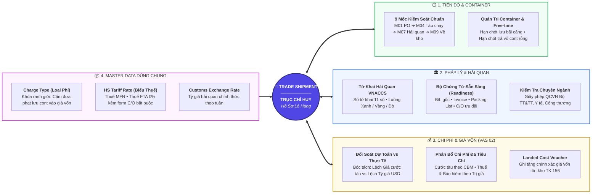
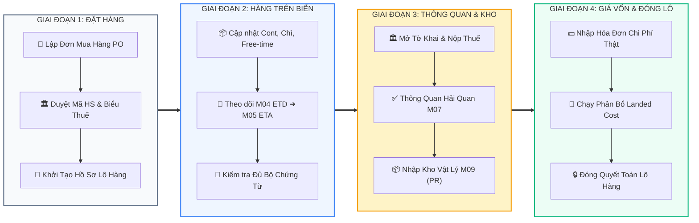
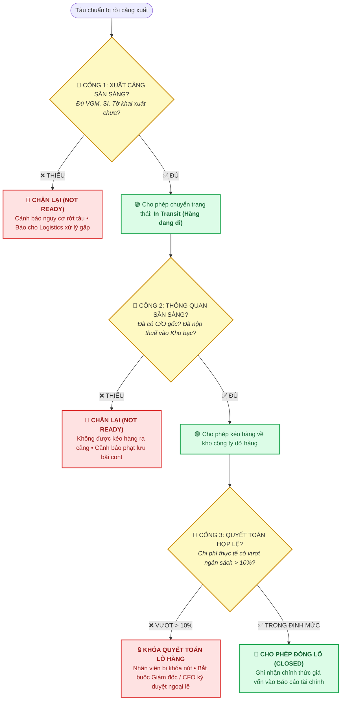

# 🏛️ BẢN THIẾT KẾ KIẾN TRÚC HỆ THỐNG QUẢN TRỊ XUẤT NHẬP KHẨU (GLOBAL TRADE ERP)
*(Enterprise Architecture Blueprint — Clean, Modular & Governance-Driven)*

---

## 💎 TRIẾT LÝ THIẾT KẾ KIẾN TRÚC (ARCHITECTURAL PRINCIPLES)

```
┌────────────────────────────────────────────────────────────────────────────────────────┐
│  1. CLEAN CORE       : Giữ nguyên lõi ERPNext v15, toàn bộ module nằm trong Custom App │
│  2. SINGLE HUB       : Trade Shipment là trục chỉ huy duy nhất (Single Source of Truth)│
│  3. STAGE GATE       : Kiểm soát điều kiện tiên quyết (Readiness) trước khi chuyển mốc │
│  4. VAS 02 / IAS 2   : Phân bổ giá vốn đa tiêu chí chuẩn mực, tách bạch chi phí phạt   │
└────────────────────────────────────────────────────────────────────────────────────────┘
```

---

## 📐 BẢN VẼ 1: KIẾN TRÚC PHÂN TẦNG TỔNG THỂ (LAYERED ENTERPRISE ARCHITECTURE)

*Mô hình 5 tầng chuẩn TOGAF, phân tách rõ ràng từ người dùng đến hạ tầng lưu trữ:*

```mermaid
flowchart TD
    %% TẦNG 1: NGƯỜI DÙNG
    subgraph L1["👥 TẦNG 1: NGƯỜI DÙNG & VAI TRÒ NGHIỆP VỤ (BUSINESS ACTORS)"]
        direction LR
        U_BUY["🛒 Thu Mua<br><i>Buyer</i>"]
        U_LOG["🚢 Logistics<br><i>Điều phối</i>"]
        U_CUS["🏛️ Hải Quan<br><i>Tuân thủ</i>"]
        U_WH["📦 Thủ Kho<br><i>Giao nhận</i>"]
        U_ACC["💰 Kế Toán<br><i>Giá vốn</i>"]
        U_CFO["👑 Giám Đốc<br><i>Phê duyệt</i>"]
    end

    %% TẦNG 2: GIAO DIỆN
    subgraph L2["🖥️ TẦNG 2: GIAO DIỆN & TRẠM ĐIỀU HÀNH (CONTROL TOWER & WORKSPACES)"]
        direction LR
        DASH["📊 <b>Global Trade Control Tower</b><br>• Cảnh báo rủi ro bến bãi cont • Báo cáo trễ tàu • Biểu đồ chi phí"]
        WORK["📋 <b>Chuyên Biệt Hóa Giao Diện (Role-based Views)</b><br>• Workspace Mua hàng • Workspace Logistics • Workspace Kế toán"]
    end

    %% TẦNG 3: TRUNG TÂM QUẢN TRỊ
    subgraph L3["⚙️ TẦNG 3: TRUNG TÂM QUẢN TRỊ XNK (CUSTOM APP: LOGISTICS WIZARD)"]
        direction TB
        
        subgraph HUB["🚢 TRỤC CHỈ HUY TRUNG TÂM (CORE HUB)"]
            TS["<b>Trade Shipment (Hồ Sơ Lô Hàng)</b><br>Mã Lô • Nhà cung cấp • Incoterms • Cảng đi/đến • Vận đơn B/L • Ngân sách"]
        end

        subgraph SATELLITES["📦 CÁC THỰC THỂ QUẢN TRỊ VỆ TINH"]
            direction LR
            SAT_M["⏱️ <b>9 Mốc Tiến Độ</b><br>(Milestones)"]
            SAT_C["📦 <b>Quản Trị Container</b><br>(Free-time Dem/Det)"]
            SAT_F["💵 <b>Chi Phí & Ngân Sách</b><br>(Cost Items)"]
            SAT_A["🧮 <b>Phân Bổ Mặt Hàng</b><br>(Item Allocation)"]
        end

        subgraph COMPLIANCE["🏛️ PHÂN HỆ HẢI QUAN & PHÁP LÝ"]
            direction LR
            CUS_DEC["📄 Tờ Khai Hải Quan<br><i>Luồng Xanh/Vàng/Đỏ</i>"]
            CUS_PER["📜 Giấy Phép Chuyên Ngành<br><i>Hợp chuẩn / Hợp quy</i>"]
            CUS_DOC["📑 Checklist Chứng Từ<br><i>Đủ/thiếu C/O, B/L, Inv</i>"]
        end

        HUB --> SATELLITES
        HUB <--> COMPLIANCE
    end

    %% TẦNG 4: THUẬT TOÁN
    subgraph L4["🧠 TẦNG 4: BỘ NÃO THUẬT TOÁN & BẢO VỆ CHÍNH SÁCH (ENGINES)"]
        direction LR
        ENG_ALLOC["🧮 <b>Động Cơ Phân Bổ Giá Vốn</b><br>Cước tàu chia theo CBM<br>Bảo hiểm/Thuế chia theo Giá trị"]
        ENG_VAR["📐 <b>Bóc Tách Chênh Lệch</b><br>Biến động Giá cước hãng tàu<br>Biến động Tỷ giá ngoại tệ USD"]
        ENG_GATE["🛡️ <b>Cổng Chặn Quản Trị</b><br>Khóa đóng lô khi vượt > 10%<br>Chặn nhập kho khi chưa thông quan"]
        ENG_RAG["🤖 <b>AI / RAG Service</b><br>Tra cứu căn cứ pháp lý<br>Gợi ý phân loại mã HS"]
    end

    %% TẦNG 5: LÕI ERPNEXT & HẠ TẦNG
    subgraph L5["🏢 TẦNG 5: LÕI KẾ TOÁN/KHO ERPNEXT & HẠ TẦNG DOCKER"]
        direction LR
        ERP_CORE["💼 <b>ERPNext Core Documents</b><br>Purchase Order • Purchase Receipt • Landed Cost Voucher • General Ledger"]
        INFRA["🐳 <b>Hạ Tầng Công Nghệ</b><br>Docker Compose • Frappe Framework v15 • MariaDB • Redis Cache"]
    end

    %% LIÊN KẾT ĐA TẦNG GỌN GÀNG
    L1 ==> L2
    L2 ==> L3
    L3 <==> L4
    L4 ==> L5

    %% PHONG CÁCH MÀU SẮC SANG TRỌNG
    style L1 fill:#F8FAFC,stroke:#64748B,stroke-width:2px
    style L2 fill:#F0F9FF,stroke:#0284C7,stroke-width:2px
    style L3 fill:#FAF5FF,stroke:#9333EA,stroke-width:2px
    style L4 fill:#FFFBEB,stroke:#D97706,stroke-width:2px
    style L5 fill:#ECFDF5,stroke:#059669,stroke-width:2px

    style TS fill:#7E22CE,stroke:#581C87,color:#FFFFFF,stroke-width:2px
    style ENG_ALLOC fill:#FEF3C7,stroke:#B45309,color:#78350F
    style ENG_VAR fill:#FEF3C7,stroke:#B45309,color:#78350F
    style ENG_GATE fill:#FEE2E2,stroke:#B91C1C,color:#7F1D1D
    style ENG_RAG fill:#E0E7FF,stroke:#4338CA,color:#312E81
```



---

## 🎯 BẢN VẼ 2: KIẾN TRÚC TRỤC CHỈ HUY TRUNG TÂM (HUB-AND-SPOKE ARCHITECTURE)

*Mô hình vệ tinh đối xứng: `Trade Shipment` đóng vai trò trái tim kết nối 4 nhóm vệ tinh xung quanh:*



---

## 🌊 BẢN VẼ 3: QUY TRÌNH DÒNG CHẢY NGHIỆP VỤ 4 CHẶNG (LIFECYCLE PIPELINE)

*Quy trình thực chiến từ lúc đặt hàng đến khi đóng sổ quyết toán:*



---

## 🚦 BẢN VẼ 4: CƠ CHẾ CỔNG KIỂM SOÁT ĐIỀU KIỆN (STAGE GATE GOVERNANCE)

*Cơ chế tự động hóa bảo vệ doanh nghiệp: Chưa đủ điều kiện thì hệ thống lập tức khóa chặn:*



---

## 👥 BẢN VẼ 5: MA TRẬN PHÂN QUYỀN TRÁCH NHIỆM RACI (GOVERNANCE MATRIX)

| Chứng Từ / Khâu Nghiệp Vụ | 🛒 Thu Mua (`buyer`) | 🏛️ Tuân Thủ (`customs`) | 🚢 Logistics (`logistics`) | 📦 Thủ Kho (`warehouse`) | 💰 Kế Toán (`accountant`) | 👑 Giám Đốc (`cfo`) |
| :--- | :---: | :---: | :---: | :---: | :---: | :---: |
| **Đơn mua hàng (PO)** | 🟢 **R** *(Lập)* | ⚪ C *(Tham vấn)* | 🔵 I *(Xem)* | 🔵 I *(Xem)* | ⚪ C *(Kiểm tra ngân sách)* | 🟡 **A** *(Duyệt)* |
| **Duyệt Mã HS & Biểu Thuế** | 🔵 I *(Đề xuất)* | 🟢 **R** *(Duyệt)* | 🔵 I *(Xem)* | ─ | 🔵 I *(Xem thuế)* | 🟡 **A** |
| **Hành trình Tàu & Cont (M01-M05)** | 🔵 I *(Theo dõi)* | 🔵 I *(Theo dõi)* | 🟢 **R** *(Điều phối)* | ─ | ─ | 🟡 **A** |
| **Tờ khai Hải quan (M06-M07)** | ─ | 🟢 **R** *(Khai báo)* | ⚪ C *(Phối hợp)* | ─ | ⚪ C *(Nộp thuế)* | 🟡 **A** |
| **Phiếu Nhập kho (PR) (M09)** | ─ | ─ | 🔵 I *(Giao cont)* | 🟢 **R** *(Đếm hàng)* | 🔵 I *(Số lượng)* | 🟡 **A** |
| **Phân bổ Giá vốn (Landed Cost)** | ─ | ─ | ─ | ─ | 🟢 **R** *(Chạy LCV)* | 🟡 **A** |
| **Duyệt đóng lô VƯỢT NGÂN SÁCH** | ─ | ─ | ─ | ─ | 🔵 I *(Trình duyệt)* | 🔴 **R / A *(Ký duyệt)*** |

*Ký hiệu: **R** (Responsible - Thực hiện) • **A** (Accountable - Quyết định tối cao) • **C** (Consulted - Tham vấn) • **I** (Informed - Nhận thông báo).*
