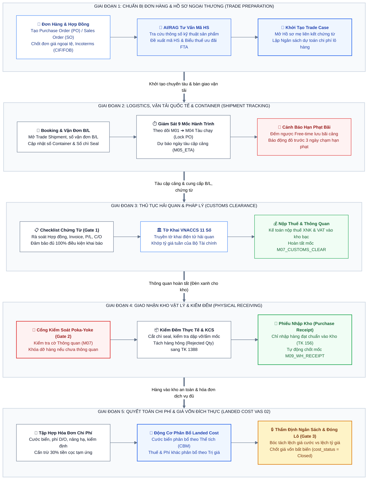
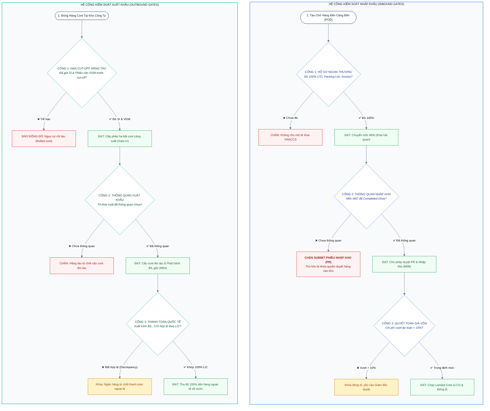

# 🏛️ BẢN THIẾT KẾ TOÀN DIỆN KIẾN TRÚC HỆ THỐNG QUẢN TRỊ XUẤT NHẬP KHẨU
*(Comprehensive Enterprise Global Trade & Supply Chain Architecture on ERPNext v15)*

---

## 💎 CHƯƠNG 1: TRIẾT LÝ VÀ NGUYÊN TẮC KIẾN TRÚC DOANH NGHIỆP

Hệ thống được thiết kế theo tiêu chuẩn khung kiến trúc mở **TOGAF Framework**, tích hợp mô hình **Song Trục Đối Xứng (Dual-Stream Shared-Core)** nhằm quản trị trọn vẹn cả hai luồng nghiệp vụ **Nhập khẩu (Inbound)** và **Xuất khẩu (Outbound)** trên cùng một nền tảng lõi ERPNext v15:

```
┌────────────────────────────────────────────────────────────────────────────────────────┐
│ 1. CLEAN ARCHITECTURE  : 100% mã nguồn nằm trong app `logistics_wizard`, giữ lõi sạch. │
│ 2. DUAL-STREAM CORE    : Trục lõi dùng chung (Shared Core) cho cả Nhập khẩu & Xuất khẩu.│
│ 3. TWO-TIER HUB        : Tách Trade Case (Hợp đồng/PO/SO) vs Trade Shipment (Vận tải). │
│ 4. PARTIAL SHIPMENT    : Hỗ trợ 1 Case nhiều chuyến hàng giao từng phần lệch lịch tàu. │
│ 5. 3-TIER STAGE GATES  : Hệ cổng Poka-Yoke 2 chiều chặn rủi ro pháp lý, kho & tài chính.│
│ 6. VAS 02 / IAS 2      : Thuật toán phân bổ đa tiêu chí chuẩn xác, bóc tách rạch ròi. │
│ 7. MANAGEMENT BY EXC.  : Quản trị theo ngoại lệ, hệ thống tự động cảnh báo sớm rủi ro. │
└────────────────────────────────────────────────────────────────────────────────────────┘
```

---

## 📐 CHƯƠNG 2: BẢN VẼ KIẾN TRÚC HỆ THỐNG TỔNG THỂ (ENTERPRISE SOLUTION ARCHITECTURE)

Bản vẽ kiến trúc hệ thống được chuẩn hóa theo mô hình **Kiến Trúc Giải Pháp Doanh Nghiệp (Enterprise Solution Architecture)** chuẩn TOGAF. Bản vẽ phân định rạch ròi 3 phân vùng độc lập: **Khung Chuẩn & Quy Định** (cột trái), **Hệ Thống 4 Tầng Kỹ Thuật Nội Bộ** (khối trung tâm) và **Ranh Giới Tích Hợp Hệ Thống Bên Ngoài** (cột phải):

```mermaid
%%{init: {'theme': 'base', 'themeVariables': { 'fontFamily': 'Segoe UI, Arial, sans-serif', 'fontSize': '12px', 'primaryTextColor': '#FFFFFF'}}}%%
flowchart LR
    %% ==========================================
    %% CỘT TRÁI: CHUẨN & QUY ĐỊNH
    %% ==========================================
    subgraph COL_LEFT["<b>Chuẩn & quy định</b>"]
        direction TB
        C_TOGAF["TOGAF"]
        C_VAS["VAS 02"]
        C_IAS["IAS 2"]
        C_INCO["Incoterms"]
        C_LAW["Luật HQ"]
        C_POKA["Poka-Yoke"]
        
        C_TOGAF ~~~ C_VAS ~~~ C_IAS ~~~ C_INCO ~~~ C_LAW ~~~ C_POKA
    end

    %% ==========================================
    %% CỘT GIỮA: 4 TẦNG HỆ THỐNG NỘI BỘ
    %% ==========================================
    subgraph COL_MID["<b>Hệ Thống Quản Trị Xuất Nhập Khẩu (ERPNext & logistics_wizard)</b>"]
        direction TB

        %% TẦNG 1: NGƯỜI DÙNG
        subgraph T1["<b>Người dùng</b>"]
            direction LR
            U1["Nhân viên<br>tác nghiệp"]
            U2["CFO duyệt<br>trên mobile"]
            U3["Control Tower<br>màn hình lớn"]
            U4["Đối tác<br>NCC, hãng tàu"]
        end

        %% TẦNG 2: CỔNG TRUY CẬP
        subgraph T2["<b>Cổng truy cập</b>"]
            direction TB
            subgraph T2_PROTO[" "]
                direction LR
                G_HTTPS["HTTPS<br>REST API"]
                G_WS["WebSocket<br>Socket.io"]
                G_HOOK["Webhook<br>API đối tác"]
                G_NOTIF["Email / SMS<br>thông báo"]
            end
            G_GATEWAY["<b>Gateway: Nginx, đăng nhập, RBAC, API key</b>"]
            T2_PROTO --- G_GATEWAY
        end

        %% TẦNG 3: TẦNG DỊCH VỤ
        subgraph T3["<b>Tầng dịch vụ</b>"]
            direction TB

            %% Truyền thông dịch vụ
            subgraph S_COMM["Truyền thông dịch vụ"]
                direction LR
                CM_REST["REST API"]
                CM_CELERY["Celery queue"]
                CM_SOCK["Socket.io"]
                CM_HOOK["Webhook"]
            end

            %% Khối Dịch vụ Nghiệp vụ + AI + Nền tảng + Giám sát
            subgraph S_CORE_WRAP[" "]
                direction LR

                %% Cột trái: Nghiệp vụ, AI, Nền tảng
                subgraph S_LEFT_BLOCK[" "]
                    direction TB

                    %% Dịch vụ nghiệp vụ
                    subgraph S_BIZ["Dịch vụ nghiệp vụ"]
                        direction TB
                        subgraph S_BIZ_R1[" "]
                            direction LR
                            B_PO["Mua hàng<br>PO, PI"]
                            B_SO["Bán hàng<br>SO, SI"]
                            B_WH["Kho vận<br>PR, DN"]
                        end
                        subgraph S_BIZ_R2[" "]
                            direction LR
                            B_ACC["Kế toán<br>GL, công nợ"]
                            B_CASE["Trade Case<br>hồ sơ mẹ"]
                            B_SHP["Shipment<br>9 mốc tiến độ"]
                        end
                        subgraph S_BIZ_R3[" "]
                            direction LR
                            B_VNACCS["Tờ khai HQ<br>VNACCS 11 số"]
                            B_LCV["Landed Cost<br>VAS 02"]
                            B_GATES["Stage Gates<br>Poka-Yoke"]
                        end
                        S_BIZ_R1 ~~~ S_BIZ_R2 ~~~ S_BIZ_R3
                    end

                    %% Dịch vụ AI
                    subgraph S_AI["Dịch vụ AI"]
                        direction LR
                        AI_RAG["RAG chatbot<br>luật XNK"]
                        AI_HS["HS Code AI<br>gợi ý mã HS"]
                        AI_OCR["OCR chứng từ<br>mở rộng"]
                    end

                    %% Dịch vụ nền tảng
                    subgraph S_PLAT["Dịch vụ nền tảng"]
                        direction TB
                        subgraph S_PLAT_R1[" "]
                            direction LR
                            P_USER["Người dùng<br>phân quyền"]
                            P_AUDIT["Audit log<br>Track Changes"]
                            P_ALERT["Thông báo<br>mail, chuông"]
                        end
                        subgraph S_PLAT_R2[" "]
                            direction LR
                            P_DOC["Tệp chứng từ<br>B/L, C/O, PDF"]
                            P_SCHED["Lịch tự động<br>Scheduler"]
                            P_CAT["Danh mục<br>HS, tỷ giá"]
                        end
                        S_PLAT_R1 ~~~ S_PLAT_R2
                    end

                    S_BIZ ~~~ S_AI ~~~ S_PLAT
                end

                %% Cột phải: Giám sát
                subgraph S_MON["Giám sát"]
                    direction TB
                    M_TOWER["Control<br>Tower"]
                    M_FREE["Cảnh báo<br>Free-time"]
                    M_BUDGET["Vượt<br>ngân sách"]
                    M_MBE["Báo cáo<br>MBE"]
                    M_PL["Lãi/lỗ<br>thực tế"]
                    M_JOB["Giám sát<br>job, log"]

                    M_TOWER ~~~ M_FREE ~~~ M_BUDGET ~~~ M_MBE ~~~ M_PL ~~~ M_JOB
                end
            end

            S_COMM ~~~ S_CORE_WRAP
        end

        %% TẦNG 4: TẦNG LƯU TRỮ
        subgraph T4["<b>Tầng lưu trữ</b>"]
            direction LR
            DB_FILES["Kho tệp<br>chứng từ"]
            DB_SQL["MariaDB<br>ACID, InnoDB"]
            DB_REDIS["Redis<br>cache, queue"]
            DB_VEC["Vector DB<br>luật, mã HS"]
        end

        T1 ~~~ T2 ~~~ T3 ~~~ T4
    end

    %% ==========================================
    %% CỘT PHẢI: TÍCH HỢP HỆ THỐNG NGOÀI
    %% ==========================================
    subgraph COL_RIGHT["<b>Tích hợp<br>hệ thống ngoài</b>"]
        direction TB
        EX_VNACCS["VNACCS<br>/ ECUS"]
        EX_SHIP["Hãng tàu<br>tracking"]
        EX_BANK["Ngân hàng<br>L/C, TT"]
        EX_EXCH["Tỷ giá<br>Bộ TC"]
        EX_LLM["LLM API<br>(AI)"]

        EX_VNACCS ~~~ EX_SHIP ~~~ EX_BANK ~~~ EX_EXCH ~~~ EX_LLM
    end

    %% ==========================================
    %% LIÊN KẾT LIÊN VÙNG
    %% ==========================================
    COL_LEFT -.-> COL_MID
    COL_MID <===> COL_RIGHT

    %% ==========================================
    %% STYLING VÀ PHÂN ĐỊNH MÀU SẮC (LEGEND)
    %% ==========================================
    classDef erpnext fill:#1E3A5F,stroke:#2563EB,stroke-width:1.5px,color:#FFFFFF;
    classDef customApp fill:#064E3B,stroke:#059669,stroke-width:1.5px,color:#FFFFFF;
    classDef aiRag fill:#3B1C54,stroke:#7C3AED,stroke-width:1.5px,color:#FFFFFF;
    classDef neutralBox fill:#272A30,stroke:#64748B,stroke-width:1.5px,color:#FFFFFF;

    classDef erpnextDashed fill:#1E3A5F,stroke:#2563EB,stroke-width:1.5px,color:#FFFFFF,stroke-dasharray: 4 4;
    classDef customAppDashed fill:#064E3B,stroke:#059669,stroke-width:1.5px,color:#FFFFFF,stroke-dasharray: 4 4;
    classDef aiRagDashed fill:#3B1C54,stroke:#7C3AED,stroke-width:1.5px,color:#FFFFFF,stroke-dasharray: 4 4;
    classDef neutralDashed fill:#272A30,stroke:#64748B,stroke-width:1.5px,color:#FFFFFF,stroke-dasharray: 4 4;

    class B_PO,B_SO,B_WH,B_ACC,P_USER,P_AUDIT,P_ALERT,P_DOC,DB_SQL,DB_REDIS,M_JOB erpnext;
    class B_CASE,B_SHP,B_LCV,B_GATES,M_TOWER,M_FREE,M_BUDGET,M_MBE,M_PL customApp;
    class B_VNACCS,P_CAT customAppDashed;
    class AI_RAG,AI_HS aiRag;
    class AI_OCR,DB_VEC aiRagDashed;
    class DB_FILES,P_SCHED erpnextDashed;
    class U1,U2,U3,G_HTTPS,G_WS,G_GATEWAY,CM_REST,CM_CELERY,CM_SOCK,C_TOGAF,C_VAS,C_IAS,C_INCO,C_LAW,C_POKA,EX_VNACCS,EX_SHIP,EX_BANK,EX_EXCH,EX_LLM neutralBox;
    class U4,G_HOOK,G_NOTIF,CM_HOOK neutralDashed;

    style COL_LEFT fill:#202327,stroke:#4B5563,stroke-width:1.5px,color:#FFFFFF
    style COL_MID fill:#181A1F,stroke:#4B5563,stroke-width:1.5px,color:#FFFFFF
    style COL_RIGHT fill:#202327,stroke:#4B5563,stroke-width:1.5px,color:#FFFFFF
    style T1 fill:#23272E,stroke:#4B5563,stroke-width:1px,color:#FFFFFF
    style T2 fill:#23272E,stroke:#4B5563,stroke-width:1px,color:#FFFFFF
    style T3 fill:#23272E,stroke:#4B5563,stroke-width:1px,color:#FFFFFF
    style T4 fill:#23272E,stroke:#4B5563,stroke-width:1px,color:#FFFFFF
    style S_COMM fill:#1C1F26,stroke:#374151,stroke-width:1px,stroke-dasharray: 3 3,color:#FFFFFF
    style S_BIZ fill:#1C1F26,stroke:#374151,stroke-width:1px,color:#FFFFFF
    style S_AI fill:#1C1F26,stroke:#374151,stroke-width:1px,stroke-dasharray: 3 3,color:#FFFFFF
    style S_PLAT fill:#1C1F26,stroke:#374151,stroke-width:1px,color:#FFFFFF
    style S_MON fill:#1C1F26,stroke:#374151,stroke-width:1px,color:#FFFFFF
```



### 🎨 Chú Giải Mã Màu & Phân Định Trách Nhiệm (Legend)

* 🟦 **Màu Xanh Dương (ERPNext có sẵn):** Kế thừa 100% các phân hệ ổn định của ERPNext lõi (Đơn mua PO, Đơn bán SO, Phiếu kho PR/DN, Sổ cái kế toán GL, Phân quyền RBAC, Audit log, MariaDB, Redis).
* 🟩 **Màu Xanh Lục (App tự phát triển - `logistics_wizard`):** Toàn bộ năng lực chuyên biệt do nhóm tự thiết kế và phát triển mới (Hồ sơ mẹ `Trade Case`, Quản trị chuyến tàu `Trade Shipment`, 9 mốc tiến độ, Thuật toán Landed Cost VAS 02, Cơ chế cổng Poka-Yoke Stage Gates, Tháp chỉ huy Control Tower, Cảnh báo sớm Demurrage).
* 🟪 **Màu Tím (Phân hệ AI / RAG):** Cấu phần trí tuệ nhân tạo độc lập phục vụ đề tài nghiên cứu (Chatbot RAG tra cứu văn bản pháp luật XNK, Mô hình gợi ý mã HS theo thông số kỹ thuật, Vector DB embedding).
* 🔲 **Viền Đứt Nét (Cấu phần Mở rộng / Định hướng Tích hợp):** Phân định rạch ròi giữa **Phần lõi đã hoàn thiện phục vụ đánh giá giữa kỳ/cuối kỳ** (viền nét liền) và **Năng lực tích hợp mở rộng với các đối tác bên ngoài** (viền nét đứt: OCR chứng từ, Webhook đối tác, Kho tệp đám mây, API ngân hàng/hải quan).

---

### 🔬 Thuyết Minh Chi Tiết 4 Tầng Kỹ Thuật Nội Bộ

#### 1. Tầng Người Dùng (Presentation Tier)
* **Nhân viên tác nghiệp:** Làm việc trên giao diện Web Desk của ERPNext (Thu mua, Sales, Logistics, Kế toán, Thủ kho).
* **CFO / Ban Giám Đốc:** Phê duyệt nhanh đơn hàng PO giá trị lớn, ủy quyền chi cọc và duyệt vượt ngân sách trên Mobile App (Android/iOS).
* **Tháp chỉ huy (Control Tower):** Hiển thị màn hình lớn (Dashboard) dành cho người quản trị: giám sát hành trình tàu biển 3D, đếm ngược hạn lưu bãi cont, cảnh báo vượt chi phí theo thời gian thực.
* **Cổng thông tin đối tác (Partner Portal - Viền đứt):** Cho phép nhà cung cấp quốc tế và forwarder tra cứu trạng thái đơn hàng.

#### 2. Tầng Cổng Truy Cập & Bảo Mật (Access / Gateway Tier)
* **API Gateway & Reverse Proxy:** Sử dụng Nginx quản lý cổng truy cập tập trung, mã hóa SSL/TLS, ngăn chặn tấn công DDoS.
* **Xác thực & Bảo vệ:** Kiểm soát phiên đăng nhập (Session Authentication), xác thực API Key đối tác, thực thi ma trận phân quyền dựa trên vai trò (**RBAC**).
* **Đa kênh truyền tải:** Hỗ trợ song song REST API (giao tác dữ liệu), WebSocket Socket.io (push sự kiện thời gian thực), Webhook (nhận callback từ đối tác) và Mail/SMS service.

#### 3. Tầng Dịch Vụ Nghiệp Vụ & AI (Services Tier) — "Bộ Não Hệ Thống"
* **Kênh truyền thông nội bộ:** REST API kết hợp **Celery Task Queue** và Redis để đẩy các tác vụ nặng (tính phân bổ giá vốn đa tiêu chí, quét đếm ngược hạn bãi mỗi đêm) xuống chạy ngầm (asynchronous background workers), giữ cho giao diện luôn phản hồi tức thì.
* **Dịch vụ Nghiệp vụ:** Kết hợp hoàn hảo giữa các DocType lõi của ERPNext và app `logistics_wizard`.
* **Dịch vụ AI & RAG:** Cung cấp Chatbot hỏi đáp chính sách thuế, thủ tục thông quan và Engine gợi ý mã HS dựa trên cơ sở tri thức pháp lý đã được số hóa.
* **Phân hệ Giám Sát Chuyên Trách (Monitoring):** Thực thi nguyên lý *Quản trị theo Ngoại lệ (Management by Exception - MBE)*: tự động lọc và chỉ báo động đỏ các trường hợp khẩn cấp (sắp hết hạn Free-time <= 3 ngày, chi phí thực tế đội > 10% ngân sách).

#### 4. Tầng Lưu Trữ Đa Mô Hình (Storage Tier)
* **MariaDB (ACID, InnoDB Engine):** Lưu trữ toàn bộ dữ liệu quan hệ giao dịch, bảo đảm toàn vẹn tài chính kế toán tuyệt đối.
* **Redis In-Memory:** Bộ nhớ đệm tốc độ cao (Cache), quản lý session đăng nhập và hàng đợi tác vụ nền (Queue).
* **Kho Tệp Chứng Từ (File Storage):** Lưu trữ các file scan PDF gốc (Vận đơn B/L, Chứng nhận xuất xứ C/O, Hóa đơn thương mại, Giấy phép chuyên ngành).
* **Vector Database (ChromaDB / FAISS):** Lưu trữ embedding các văn bản pháp luật hải quan và chú giải HS Code, phục vụ thuật toán tìm kiếm ngữ nghĩa (Semantic Search) trong RAG.

---

### 🌐 Ranh Giới Tích Hợp Hệ Thống Bên Ngoài (External Integrations)

Khắc phục hoàn toàn tư duy "hệ thống cô lập", kiến trúc thiết lập các điểm kết nối chuẩn xác ra thế giới thực:
1. **Hệ thống Hải quan Điện tử (VNACCS / ECUS):** Xuất/nhập dữ liệu tờ khai hải quan điện tử 11 số.
2. **Hệ thống Tracking Hãng Tàu (Carriers / Forwarders):** Kết nối API định vị AIS / Tracking sự kiện container, cập nhật tọa độ tàu biển và ngày cập cảng thực tế (ATA).
3. **Ngân Hàng Thương Mại (Fintech / Banking):** Kết nối cổng thanh toán quốc tế (L/C, T/T), tự động đối soát sổ phụ ngân hàng khi chi tiền cọc ngoại tệ.
4. **Cổng Thông Tin Bộ Tài Chính:** Tự động đồng bộ Bảng tỷ giá tính thuế XNK hàng tuần của Tổng cục Hải quan.
5. **Dịch Vụ Mô Hình Ngôn Ngữ Lớn (LLM API):** Kết nối mô hình ngôn ngữ phục vụ tác vụ trích xuất thông tin chứng từ và trả lời pháp lý trong phân hệ RAG.

---

### 💡 Giải Quyết Mâu Thuẫn Nghiệp Vụ: Cơ Chế "Kho Chờ Thông Quan" (Suspense / Bonded Warehouse)

Để đồng bộ hoàn hảo giữa **Cổng kiểm soát 2 (Chặn dỡ hàng)** và **Tình huống thực tế 4 (Hàng được kéo về kho bảo quản khi chưa có C/O)**:
* Hệ thống thiết lập phân định 2 trạng thái kho vật lý trong ERPNext:
  1. **Kho Bảo Quản Tạm / Kho Chờ Thông Quan (`Suspense Warehouse`):** Khi tàu cập cảng nhưng hàng đang nợ C/O hoặc kiểm tra chuyên ngành, cơ quan Hải quan cho phép kéo hàng về kho công ty để tránh phạt lưu bãi tại cảng. Thủ kho tiếp nhận vào *Kho Bảo Quản* (hàng nằm dưới sự giám sát hải quan, cấm xuất bán, không ghi nhận tăng tài sản thương mại TK 156).
  2. **Kho Chính Thương Mại (`Main Finished Goods Warehouse`):** Ngay khi chuyên viên Hải quan cập nhật tờ khai sang trạng thái `Cleared` (mốc M07 hoàn tất), hệ thống mới tự động giải phóng Cổng Stage Gate 2, cho phép lập phiếu chuyển kho (`Stock Entry`) từ *Kho Bảo Quản* sang *Kho Chính* để chính thức xuất bán ra thị trường.
* Cơ chế này giúp doanh nghiệp vừa bảo vệ tuyệt đối tính pháp lý, vừa chủ động cắt giảm hàng chục triệu đồng tiền phạt lưu bãi cảng!

---

## 🔄 CHƯƠNG 3: LUỒNG NGHIỆP VỤ 5 GIAI ĐOẠN VÒNG ĐỜI LÔ HÀNG (GLOBAL TRADE LIFECYCLE WORKFLOW)

Toàn bộ hoạt động xuất nhập khẩu được quản trị khép kín qua **5 Giai Đoạn Vòng Đời Chuẩn (End-to-End Lifecycle Stages)**, bảo đảm tính liên tục của dòng hàng vật lý và tính chính xác của dòng tài chính kế toán:



### 📋 Bảng Đặc Tả Nghiệp Vụ & Chứng Từ 5 Giai Đoạn Vòng Đời

| Giai Đoạn | Chứng Từ / Dữ Liệu Tác Nghiệp | Vai Trò Chính | Đầu Ra Nghiệp Vụ & Rào Chắn Poka-Yoke |
| :--- | :--- | :---: | :--- |
| **Giai đoạn 1: Chuẩn bị Đơn hàng** | `Purchase Order` (PO), `Sales Order` (SO), `Trade Case`, Tra cứu HS Code (AI RAG) | 🛒 Thu Mua / 🌍 Sales | Khởi tạo hồ sơ mẹ `IMP-xxxx`, chốt dự toán ngân sách; Đơn PO/SO được Giám đốc ký duyệt. |
| **Giai đoạn 2: Logistics & Tàu biển** | `Trade Shipment`, Master/House B/L, Container, Booking Confirmation | 🚢 Logistics | Cập nhật số Cont/Seal; giám sát mốc M01-M05; khóa cứng đơn PO khi tàu rời cảng (M04); đếm ngược Free-time. |
| **Giai đoạn 3: Thủ tục Hải quan** | `Customs Declaration`, C/O Form E/D/AK, Packing List, Tờ khai VNACCS 11 số | 🏛️ Hải Quan / 💰 Kế Toán | Stage Gate 1: đủ 100% chứng từ mới mở tờ khai; nộp thuế kho bạc; chốt mốc thông quan M07_CUSTOMS_CLEAR. |
| **Giai đoạn 4: Kho bãi Vật lý** | `Purchase Receipt` (PR), `Delivery Note` (DN), Biên bản đồng kiểm, KCS | 📦 Thủ Kho | Stage Gate 2: Chặn dỡ hàng và cấm submit PR nếu chưa thông quan; tách hàng hỏng ra TK 1388; chốt mốc M09. |
| **Giai đoạn 5: Quyết toán Giá vốn** | `Purchase Invoice` (PI), Hóa đơn cước forwarder, `Landed Cost Voucher` (LCV) | 💰 Kế Toán / 👑 CFO | Stage Gate 3: Tự cấn trừ 30% cọc; phân bổ chi phí theo CBM & Trị giá (VAS 02); khóa đóng lô nếu vượt dự toán > 10%. |

---

## 🚦 CHƯƠNG 4: HỆ THỐNG CỔNG KIỂM SOÁT ĐIỀU KIỆN (DUAL-STREAM STAGE GATES)

Hệ thống hoạt động theo cơ chế **Quản trị Chủ động (Proactive Control)**: Trước khi chuyển sang bước tiếp theo, hệ thống tự động kiểm tra các điều kiện sẵn sàng đối xứng cho cả 2 luồng Nhập khẩu và Xuất khẩu:



---

## 👥 CHƯƠNG 5: MA TRẬN PHÂN QUYỀN TRÁCH NHIỆM RACI (GOVERNANCE MATRIX)

| Chứng Từ / Khâu Nghiệp Vụ | 🛒 Mua Hàng (`buyer`) | 🌍 Bán Hàng QT (`sales`) | 🏛️ Tuân Thủ (`customs`) | 🚢 Logistics (`logistics`) | 📦 Thủ Kho (`warehouse`) | 💰 Kế Toán (`accountant`) | 👑 Giám Đốc (`cfo`) |
| :--- | :---: | :---: | :---: | :---: | :---: | :---: | :---: |
| **Đơn mua hàng (PO - Nhập khẩu)** | 🟢 **R** *(Lập)* | ─ | ⚪ C *(Tham vấn)* | 🔵 I *(Xem)* | 🔵 I *(Xem)* | ⚪ C *(Duyệt ngân sách)* | 🟡 **A** *(Duyệt)* |
| **Đơn bán hàng (SO - Xuất khẩu)** | ─ | 🟢 **R** *(Lập)* | ⚪ C *(Kiểm tra FTA)* | ⚪ C *(Check cước)* | 🔵 I *(Xem tồn kho)* | ⚪ C *(Check hạn mức nợ)*| 🟡 **A** *(Duyệt)* |
| **Duyệt Mã HS & Biểu Thuế XNK** | 🔵 I *(Đề xuất)* | 🔵 I *(Đề xuất)* | 🟢 **R** *(Duyệt mã)* | 🔵 I *(Xem)* | ─ | 🔵 I *(Xem thuế)* | 🟡 **A** |
| **Booking, SI/VGM, Vận tải (M01-M05)**| 🔵 I *(Xem)* | 🔵 I *(Xem)* | 🔵 I *(Xem)* | 🟢 **R** *(Điều phối)* | ─ | ─ | 🟡 **A** |
| **Tờ khai VNACCS Xuất & Nhập (M06-M07)**| ─ | ─ | 🟢 **R** *(Khai báo)* | ⚪ C *(Phối hợp)* | ─ | ⚪ C *(Nộp thuế)* | 🟡 **A** |
| **Phiếu Nhập kho (PR) (M09 - Nhập)** | ─ | ─ | ─ | 🔵 I *(Giao cont)* | 🟢 **R** *(Đếm hàng)* | 🔵 I *(Số lượng)* | 🟡 **A** |
| **Phiếu Xuất kho (DN) (Xuất khẩu)** | ─ | 🔵 I *(Lệnh xuất)*| ─ | ⚪ C *(Lấy cont rỗng)*| 🟢 **R** *(Đóng cont)* | 🔵 I *(Giảm kho)* | 🟡 **A** |
| **Phân bổ Giá vốn (Landed Cost - LCV)**| ─ | ─ | ─ | ─ | ─ | 🟢 **R** *(Chạy LCV)* | 🟡 **A** |
| **Duyệt đóng lô VƯỢT NGÂN SÁCH > 10%**| ─ | ─ | ─ | ─ | ─ | 🔵 I *(Trình duyệt)* | 🔴 **R / A *(Ký duyệt)*** |

*Ký hiệu: **R** (Responsible - Trực tiếp làm) • **A** (Accountable - Phê duyệt tối cao, mỗi khâu duy nhất 1 người) • **C** (Consulted - Tham vấn ý kiến) • **I** (Informed - Nhận thông báo tự động).*

---

## 🛡️ CHƯƠNG 6: KIỂM TOÁN ỨNG SUẤT — KHẮC CHẾ 7 TÌNH HUỐNG HIỂM HÓC

Bảo đảm hệ thống không bao giờ bị nghẽn (Deadlock) trước các biến cố phức tạp ngoài đời thực:

| # | Tình huống rủi ro thực tế | Rủi ro nếu thiết kế kém | Cơ chế Kiến trúc khắc chế triệt để | Đánh giá |
| :-: | :--- | :--- | :--- | :---: |
| **1** | **Giao hàng từng phần (Partial Shipment)** | Hệ thống bắt đợi đủ hợp đồng mới tính giá vốn/doanh thu | Tách `Trade Case` (Hồ sơ tổng) vs `Shipment` (xử lý chứng từ, giá vốn riêng từng đợt tàu) | 🟢 An toàn |
| **2** | **Hàng thiếu hụt, rơi vỡ khi mở cont** | Phân bổ khống chi phí vào hàng hỏng | Phiếu PR chỉ ghi nhận hàng thực nhập; phần hỏng hạch toán Phải thu bồi thường bảo hiểm (TK 1388) | 🟢 An toàn |
| **3** | **Hóa đơn cước về trễ sau khi đã xuất bán hết** | Gây lỗi "Tồn kho âm" sập sổ cái kế toán | Cơ chế Additional LCV: Tự động kết chuyển thẳng vào Giá vốn hàng bán trong kỳ (COGS - TK 632) | 🟢 An toàn |
| **4** | **Giải phóng hàng chờ thông quan (nợ C/O)** | Cont bị giữ chết tại cảng, phạt bãi hàng chục triệu | Trạng thái `Released Pending Clearance`: Kéo hàng về kho bảo quản, khóa cờ xuất bán | 🟢 An toàn |
| **5** | **Rớt tàu, trễ hạn Cut-off SI/VGM (Xuất khẩu)** | Hàng bị lưu bãi cảng xuất, lỡ hẹn với khách quốc tế | Cảnh báo đếm ngược trước 24h hạn Cut-off; tự động sinh Exception Ticket chuyển sang chuyến tàu kế | 🟢 An toàn |
| **6** | **Nhiều cont trả vỏ lệch ngày nhau** | Gộp chung, không biết cont nào bị phạt demurrage | Bảng con `containers` quản lý độc lập từng dòng: Số cont, seal, ngày trả vỏ và tiền phạt riêng | 🟢 An toàn |
| **7** | **Lẫn lộn Incoterms (Hàng FOB lẫn CIF)** | Hàng CIF bị tính trùng cước tàu 2 lần | Cấu hình dòng chi phí: Chỉ định phân bổ cước tàu cho hàng FOB, miễn trừ cho hàng CIF | 🟢 An toàn |

---

## 🔒 CHƯƠNG 7: CƠ CHẾ BẢO VỆ TỪNG VAI TRÒ CHỨC NĂNG (POKA-YOKE)

Ngăn ngừa triệt để sai sót và gian lận của yếu tố con người tại từng vị trí:

1. **🛒 Thu mua (`buyer`):**
   * *Rào chắn 1:* Ngay khi tàu chạy (mốc M04), đơn mua PO bị khóa bất biến (Locked), không ai được tự ý đổi giá hoặc số lượng.
   * *Rào chắn 2:* Thu mua chỉ có quyền "Đề xuất mã HS", không được tự duyệt mã HS.
2. **🌍 Bán hàng quốc tế (`sales`):**
   * *Rào chắn 1:* Hệ thống tự động khóa đơn bán SO ngay khi xuất hành B/L gốc, ngăn chặn nhân viên tự ý sửa giá bán hoặc điều khoản Incoterm sau khi hàng đã rời cảng.
   * *Rào chắn 2:* Bắt buộc kiểm tra hạn mức công nợ (Credit Limit) và nhận đủ tiền cọc trước khi kích hoạt lệnh xuất kho đóng cont (DN).
3. **📦 Thủ kho (`warehouse`):**
   * *Rào chắn 1 (Stage Gate 2):* Hệ thống khóa cứng nút Submit Phiếu Nhập Kho (`Purchase Receipt`) nếu lô hàng chưa hoàn tất Thông quan Hải quan (Mốc M07).
   * *Rào chắn 2:* Phân quyền ẩn hoàn toàn đơn giá mua, chi phí và biên lợi nhuận để bảo mật tài chính.
4. **💰 Kế toán (`accountant`):**
   * *Rào chắn 1:* Tự động cấn trừ tiền cọc: Khi mở hóa đơn, hệ thống tự trừ tiền tạm ứng ngoại tệ, kế toán chỉ có thể chi trả phần còn lại.
   * *Rào chắn 2:* Khóa cứng chức năng đóng sổ lô hàng nếu chi phí thực tế vượt dự toán $> 10\%$.
5. **🏛️ Hải quan (`customs`):**
   * *Rào chắn 1:* Khóa ô nhập tỷ giá tính thuế, bắt buộc lấy tự động từ `Customs Exchange Rate` theo tuần của Bộ Tài chính.
   * *Rào chắn 2:* Bắt buộc tờ khai phải chuẩn 11 chữ số theo hệ thống thông quan tự động VNACCS.
6. **🚢 Logistics (`logistics`):**
   * *Rào chắn 1:* Hệ thống tự động đếm ngược hạn Free-time bãi, tự động gửi chuông cảnh báo trước 3 ngày để nhắc kéo vỏ cont.
   * *Rào chắn 2:* Cảnh báo đếm ngược hạn nộp SI/VGM trước giờ Cut-off của hãng tàu, loại bỏ nguy cơ rớt cont.
7. **👑 Giám đốc / CFO (`cfo`):**
   * *Rào chắn 1:* Cơ chế ủy quyền phê duyệt điện tử (Delegation) khi đi công tác xa; hỗ trợ duyệt trên Mobile App.
   * *Rào chắn 2:* Tính năng `Track Changes` ghi nhật ký vĩnh viễn không thể xóa sửa, phục vụ hậu kiểm thuế sau 3 - 5 năm.

---

## 📊 CHƯƠNG 8: BẢO VỆ NGƯỜI QUẢN TRỊ BẰNG THÁP CHỈ HUY & CẢNH BÁO SỚM

Giải phóng lãnh đạo khỏi các cạm bẫy báo cáo truyền thống:

* **1. Triệt tiêu báo cáo "Sự đã rồi":** Bắn cảnh báo đếm ngược trước 3 ngày trước khi cont bị phạt lưu bãi, giúp xử lý rủi ro trước khi mất tiền.
* **2. Báo cáo Quản trị theo Ngoại lệ (MBE):** Lô hàng an toàn được ẩn đi; màn hình của Giám đốc chỉ hiển thị các điểm nóng cần can thiệp (lô trễ hạn, lô vượt ngân sách).
* **3. Lưu vết bất biến (Immutable Audit Trail):** Ngăn chặn nhân viên xào xáo số liệu, lùi ngày kế hoạch để che giấu khuyết điểm KPI.
* **4. Một nguồn chân lý duy nhất (Single Source of Truth):** Xóa bỏ tranh cãi số liệu giữa phòng Mua hàng, Kế toán và Logistics.
* **5. Báo cáo Biên lợi nhuận đích thực (True Landed Gross Margin):** Tính lãi/lỗ dựa trên **Unit Landed Cost** (FOB + Cước + Phí cảng + Thuế + Bảo hiểm), bảo đảm không bao giờ bị rơi vào bẫy "Lãi giả - Lỗ thật".

---

### 🏆 TỔNG KẾT
Bản thiết kế kiến trúc hoàn thiện này biến hệ thống trở thành một **"Cỗ máy quản trị tự động và vững chắc"**:
* Nhân viên tác nghiệp dễ dàng vì có đường ray chuẩn và máy tính tự động hóa.
* Doanh nghiệp được bảo vệ tuyệt đối về mặt pháp lý và chuẩn mực kế toán.
* Người lãnh đạo nắm trọn quyền kiểm soát toàn cục trong lòng bàn tay!
