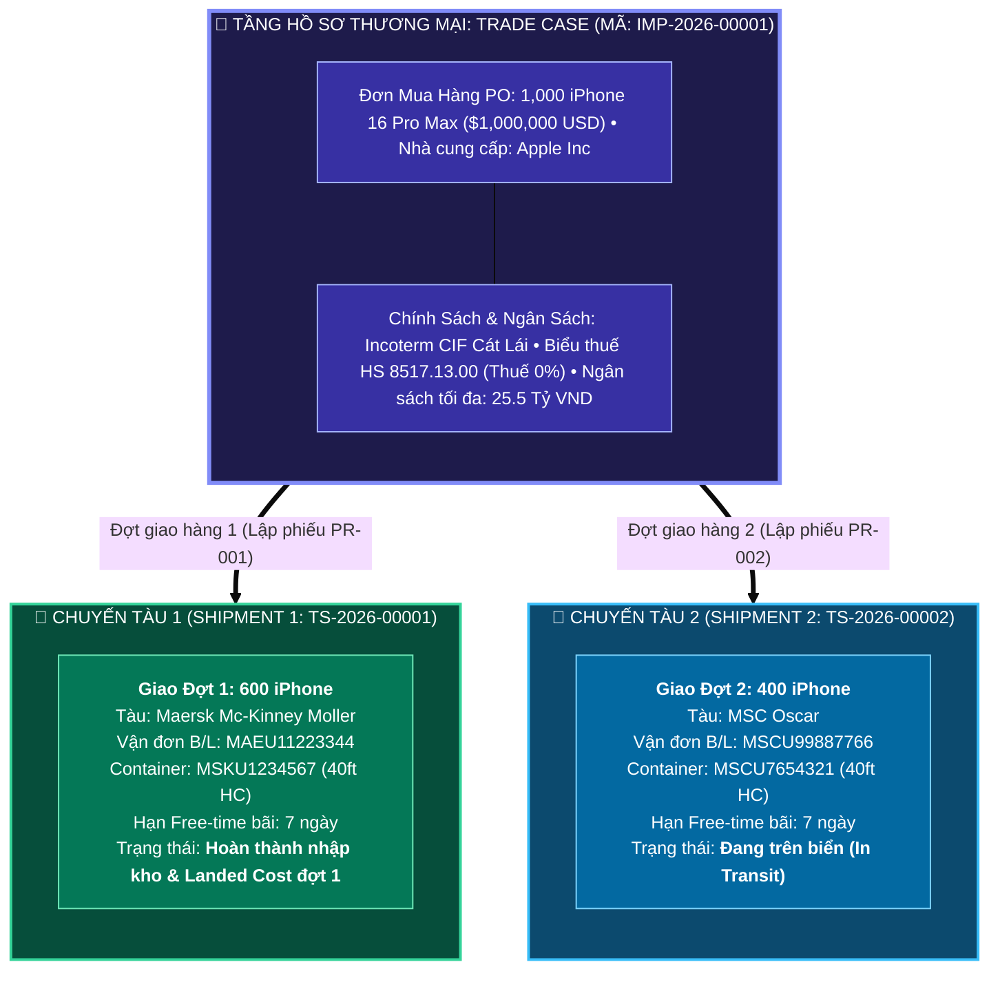

# 🏛️ BẢN THIẾT KẾ TOÀN DIỆN KIẾN TRÚC HỆ THỐNG QUẢN TRỊ XUẤT NHẬP KHẨU
*(Comprehensive Enterprise Global Trade & Supply Chain Architecture on ERPNext v15)*

---

## 💎 CHƯƠNG 1: TRIẾT LÝ VÀ NGUYÊN TẮC KIẾN TRÚC DOANH NGHIỆP

Hệ thống được thiết kế theo tiêu chuẩn khung kiến trúc mở **TOGAF Framework**, kết hợp nguyên tắc quản trị nội bộ chuẩn mực nhằm giải quyết triệt để sự phân mảnh giữa Nghiệp vụ Mua/Bán ngoại thương, Vận tải quốc tế, Pháp lý Hải quan, Kho bãi vật lý và Kế toán giá vốn:

```
┌────────────────────────────────────────────────────────────────────────────────────────┐
│ 1. CLEAN ARCHITECTURE  : 100% mã nguồn nằm trong app `logistics_wizard`, giữ lõi sạch. │
│ 2. TWO-TIER HUB        : Tách Trade Case (Hợp đồng/PO) vs Trade Shipment (Chuyến tàu). │
│ 3. PARTIAL SHIPMENT    : Hỗ trợ 1 Case nhiều chuyến hàng giao từng phần lệch lịch tàu. │
│ 4. STAGE GATE & READY  : 3 Trụ cột Readiness (Chứng từ, Hải quan, Kho) kiểm soát mốc.   │
│ 5. VAS 02 / IAS 2      : Thuật toán phân bổ đa tiêu chí chuẩn xác, bóc tách rạch ròi. │
│ 6. MANAGEMENT BY EXC.  : Quản trị theo ngoại lệ, hệ thống tự động cảnh báo sớm rủi ro. │
└────────────────────────────────────────────────────────────────────────────────────────┘
```

---

## 📐 CHƯƠNG 2: BẢN VẼ KIẾN TRÚC PHÂN TẦNG TỔNG THỂ (TOGAF 5 LAYERS)

Bản vẽ phân tách rõ ràng 5 tầng kiến trúc, từ con người, giao diện, trung tâm nghiệp vụ, bộ não thuật toán đến cơ sở dữ liệu hạ tầng:

```mermaid
%%{init: {'theme': 'base', 'themeVariables': { 'fontFamily': 'Arial, sans-serif', 'fontSize': '13px'}}}%%
flowchart TD
    %% TẦNG 1: VAI TRÒ TÁC NGHIỆP
    subgraph TANG_1["TẦNG 1: NGƯỜI DÙNG & VAI TRÒ NGHIỆP VỤ (ROLES)"]
        direction LR
        U_BUY["🛒 Thu Mua (Buyer)"]
        U_LOG["🚢 Logistics (Điều Phối)"]
        U_CUS["🏛️ Hải Quan (Tuân Thủ)"]
        U_WH["📦 Thủ Kho (Giao Nhận)"]
        U_ACC["💰 Kế Toán (Giá Vốn)"]
        U_CFO["👑 Giám Đốc (Phê Duyệt)"]
    end

    %% TẦNG 2: GIAO DIỆN & TRẠM ĐIỀU HÀNH
    subgraph TANG_2["TẦNG 2: TRẠM ĐIỀU HÀNH & GIAO DIỆN (PRESENTATION)"]
        direction LR
        DASH["📊 THÁP CHỈ HUY CONTROL TOWER<br>Cảnh báo phạt bãi cont • Báo cáo trễ tàu • Biểu đồ chi phí"]
        WORK["📋 WORKSPACE NGHIỆP VỤ CHUYÊN BIỆT<br>Giao diện làm việc riêng cho từng phòng ban (Role-based Views)"]
    end

    %% TẦNG 3: TRUNG TÂM QUẢN TRỊ XNK
    subgraph TANG_3["TẦNG 3: TRUNG TÂM QUẢN TRỊ XNK (LOGISTICS WIZARD)"]
        direction TB
        
        TC["📂 <b>TRADE CASE: HỒ SƠ THƯƠNG MẠI NGOẠI THƯƠNG (IMP / EXP)</b><br>Quản lý Hợp đồng • Đơn mua PO / Đơn bán SO • Nhà cung cấp • Incoterms • Tổng ngân sách Case"]
        
        SHP["🚢 <b>TRADE SHIPMENT: CHUYẾN VẬN TẢI VẬT LÝ (1 HOẶC NHIỀU ĐỢT GIAO)</b><br>Hãng tàu • Vận đơn B/L • Cảng đi/đến • 9 Mốc hành trình • Container & Free-time • Chi phí"]

        TC ==>|"1 Case có thể có 1 hoặc nhiều Shipment"| SHP
    end

    %% TẦNG 4: THUẬT TOÁN & BẢO VỆ CHÍNH SÁCH
    subgraph TANG_4["TẦNG 4: ĐỘNG CƠ THUẬT TOÁN & BẢO VỆ CHÍNH SÁCH"]
        direction LR
        E_ALLOC["🧮 PHÂN BỔ GIÁ VỐN<br>Cước tàu chia CBM<br>Phí khác chia Trị giá"]
        E_VAR["📐 BÓC TÁCH CHÊNH LỆCH<br>Lệch do Giá cước hãng tàu<br>Lệch do Tỷ giá USD/VND"]
        E_GATE["🛡️ KHÓA CHẶN QUẢN TRỊ<br>Chặn đóng lô khi vượt > 10%<br>Chặn kho khi chưa thông quan"]
        E_RAG["🤖 DỊCH VỤ AI / RAG<br>Tra cứu căn cứ pháp lý<br>Gợi ý phân loại mã HS"]
    end

    %% TẦNG 5: ERPNEXT CORE & INFRASTRUCTURE
    subgraph TANG_5["TẦNG 5: LÕI ERPNEXT GỐC & CƠ SỞ DỮ LIỆU"]
        direction LR
        ERP_DOCS["💼 CHỨNG TỪ LÕI ERPNEXT<br>Purchase Order • Purchase Receipt • Landed Cost Voucher • General Ledger"]
        INFRA_DB["🐳 HẠ TẦNG KỸ THUẬT<br>Docker Compose (9 Containers) • Frappe v15 • MariaDB • Redis Cache"]
    end

    %% LIÊN KẾT ĐA TẦNG
    TANG_1 ==> TANG_2
    TANG_2 ==> TANG_3
    TANG_3 <==> TANG_4
    TANG_4 ==> TANG_5

    %% MÀU SẮC ĐỘ TƯƠNG PHẢN CAO
    style TANG_1 fill:#0F172A,stroke:#38BDF8,stroke-width:2px,color:#FFFFFF
    style TANG_2 fill:#0F172A,stroke:#0284C7,stroke-width:2px,color:#FFFFFF
    style TANG_3 fill:#1E1B4B,stroke:#818CF8,stroke-width:2px,color:#FFFFFF
    style TANG_4 fill:#18181B,stroke:#F59E0B,stroke-width:2px,color:#FFFFFF
    style TANG_5 fill:#064E3B,stroke:#10B981,stroke-width:2px,color:#FFFFFF

    style U_BUY fill:#0284C7,stroke:#38BDF8,color:#FFFFFF
    style U_LOG fill:#0284C7,stroke:#38BDF8,color:#FFFFFF
    style U_CUS fill:#0284C7,stroke:#38BDF8,color:#FFFFFF
    style U_WH fill:#0284C7,stroke:#38BDF8,color:#FFFFFF
    style U_ACC fill:#0284C7,stroke:#38BDF8,color:#FFFFFF
    style U_CFO fill:#D97706,stroke:#FBBF24,color:#FFFFFF

    style DASH fill:#0369A1,stroke:#38BDF8,color:#FFFFFF
    style WORK fill:#0369A1,stroke:#38BDF8,color:#FFFFFF

    style TC fill:#4338CA,stroke:#C7D2FE,color:#FFFFFF,stroke-width:3px
    style SHP fill:#6D28D9,stroke:#DDD6FE,color:#FFFFFF,stroke-width:2px

    style E_ALLOC fill:#B45309,stroke:#FCD34D,color:#FFFFFF
    style E_VAR fill:#B45309,stroke:#FCD34D,color:#FFFFFF
    style E_GATE fill:#B91C1C,stroke:#FCA5A5,color:#FFFFFF
    style E_RAG fill:#4F46E5,stroke:#C7D2FE,color:#FFFFFF

    style ERP_DOCS fill:#047857,stroke:#6EE7B7,color:#FFFFFF
    style INFRA_DB fill:#047857,stroke:#6EE7B7,color:#FFFFFF
```



---

## 🎯 CHƯƠNG 3: MÔ HÌNH PHÂN TÁCH `TRADE CASE` VS `TRADE SHIPMENT` (PARTIAL SHIPMENT)

Giải quyết trọn vẹn bài toán: **1 Đơn hàng mua lớn (PO) được nhà máy chia làm 2 đợt giao trên 2 chuyến tàu khác nhau**:



---

## 🚦 CHƯƠNG 4: ĐỘNG CƠ CỔNG KIỂM SOÁT ĐIỀU KIỆN (STAGE GATE & 3 TRỤ CỘT READINESS)

Hệ thống hoạt động theo cơ chế **Quản trị Chủ động (Proactive Control)**: Trước khi chuyển sang bước tiếp theo, hệ thống tự động kiểm tra 3 trụ cột điều kiện sẵn sàng:


---

## 👥 CHƯƠNG 5: MA TRẬN PHÂN QUYỀN TRÁCH NHIỆM RACI (GOVERNANCE MATRIX)

| Chứng Từ / Khâu Nghiệp Vụ | 🛒 Thu Mua (`buyer`) | 🏛️ Tuân Thủ (`customs`) | 🚢 Logistics (`logistics`) | 📦 Thủ Kho (`warehouse`) | 💰 Kế Toán (`accountant`) | 👑 Giám Đốc (`cfo`) |
| :--- | :---: | :---: | :---: | :---: | :---: | :---: |
| **Đơn mua hàng (PO)** | 🟢 **R** *(Lập)* | ⚪ C *(Tham vấn)* | 🔵 I *(Xem)* | 🔵 I *(Xem)* | ⚪ C *(Kiểm tra tiền)* | 🟡 **A** *(Duyệt)* |
| **Duyệt Mã HS & Biểu Thuế** | 🔵 I *(Đề xuất)* | 🟢 **R** *(Duyệt)* | 🔵 I *(Xem)* | ─ | 🔵 I *(Xem thuế)* | 🟡 **A** |
| **Hành trình Tàu & Cont (M01-M05)** | 🔵 I *(Theo dõi)* | 🔵 I *(Theo dõi)* | 🟢 **R** *(Điều phối)* | ─ | ─ | 🟡 **A** |
| **Tờ khai Hải quan (M06-M07)** | ─ | 🟢 **R** *(Khai báo)* | ⚪ C *(Phối hợp)* | ─ | ⚪ C *(Nộp thuế)* | 🟡 **A** |
| **Phiếu Nhập kho (PR) (M09)** | ─ | ─ | 🔵 I *(Giao cont)* | 🟢 **R** *(Đếm hàng)* | 🔵 I *(Số lượng)* | 🟡 **A** |
| **Phân bổ Giá vốn (Landed Cost)** | ─ | ─ | ─ | ─ | 🟢 **R** *(Chạy LCV)* | 🟡 **A** |
| **Duyệt đóng lô VƯỢT NGÂN SÁCH** | ─ | ─ | ─ | ─ | 🔵 I *(Trình duyệt)* | 🔴 **R / A *(Ký duyệt)*** |

*Ký hiệu: **R** (Responsible - Trực tiếp làm) • **A** (Accountable - Phê duyệt tối cao, mỗi khâu duy nhất 1 người) • **C** (Consulted - Tham vấn ý kiến) • **I** (Informed - Nhận thông báo tự động).*

---

## 🛡️ CHƯƠNG 6: KIỂM TOÁN ỨNG SUẤT — KHẮC CHẾ 7 TÌNH HUỐNG HIỂM HÓC

Bảo đảm hệ thống không bao giờ bị nghẽn (Deadlock) trước các biến cố phức tạp ngoài đời thực:

| # | Tình huống rủi ro thực tế | Rủi ro nếu thiết kế kém | Cơ chế Kiến trúc khắc chế triệt để | Đánh giá |
| :-: | :--- | :--- | :--- | :---: |
| **1** | **Giao hàng từng phần** *(1 PO giao 2 đợt tàu)* | Hệ thống bắt đợi đủ 1,000 cái mới tính giá vốn | Tách `Trade Case` (PO tổng) vs `Shipment` (tính Landed Cost riêng từng đợt để bán ngay) | 🟢 An toàn |
| **2** | **Hàng thiếu hụt, rơi vỡ khi mở cont** | Phân bổ khống chi phí vào hàng hỏng | Phiếu PR chỉ ghi nhận hàng thực nhập; 20 cái hỏng hạch toán Phải thu đòi bảo hiểm (TK 1388) | 🟢 An toàn |
| **3** | **Hóa đơn về trễ sau khi đã bán hết hàng** | Gây lỗi "Tồn kho âm" sập sổ cái | Cơ chế Additional LCV: Tự động kết chuyển thẳng vào Giá vốn hàng bán trong kỳ (COGS - TK 632) | 🟢 An toàn |
| **4** | **Giải phóng hàng chờ thông quan (nợ C/O)** | Cont bị giữ chết tại cảng, phạt nặng | Trạng thái `Released Pending Clearance`: Kéo hàng về kho bảo quản, khóa cờ xuất bán | 🟢 An toàn |
| **5** | **Hãng tàu delay, rớt tàu, đổi cảng dỡ** | Lệch hạn bãi, điều xe nhầm cảng | Tự động cập nhật `demurrage_deadline` theo ngày dỡ thực tế tại cảng mới, lưu vết Audit Log | 🟢 An toàn |
| **6** | **Nhiều cont trả vỏ lệch ngày nhau** | Gộp chung, không biết cont nào bị phạt | Bảng con `containers` quản lý độc lập từng dòng: Số cont, seal, ngày trả vỏ và tiền phạt riêng | 🟢 An toàn |
| **7** | **Lẫn lộn Incoterms (Hàng FOB lẫn CIF)** | Hàng CIF bị tính trùng cước tàu 2 lần | Cấu hình dòng chi phí: Chỉ định phân bổ cước tàu cho hàng FOB, miễn trừ cho hàng CIF | 🟢 An toàn |

---

## 🔒 CHƯƠNG 7: CƠ CHẾ BẢO VỆ TỪNG VAI TRÒ CHỨC NĂNG (POKA-YOKE)

Ngăn ngừa triệt để sai sót và gian lận của yếu tố con người tại từng vị trí:

1. **📦 Thủ kho (`warehouse`):**
   * *Rào chắn 1:* Hệ thống cài đặt hạn mức dung sai (Tolerance Limit), khóa cứng không cho nhập kho vượt quá số lượng trên đơn PO.
   * *Rào chắn 2:* Phân quyền ẩn hoàn toàn đơn giá mua, chi phí và lợi nhuận để bảo mật thông tin tài chính.
2. **💰 Kế toán (`accountant`):**
   * *Rào chắn 1:* Cơ chế tự động cấn trừ tiền cọc: Khi mở hóa đơn, hệ thống tự động trừ tiền tạm ứng 30%, kế toán chỉ có thể chi trả 70% còn lại.
   * *Rào chắn 2:* Khóa cứng chức năng đóng sổ lô hàng nếu chi phí thực tế vượt dự toán $> 10\%$.
3. **🛒 Thu mua (`buyer`):**
   * *Rào chắn 1:* Ngay khi tàu chạy (mốc M04), đơn mua PO bị khóa bất biến (Locked), không ai được tự ý đổi giá hoặc số lượng.
   * *Rào chắn 2:* Thu mua chỉ có quyền "Đề xuất mã HS", không được tự duyệt mã HS.
4. **🏛️ Hải quan (`customs`):**
   * *Rào chắn 1:* Khóa ô nhập tỷ giá tính thuế, bắt buộc lấy tự động từ `Customs Exchange Rate` theo tuần của Bộ Tài chính.
5. **🚢 Logistics (`logistics`):**
   * *Rào chắn 1:* Hệ thống tự động đếm ngược hạn Free-time bãi, tự động bắn chuông cảnh báo trước 3 ngày để nhắc kéo vỏ cont.
6. **👑 Giám đốc / CFO (`cfo`):**
   * *Rào chắn 1:* Cơ chế ủy quyền phê duyệt điện tử (Delegation) khi đi công tác xa; hỗ trợ duyệt trên Mobile App.
   * *Rào chắn 2:* Tính năng `Track Changes` ghi nhật ký vĩnh viễn không thể xóa sửa, phục vụ hậu kiểm thuế sau 3 - 5 năm.

---

## 📊 CHƯƠNG 8: BẢO VỆ NGƯỜI QUẢN TRỊ BẰNG THÁP CHỈ HUY & CẢNH BÁO SỚM

Giải phóng lãnh đạo khỏi các cạm bẫy báo cáo truyền thống:

* **1. Triệt tiêu báo cáo "Sự đã rồi":** Bắn cảnh báo đếm ngược trước 3 ngày trước khi cont bị phạt lưu bãi, giúp xử lý rủi ro trước khi mất tiền.
* **2. Báo cáo Quản trị theo Ngoại lệ (MBE):** Lô hàng an toàn được ẩn đi; màn hình của Giám đốc chỉ hiển thị các điểm nóng cần can thiệp (lô trễ hạn, lô vượt ngân sách).
* **3. Lưu vết bất biến (Immutable Audit Trail):** Ngăn chặn nhân viên xào xáo số liệu, lùi ngày kế hoạch để che giấu khuyết điểm KPI.
* **4. Một nguồn chân lý duy nhất (Single Source of Truth):** Xóa bỏ tranh cãi số liệu giữa phòng Mua hàng, Kế toán và Logistics.
* **5. Báo cáo Biên lợi nhuận đích thực (True Landed Gross Margin):** Tính lãi/lỗ dựa trên **Unit Landed Cost** (FOB + Cước + Phí cảng + Thuế + Bảo hiểm), bảo đảm không bao giờ bị rơi vào bẫy "Lãi giả - Lỗ thật".

---

### 🏆 TỔNG KẾT
Bản thiết kế kiến trúc hoàn thiện này biến hệ thống trở thành một **"Cỗ máy quản trị tự động và vững chắc"**:
* Nhân viên tác nghiệp dễ dàng vì có đường ray chuẩn và máy tính tự động hóa.
* Doanh nghiệp được bảo vệ tuyệt đối về mặt pháp lý và chuẩn mực kế toán.
* Người lãnh đạo nắm trọn quyền kiểm soát toàn cục trong lòng bàn tay!
