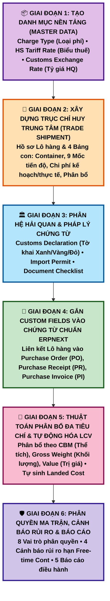
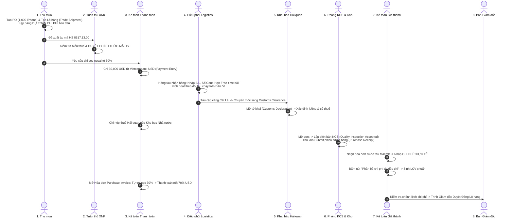

# 🚀 LỘ TRÌNH TRIỂN KHAI KỸ THUẬT & HƯỚNG DẪN THAO TÁC QUẢN TRỊ XUẤT NHẬP KHẨU TRÊN ERPNEXT
*(Implementation Roadmap & End-to-End Operational SOP on ERPNext v15)*

---

## 🧭 PHẦN 1: LỘ TRÌNH XÂY DỰNG & HOÀN THIỆN KỸ THUẬT (6 GIAI ĐOẠN)

Để hiện thực hóa bản thiết kế kiến trúc vào custom app `logistics_wizard` một cách khoa học, không gây lỗi phụ thuộc dữ liệu (dependency errors), toàn bộ quá trình phát triển được chia làm **6 Giai đoạn tuần tự**:

---

### 🔹 GIAI ĐOẠN 1: TẠO CÁC DANH MỤC CẤU HÌNH NỀN TẢNG (MASTER DATA)
* **Mục tiêu:** Tạo các bảng tham chiếu chuẩn trước khi dựng Doctype nghiệp vụ.
* **Các Doctype cần tạo trong Module `Logistics Wizard`:**
  1. **`Charge Type`**: Danh mục loại phí (Cước biển, THC, Bảo hiểm, Thuế...). 
     * Khởi tạo sẵn ~10 loại phí chuẩn kèm quy định: cờ tính vào giá vốn, tiêu chí phân bổ (theo giá trị, theo CBM, theo Gross weight).
  2. **`HS Tariff Rate`**: Biểu thuế xuất nhập khẩu.
     * Quản lý mã HS 8-10 số, mô tả kỹ thuật, thuế suất MFN, thuế ưu đãi FTA (Form E, Form D, EUR.1...).
  3. **`Customs Exchange Rate`**: Bảng lưu tỷ giá hải quan công bố theo tuần áp dụng cho các tờ khai đăng ký trong tuần đó.

---

### 🔹 GIAI ĐOẠN 2: XÂY DỰNG TRỤC CHỈ HUY TRUNG TÂM `TRADE SHIPMENT`
* **Mục tiêu:** Dựng Doctype chính và 4 bảng con để làm "Hồ sơ Lô hàng".
* **Thứ tự thực hiện:**
  1. Tạo 4 Child Table Doctypes (tích chọn `Is Child Table = 1`):
     * `Trade Shipment Milestone` (Bảng 9 mốc kiểm soát tiến độ)
     * `Trade Shipment Container` (Bảng quản lý số cont, chì, hạn Free-time)
     * `Trade Shipment Cost Item` (Bảng dự toán chi phí vs Thực tế)
     * `Trade Shipment Item Allocation` (Bảng phân bổ giá vốn từng mặt hàng)
  2. Tạo Master Doctype `Trade Shipment`:
     * Khai báo các trường Header (Số lô, Nhà cung cấp, Incoterm, B/L, Cảng, Tỷ giá dự toán...).
     * Nhúng 4 bảng con trên vào form.
     * Tích chọn `Track Changes = 1` để lưu vết lịch sử mọi thay đổi dữ liệu.

---

### 🔹 GIAI ĐOẠN 3: XÂY DỰNG PHÂN HỆ HẢI QUAN & PHÁP LÝ CHỨNG TỪ
* **Mục tiêu:** Quản lý tuân thủ pháp luật, tờ khai và bộ chứng từ gốc.
* **Các Doctype cần tạo:**
  1. **`Customs Declaration`**: Quản lý số tờ khai 11 số, phân luồng (Xanh/Vàng/Đỏ), trạng thái thông quan, số thuế nhập khẩu và thuế VAT phải nộp.
  2. **`Import Permit`**: Quản lý giấy phép nhập khẩu, kiểm tra chất lượng chuyên ngành của Bộ TT&TT, Y tế...
  3. **`Document Checklist`**: Bảng kiểm tra danh mục chứng từ cần có (B/L, Invoice, Packing List, C/O...) trước khi tàu cập cảng.

---

### 🔹 GIAI ĐOẠN 4: GẮN CUSTOM FIELDS VÀO CÁC CHỨNG TỪ CHUẨN CỦA ERPNEXT
* **Mục tiêu:** Tạo mối liên kết hữu cơ giữa phân hệ quản trị XNK với lõi kế toán/kho của ERPNext.
* **Các trường cần thêm qua `Customize Form`:**
  * **Trên `Purchase Order`, `Purchase Receipt`, `Purchase Invoice`:**
    * Thêm trường: `trade_shipment` (Link: `Trade Shipment`, Label: `Hồ sơ Lô hàng`) đặt ở đầu form để liên kết mọi chứng từ về một lô.
  * **Trên `Item`:**
    * Thêm trường: `custom_hs_code` (Link: `HS Tariff Rate`)
    * Thêm trường: `unit_cbm` (Float - Thể tích 1 đơn vị sản phẩm)
    * Thêm trường: `technical_description` (Text - Mô tả công dụng kỹ thuật)
  * **Trên `Purchase Order Item`, `Purchase Receipt Item`:**
    * Thêm trường: `hs_code` (tự động fetch từ Item)
    * Thêm trường: `origin_country` (Xuất xứ hàng hóa - VD: China, USA)

---

### 🔹 GIAI ĐOẠN 5: BACKEND LOGIC - THUẬT TOÁN PHÂN BỔ CHI PHÍ ĐA TIÊU CHÍ
* **Mục tiêu:** Tự động hóa hoàn toàn bài toán phân bổ giá vốn chuẩn mực VAS 02 / IAS 2.
* **Logic triển khai (Python Backend trong `apps/logistics_wizard/logistics_wizard/api.py`):**
  1. Viết API `@frappe.whitelist() def allocate_shipment_costs(shipment_name)`:
     * Quét toàn bộ các dòng chi phí thực tế (`actual_amount_vnd`) có đánh dấu `include_in_valuation = 1`.
     * Với mỗi loại phí, kiểm tra tiêu chí phân bổ:
       * **Theo Thể tích/Trọng lượng (Cước tàu, THC):** Tính tỷ trọng CBM hoặc Gross weight của từng mặt hàng trong tổng lô.
       * **Theo Giá trị (Bảo hiểm, Thuế nhập khẩu):** Tính tỷ trọng kim ngạch mua hàng của từng mặt hàng.
     * Ghi kết quả vào bảng `Trade Shipment Item Allocation`.
  2. Tự động sinh phiếu **`Landed Cost Voucher` chuẩn**:
     * Kéo phiếu nhập kho `Purchase Receipt` tương ứng.
     * Điền các dòng chi phí và phân bổ chính xác từng xu vào giá vốn của từng sản phẩm.
     * Bấm Submit LCV bằng code.

---

### 🔹 GIAI ĐOẠN 6: PHÂN QUYỀN, CẢNH BÁO TỰ ĐỘNG & BÁO CÁO ĐIỀU HÀNH
1. **Cấu hình Roles & Workflow:**
   * Tạo các Role: `Compliance Officer` *(Tuân thủ XNK)*, `Logistics Coordinator` *(Điều phối logistics)*, `Customs Specialist` *(Khai báo hải quan)*.
   * Thiết lập Workflow duyệt mã HS và duyệt đóng chi phí lô hàng khi tỷ lệ vượt ngân sách > 10%.
2. **Thiết lập Notifications (Cảnh báo):**
   * Cảnh báo tự động trễ hạn ETA gửi qua Email/System Notification.
   * Cảnh báo trước 3 ngày hết hạn Free-time lưu cont rỗng (tránh tiền phạt bãi).
3. **Xây dựng Báo cáo Quản trị (Script Report):**
   * *Báo cáo 1:* Đối soát Dự toán vs Thực tế theo Lô (tách chênh lệch Giá vs Tỷ giá).
   * *Báo cáo 2:* Lịch sử giá vốn đơn vị và biên lợi nhuận gộp thực tế.
   * *Báo cáo 3:* Tổng giá trị hàng đang đi đường trên biển.

---

## 💼 PHẦN 2: QUY TRÌNH THAO TÁC THỰC CHIẾN CHUẨN 10 BƯỚC TRÊN ERPNEXT

Dưới đây là kịch bản chuẩn cho người vận hành (End-to-End User Operational Flow) áp dụng toàn bộ kiến trúc mới:

---

### BƯỚC 1: LẬP ĐƠN MUA HÀNG & KHỞI TẠO HỒ SƠ LÔ HÀNG (`Trade Shipment`)
1. **Tạo Đơn hàng PO:** Vào [Purchase Order](http://localhost:2828/app/purchase-order) tạo đơn mua 1,000 cái iPhone từ Apple Inc., giá $100/cái = $100,000 USD.
2. **Khởi tạo Lô hàng:** Vào [Trade Shipment](http://localhost:2828/app/trade-shipment) bấm **Add Trade Shipment**:
   * Liên kết PO vừa tạo.
   * Chọn Incoterm: `FOB Shanghai`.
   * **Lập bảng Dự toán chi phí ban đầu (Cost Items):**
     * Cước tàu dự toán: `$2,000 USD` (Tỷ giá 25,400 = `50,800,000 VND`).
     * Phí cảng THC dự toán: `5,000,000 VND`.
     * Thuế nhập khẩu dự toán (0%): `0 VND`.
     * Chi phí thông quan & kéo cont nội địa dự toán: `10,000,000 VND`.
   * Hệ thống tự động ghi nhận: **Tổng chi phí dự toán lô = 65,800,000 VND**.
   * Bấm **Save**.

---

### BƯỚC 2: PHÊ DUYỆT MÃ HS BỞI BỘ PHẬN TUÂN THỦ (COMPLIANCE)
1. Chuyên viên Tuân thủ XNK mở màn hình duyệt mã HS.
2. Kiểm tra mã đề xuất `8517.13.00` đối chiếu với quy chuẩn kỹ thuật của mặt hàng.
3. Bấm nút **Approve HS Code** (Chuyển trạng thái sang `Approved`).
   * *Ý nghĩa quản trị:* Tránh rủi ro bị cơ quan hải quan phạt hành chính và ấn định thuế do áp sai mã HS khi kiểm tra sau thông quan.

---

### BƯỚC 3: CHI TIỀN TẠM ỨNG CỌC 30% NGOẠI TỆ
1. Kế toán mở PO, bấm **Create $\rightarrow$ Payment**.
2. Chọn tài khoản chi: **`Vietcombank USD - CK`**.
3. Điền số tiền cọc: **`$30,000 USD`**.
4. Nhập số lệnh chuyển tiền: `UNC-VCB-001` $\rightarrow$ Bấm **Save** $\rightarrow$ **Submit**.

---

### BƯỚC 4: HÃNG TÀU PHÁT HÀNH VẬN ĐƠN & CẬP NHẬT THEO DÕI HÀNH TRÌNH
1. Mở lại phiếu `Trade Shipment`:
   * Nhập số vận đơn: `Master B/L: MAEU987654321`.
   * Bảng Container: Nhập số cont `MSKU8899221`, loại `40ft HC`, Seal `SEAL-998877`.
   * **Cài đặt ranh giới an toàn (Risk Control):** Nhập số ngày miễn phí lưu bãi: `Free-time Demurrage = 7 ngày`. Hệ thống tự tính ngày chót phải kéo cont ra khỏi cảng.
   * Cập nhật mốc `M04_ETD`: Ngày tàu rời cảng.
   * Cập nhật mốc `M05_ETA`: Ngày tàu dự kiến cập cảng Cát Lái.
2. Bấm nút **Sync AfterShip** để lấy các trạm hải trình và xem trực quan trên bản đồ Leaflet.

---

### BƯỚC 5: TÀU CẬP CẢNG, KHAI BÁO HẢI QUAN & NỘP THUẾ
1. Khi tàu đến phao số 0: Cập nhật mốc thời gian thực tế `M05_ETA` $\rightarrow$ Trạng thái lô tự chuyển sang **`Customs Clearance`**.
2. **Mở Tờ khai:** Vào [Customs Declaration](http://localhost:2828/app/customs-declaration) tạo tờ khai liên kết với Lô hàng:
   * Nhập số tờ khai: `106889922331`.
   * Phân luồng: Chọn `Luồng Vàng` (Kiểm tra hồ sơ hải quan).
   * Hệ thống tự động bốc tỷ giá tính thuế tuần từ `Customs Exchange Rate`.
   * Khai báo tiền thuế nhập khẩu phải nộp: `0 VND`; Tiền thuế VAT 10%: `254,000,000 VND`.
3. Kế toán lập `Payment Entry` chi tiền từ `Vietcombank VND` nộp thuế vào tài khoản Kho bạc Nhà nước.
4. Cán bộ hải quan duyệt thông quan $\rightarrow$ Cập nhật mốc `M07_CUSTOMS_CLEAR: Completed`.

---

### BƯỚC 6: KIỂM ĐỊNH KCS & NHẬP KHO CHÍNH THỨC (`Purchase Receipt`)
1. Xe kéo container từ cảng Cát Lái về đến cửa kho công ty.
2. Bộ phận KCS vào [Quality Inspection](http://localhost:2828/app/quality-inspection) lập biên bản kiểm tra 1,000 chiếc iPhone:
   * Ngoại quan: Nguyên seal, không móp méo.
   * Điện áp sạc: 5.0V (đạt chuẩn 4.8 - 5.2V).
   * Pin: 100%.
   * Đánh giá: **`Accepted`** $\rightarrow$ **Submit**.
3. Thủ kho vào PO bấm **Create $\rightarrow$ Purchase Receipt**:
   * Hệ thống tự nhận diện phiếu KCS đạt chuẩn.
   * Bấm **Save** $\rightarrow$ **Submit**. 1,000 chiếc iPhone chính thức tăng tồn kho tại `Stores - CK`.

---

### BƯỚC 7: TIẾP NHẬN HÓA ĐƠN DỊCH VỤ & PHÂN BỔ GIÁ VỐN THÔNG MINH
1. Nhận hóa đơn cước vận chuyển từ hãng tàu Maersk Line và hóa đơn bến bãi cảng Cát Lái.
2. Mở lại phiếu `Trade Shipment`, cuộn xuống bảng **Dòng chi phí (Cost Items)**:
   * Cập nhật số tiền thực tế: Cước tàu thực tế là `$2,200 USD` (bị đội $200 so với dự toán do phụ phí xăng dầu BAF); Tỷ giá thực tế 25,450.
   * Chi phí thực tế cảng THC: `5,200,000 VND`.
   * Chi phí nâng hạ vận chuyển nội địa: `10,000,000 VND`.
   * Hệ thống tự tính: **Tổng chi phí thực tế = 71,190,000 VND** (Đội ngân sách +5,390,000 VND, tương đương tăng +8.2%).
3. Bấm nút màu tím: 👉 **`Phân bổ chi phí đa tiêu chí (Allocate Landed Costs)`**:
   * Hệ thống tự động phân bổ cước tàu theo thể tích cont, thuế và bảo hiểm theo giá trị hàng.
   * Tự động sinh và Submit phiếu **`Landed Cost Voucher`** chuẩn $\rightarrow$ Giá vốn của 1 chiếc iPhone trên sổ kho tự động nâng từ $100 lên **$102.8 / chiếc**!

---

### BƯỚC 8: HÓA ĐƠN MUA HÀNG & TẤT TOÁN 70% TIỀN HÀNG
1. Vào Purchase Receipt bấm **Create $\rightarrow$ Purchase Invoice**:
   * Tổng tiền: `$100,000 USD`.
   * Cuộn xuống mục **Advance Payments** bấm **Get Advances Paid** $\rightarrow$ Tự động cấn trừ `$30,000 USD` cọc.
   * Số tiền còn nợ: Đúng **`$70,000 USD`**.
   * Bấm **Save** $\rightarrow$ **Submit**.
2. Trên Hóa đơn, bấm **Create $\rightarrow$ Payment**:
   * Chọn tài khoản chi: `Vietcombank USD - CK`.
   * Số tiền chi: Đúng `$70,000 USD`.
   * Bấm **Save** $\rightarrow$ **Submit**. Hóa đơn chuyển trạng thái xanh lá **`Paid`** (Hoàn tất nghĩa vụ với Apple).

---

### BƯỚC 9: ĐỐI SOÁT BIẾN ĐỘNG CHI PHÍ & DUYỆT ĐÓNG LÔ HÀNG (`Close Shipment`)
1. Kế toán giá thành mở lại hồ sơ `Trade Shipment`:
   * Kiểm tra bảng so sánh:
     * Chênh lệch do giá cước dịch vụ tăng: `+5,090,000 VND`.
     * Chênh lệch do tỷ giá USD tăng (+50đ): `+300,000 VND`.
     * Tỷ lệ đội ngân sách: `+8.2%` (Nằm trong hạn mức cho phép < 10%).
2. Kế toán giá thành bấm nút **Request Close Shipment** (Yêu cầu đóng chi phí).
3. Vì tỷ lệ lệch < 10%, hệ thống tự động hoàn tất đóng lô (`cost_status = Closed`).
   *(Nếu tỷ lệ lệch > 10%, hệ thống sẽ tự chuyển trạng thái `Pending Review` và gửi email thông báo bắt buộc Giám đốc ký duyệt giải trình)*.

---

### BƯỚC 10: TRÍCH XUẤT BÁO CÁO PHÂN TÍCH QUẢN TRỊ ĐIỀU HÀNH
1. Vào mục Báo cáo quản trị XNK mở:
   * **Báo cáo Lãi gộp thực tế (Real Gross Profit Report):** Đánh giá chính xác tỷ suất lợi nhuận sau khi đã trừ toàn bộ 71 triệu tiền cước và thuế phí thực tế.
   * **Báo cáo Hiệu quả Forwarder (Logistics Scorecard):** Đánh giá mức độ hoàn thành đúng hạn của hãng tàu Maersk và mức độ chênh lệch giữa báo giá chào thầu so với hóa đơn quyết toán.
2. Toàn bộ hồ sơ pháp lý, chứng từ gốc, số tờ khai, biên bản KCS và lịch sử dòng tiền được lưu trữ trọn đời trong một mã hồ sơ `TS-2026-00001` duy nhất, sẵn sàng phục vụ thanh tra, kiểm toán sau thông quan bất cứ lúc nào!
