# 🌐 BẢN ĐẶC TẢ QUY TRÌNH TÁC NGHIỆP PHÂN VAI TOÀN DIỆN XUẤT NHẬP KHẨU
*(Comprehensive Role-Based Standard Operating Procedures & Modular Workflows on ERPNext v15)*

Tài liệu thiết kế hoàn chỉnh hai luồng nghiệp vụ kinh điển của Doanh nghiệp Thương mại Quốc tế tại Việt Nam:
* **🔵 PHẦN I: LUỒNG NHẬP KHẨU (INBOUND SUPPLY CHAIN & LANDED COST VAS 02)**
* **🟢 PHẦN II: LUỒNG XUẤT KHẨU (OUTBOUND SALES, CONTAINER STUFFING & L/C SETTLEMENT)**

---

# 🔵 PHẦN I: QUY TRÌNH TÁC NGHIỆP LUỒNG NHẬP KHẨU (INBOUND PROCUREMENT)

## 1. TỔNG QUAN DÒNG CHẢY BÀN GIAO GIỮA 6 VỊ TRÍ NHẬP KHẨU (INBOUND HANDSHAKE)

Sơ đồ mô tả dòng bàn giao liên vị trí mức cao giữa 6 bộ phận tác nghiệp. Dòng màu xanh thể hiện tiến trình thuận chiều chuẩn; các đường nét đứt màu đỏ thể hiện các phản hồi trả ngược về khi phát sinh sự cố cần điều chỉnh:

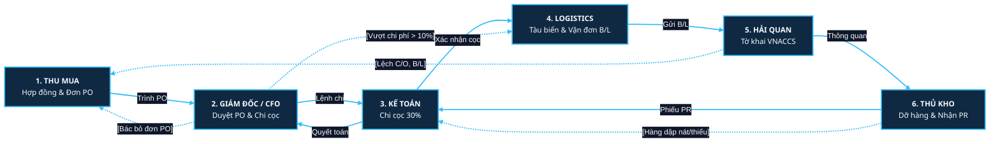

---

## 2. VỊ TRÍ CHUYÊN VIÊN THU MUA (BUYER)

### 2.1. Sơ đồ Luồng Tác nghiệp của Thu Mua

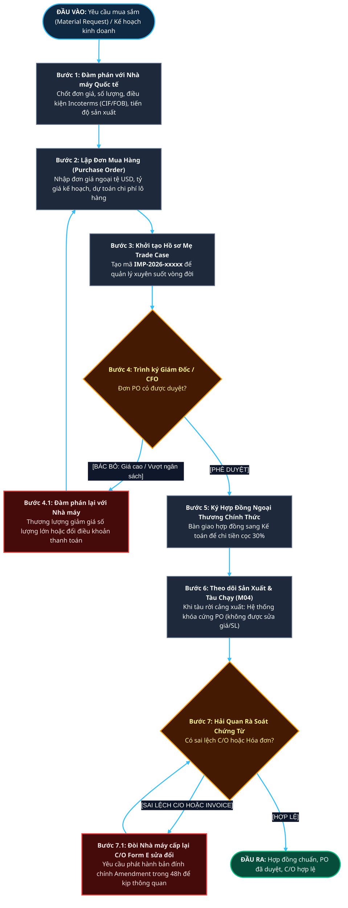

### 2.2. Bảng Đặc tả Nghiệp vụ & Rào chắn Poka-Yoke (Thu Mua)
* **Chứng từ ERPNext tạo ra:** `Material Request`, `Purchase Order` (PO), `Trade Case` (`IMP-.YYYY.-.#####`).
* **Rào chắn 1 (Tolerance Limit):** Hệ thống chặn không cho tạo đơn PO vượt quá hạn mức công nợ tối đa đã cấp cho nhà cung cấp.
* **Rào chắn 2 (Immutable PO at M04):** Ngay khi Chuyến tàu đạt mốc `M04_ETD` (Tàu rời cảng bốc), hệ thống tự động khóa trạng thái đơn PO sang Read-only. Thu mua không được tự ý sửa số lượng hoặc đơn giá để che giấu chênh lệch.
* **Xử lý khi bị trả ngược:** Nếu CFO từ chối hoặc Hải quan báo C/O sai tiêu chí, Thu mua là đầu mối liên hệ nhà máy nước ngoài để đàm phán lại trong vòng 24 - 48h.

---

## 3. VỊ TRÍ BAN GIÁM ĐỐC / GIÁM ĐỐC TÀI CHÍNH (CFO)

### 3.1. Sơ đồ Luồng Tác nghiệp của Giám Đốc / CFO

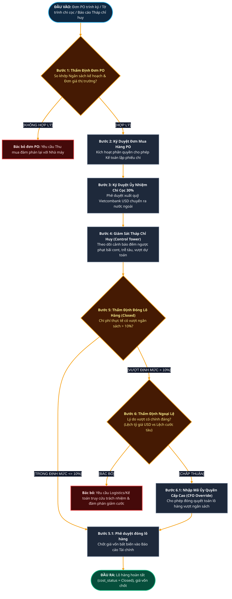

### 3.2. Bảng Đặc tả Nghiệp vụ & Rào chắn Poka-Yoke (CFO)
* **Quyền hạn tối cao:** Duyệt PO giá trị lớn, duyệt chi ngoại tệ, duyệt ngoại lệ chi phí vượt ngân sách $> 10\%$.
* **Rào chắn 1 (Two-Man Rule):** Kế toán viên không thể tự ý chuyển tiền nếu không có chữ ký điện tử hoặc phê duyệt của Giám đốc/CFO.
* **Rào chắn 2 (Stage Gate 3 - Over Budget Lock):** Hệ thống phân quyền cứng: Chỉ Role `CFO` hoặc `System Manager` mới có quyền chuyển `cost_status` sang `Closed` khi lô hàng có `cost_variance_pct > 10%`. Nhân viên cấp dưới hoàn toàn bị khóa chức năng này.

---

## 4. VỊ TRÍ KẾ TOÁN GIÁ VỐN & CÔNG NỢ (ACCOUNTANT)

### 4.1. Sơ đồ Luồng Tác nghiệp của Kế Toán

```mermaid
%%{init: {
  'theme': 'base',
  'themeVariables': {
    'fontFamily': 'Segoe UI, Arial, sans-serif',
    'fontSize': '13px',
    'primaryColor': '#1E293B',
    'primaryTextColor': '#F8FAFC',
    'primaryBorderColor': '#10B981',
    'lineColor': '#10B981',
    'edgeLabelBackground': '#0F172A'
  }
}}%%
flowchart TD
    classDef default fill:#1E293B,stroke:#64748B,stroke-width:1.5px,color:#F8FAFC,font-family:Segoe UI,Arial,sans-serif;
    classDef decision fill:#451A03,stroke:#F59E0B,stroke-width:2px,color:#FEF08A,font-family:Segoe UI,Arial,sans-serif;
    classDef input fill:#0F2942,stroke:#38BDF8,stroke-width:2px,color:#F8FAFC,font-family:Segoe UI,Arial,sans-serif;
    classDef error fill:#450A0A,stroke:#EF4444,stroke-width:2px,color:#FEE2E2,font-family:Segoe UI,Arial,sans-serif;
    classDef success fill:#064E3B,stroke:#10B981,stroke-width:2px,color:#ECFDF5,font-family:Segoe UI,Arial,sans-serif;

    A_IN(["<b>ĐẦU VÀO:</b> PO đã duyệt / Tờ khai thuế / Hóa đơn cước / Phiếu nhập kho PR"]):::input --> A1
    A1["<b>Bước 1: Chi Tạm Ứng Cọc 30% Tiền Hàng</b><br>Lập Payment Entry (Nợ 331 / Có 1121 VCB USD)<br>[Bắt buộc đánh dấu: Is Advance]"] --> A2
    A2["<b>Bước 2: Nộp Thuế Hải Quan Vào Kho Bạc</b><br>Căn cứ Tờ khai VNACCS ➔ Nộp Thuế NK (TK 3333) & Thuế GTGT (TK 33312)"] --> A3
    A3["<b>Bước 3: Thu Thập Hóa Đơn Dịch Vụ Cảng & Forwarder</b><br>Cước biển, phí D/O, nâng hạ, kiểm định, cước bộ. Kiểm tra tính hợp lệ e-Invoice"] --> A4
    A4["<b>Bước 4: Chạy Phân Bổ Giá Vốn (Landed Cost Voucher - LCV)</b><br>• Cước tàu biển: Phân bổ theo Thể tích (CBM)<br>• Thuế & Phí khác: Phân bổ theo Trị giá hàng (Customs Value)"] --> A5
    A5["<b>Bước 5: Bóc Tách Chênh Lệch Dự Toán vs Thực Tế</b><br>Hệ thống tự bóc tách: Lệch Giá cước hãng tàu vs Lệch Tỷ giá USD/VND"] --> A6
    
    A6{"<b>Bước 6: Kho Báo Hàng Hư Hỏng / Mất Mát?</b><br>Có biên bản giám định hiện trường?"}:::decision
    
    A6 -- "[CÓ HÀNG HỎNG]" --> A_CLAIM["<b>Bước 6.1: Hạch toán Phải Thu Bồi Thường (TK 1388)</b><br>Ghi nợ TK 1388 đòi Bảo hiểm/NCC. Không gộp vào giá vốn hàng tồn"]:::error --> A7
    A6 -- "[ĐỦ HÀNG 100%]" --> A7
    
    A7["<b>Bước 7: Quyết Toán Hóa Đơn Mua Hàng (Purchase Invoice - PI)</b><br>ERPNext tự động cấn trừ 30% tiền cọc ➔ Kế toán lập lệnh chi 70% còn lại"] --> A8
    
    A8{"<b>Bước 8: Kiểm Tra Cổng Ngân Sách Lô Hàng</b><br>Tổng chi phí thực tế có vượt > 10% dự toán?"}:::decision
    
    A8 -- "[VƯỢT > 10%]" --> A_REP["<b>Bước 8.1: Lập Tờ Trình Vượt Ngân Sách Trình CFO</b><br>Phân tích rõ nguyên nhân phát sinh chi phí"]:::error
    A_REP --> A9{"<b>CFO Có Duyệt Ngoại Lệ?</b>"}:::decision
    A9 -- "[BÁC BỎ]" --> A_DISPUTE["<b>Bước 8.2: Phối hợp Logistics bắt Forwarder giảm trừ</b><br>Yêu cầu nhà xe/forwarder phát hành hóa đơn điều chỉnh giảm"]:::error --> A4
    A9 -- "[PHÊ DUYỆT]" --> A_CLOSE
    
    A8 -- "[TRONG ĐỊNH MỨC <= 10%]" --> A_CLOSE["<b>Bước 9: Đóng Quyết Toán Lô Hàng (Closed)</b><br>Chốt giá vốn đơn vị vào thẻ kho và sổ cái kế toán"]
    
    A_CLOSE --> A_OUT(["<b>ĐẦU RA:</b> Giá vốn đích thực (Landed Cost) đã chốt, công nợ sạch"]):::success

    linkStyle default stroke:#10B981,stroke-width:2px;
```

### 4.2. Bảng Hạch Toán Kế Toán & Rào Chắn Poka-Yoke (Kế Toán)
* **Bảng tài khoản chuẩn mực (VAS 02 / IAS 2):**
  * Tạm ứng cọc: Nợ TK 331 / Có TK 1121 (USD).
  * Nộp thuế: Nợ TK 3333 (Thuế NK), Nợ TK 33312 (VAT) / Có TK 1121 (VND).
  * Hàng hỏng: Nợ TK 1388 (Phải thu bồi thường) / Có TK 331 hoặc Có TK 156.
  * Phân bổ chi phí: Nợ TK 156 (Tăng giá trị hàng tồn kho) / Có TK 331 (Forwarder/Cảng).
* **Rào chắn 1 (Auto Advance Deduction):** Khi mở Purchase Invoice, hệ thống tự động kiểm tra bảng tạm ứng và cấn trừ đúng số tiền 30% cọc. Kế toán không thể thanh toán 100% tiền hàng lần thứ hai.
* **Rào chắn 2 (VAS 02 Non-Capitalization):** Tiền phạt lưu bãi (Demurrage) và phạt vi phạm hải quan tuyệt đối không được chọn vào LCV, bắt buộc hạch toán vào chi phí quản lý kinh doanh trong kỳ (TK 811 hoặc 642).

---

## 5. VỊ TRÍ ĐIỀU PHỐI LOGISTICS (COORDINATOR)

### 5.1. Sơ đồ Luồng Tác nghiệp của Điều Phối Logistics

```mermaid
%%{init: {
  'theme': 'base',
  'themeVariables': {
    'fontFamily': 'Segoe UI, Arial, sans-serif',
    'fontSize': '13px',
    'primaryColor': '#1E293B',
    'primaryTextColor': '#F8FAFC',
    'primaryBorderColor': '#A855F7',
    'lineColor': '#A855F7',
    'edgeLabelBackground': '#0F172A'
  }
}}%%
flowchart TD
    classDef default fill:#1E293B,stroke:#64748B,stroke-width:1.5px,color:#F8FAFC,font-family:Segoe UI,Arial,sans-serif;
    classDef decision fill:#451A03,stroke:#F59E0B,stroke-width:2px,color:#FEF08A,font-family:Segoe UI,Arial,sans-serif;
    classDef input fill:#0F2942,stroke:#38BDF8,stroke-width:2px,color:#F8FAFC,font-family:Segoe UI,Arial,sans-serif;
    classDef error fill:#450A0A,stroke:#EF4444,stroke-width:2px,color:#FEE2E2,font-family:Segoe UI,Arial,sans-serif;
    classDef success fill:#064E3B,stroke:#10B981,stroke-width:2px,color:#ECFDF5,font-family:Segoe UI,Arial,sans-serif;

    L_IN(["<b>ĐẦU VÀO:</b> Hợp đồng ngoại thương / Thông báo hàng sẵn sàng (Cargo Ready)"]):::input --> L1
    L1["<b>Bước 1: Khởi Tạo Chuyến Tàu Con Trade Shipment</b><br>Mở mã <b>TS-2026-xxxxx</b> liên kết với Trade Case mẹ. Ghi nhận Incoterm, Cảng đi/đến"] --> L2
    L2["<b>Bước 2: Thu Thập Vận Đơn (B/L) & Dữ Liệu Container</b><br>Nhận Master B/L, House B/L, cập nhật danh sách Container (Số Cont, Số Seal, CBM, KGS)"] --> L3
    L3["<b>Bước 3: Theo Dõi 9 Mốc Hành Trình Chuẩn (M01 ➔ M05)</b><br>Giám sát ngày tàu chạy thực tế (M04_ETD) và ngày tàu dự kiến cập cảng (M05_ETA)"] --> L4
    
    L4{"<b>Bước 4: Tàu Có Bị Delay / Rớt Tàu (Rolled)?</b><br>Hãng tàu thông báo trễ lịch?"}:::decision
    
    L4 -- "[TÀU BỊ TRỄ LỊCH]" --> L_REVISE["<b>Bước 4.1: Cập nhật ETA mới & Tính lại Hạn Bãi</b><br>Hệ thống tự cộng thêm ngày dỡ mới vào Demurrage Deadline.<br>Logistics gửi công văn xin hãng tàu nới thêm Free-time"]:::error --> L5
    L4 -- "[ĐÚNG LỊCH TRÌNH]" --> L5
    
    L5["<b>Bước 5: Kích Hoạt Đếm Ngược Miễn Phí Lưu Bãi (Free-Time)</b><br>Tàu cập cảng (M05) ➔ Hệ thống đếm ngược 7 ngày miễn phí bãi cảng Cát Lái/Hải Phòng"] --> L6
    
    L6{"<b>Bước 6: Kiểm Tra Cảnh Báo Sớm Hạn Bãi?</b><br>Còn <= 3 ngày mà chưa xong thủ tục?"}:::decision
    
    L6 -- "[CÒN <= 3 NGÀY]" --> L_WARN["<b>Bắn Cảnh Báo Khẩn Cấp (Alarm):</b><br>Thúc ép Hải quan và Kế toán nộp thuế giải phóng hàng ngay để tránh phạt > 100$/ngày/cont"]:::error --> L7
    L6 -- "[AN TOÀN > 3 NGÀY]" --> L7
    
    L7{"<b>Bước 7: Cổng Stage Gate Rút Hàng:</b><br>Tờ khai Hải quan đã có cờ Cleared (M07)?"}:::decision
    
    L7 -- "[CHƯA THÔNG QUAN]" --> L_BLOCK["<b>CHẶN LẠI:</b> Tuyệt đối không điều xe kéo cont ra khỏi cảng<br>(Tránh xe đầu kéo chờ tại bãi phát sinh phí lưu ca xe)"]:::error
    L_BLOCK --> L7
    
    L7 -- "[ĐÃ THÔNG QUAN]" --> L8["<b>Bước 8: Phát Lệnh Điều Xe Đầu Kéo (Delivery Order)</b><br>Điều xe ra cảng nâng cont và vận chuyển về kho nhà máy an toàn"] --> L_OUT
    
    L_OUT(["<b>ĐẦU RA:</b> Container về tới cổng kho nguyên vẹn số seal"]):::success

    linkStyle default stroke:#A855F7,stroke-width:2px;
```

### 5.2. Bảng Đặc tả Nghiệp vụ & Rào chắn Poka-Yoke (Logistics)
* **Chứng từ ERPNext:** `Trade Shipment` (`TS-.YYYY.-.#####`), `Trade Shipment Container`, `Trade Shipment Milestone`.
* **Công thức tự động hóa:**
  $$\text{Demurrage Deadline} = \text{ETA Actual} + \text{demurrage\_free\_days}$$
  $$\text{Detention Deadline} = \text{ETA Actual} + \text{detention\_free\_days}$$
* **Rào chắn 1 (Stage Gate Trucking Lock):** Hệ thống chặn không cho phép nhân viên logistics in Phiếu điều xe hoặc xác nhận mốc dỡ hàng nếu Tờ khai liên kết chưa đạt `clearance_status = "Cleared"`.
* **Rào chắn 2 (Demurrage 3-Day Early Warning):** Khi `today() >= Demurrage Deadline - 3 ngày`, hệ thống tự động đổi màu dòng container sang ĐỎ và gửi cảnh báo trực tiếp đến Trưởng phòng Logistics.

---

## 6. VỊ TRÍ CHUYÊN VIÊN HẢI QUAN (CUSTOMS)

### 6.1. Sơ đồ Luồng Tác nghiệp của Chuyên Viên Hải Quan

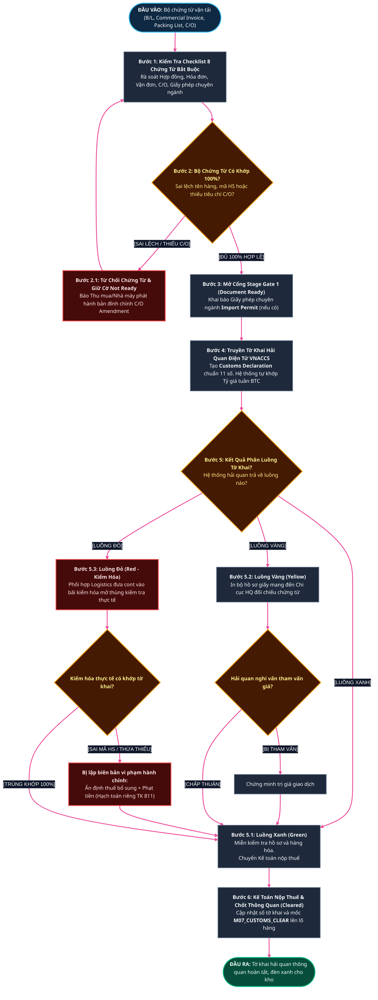

### 6.2. Bảng Đặc tả Nghiệp vụ & Rào chắn Poka-Yoke (Hải Quan)
* **Chứng từ ERPNext:** `Trade Document Item`, `Import Permit`, `Customs Declaration` (`1058249xxxxx`).
* **Rào chắn 1 (11-Digit Strict Validation):** Bắt buộc số tờ khai VNACCS phải đúng 11 chữ số nguyên vẹn. Hệ thống từ chối lưu bản ghi nếu độ dài khác 11.
* **Rào chắn 2 (Customs Rate Auto-Lookup):** Khóa cứng không cho nhân viên tự nhập tỷ giá tính thuế, bắt buộc hàm `fetch_customs_exchange_rate` lấy tự động từ bảng công bố hàng tuần của Bộ Tài chính.

---

## 7. VỊ TRÍ THỦ KHO VẬT LÝ (WAREHOUSE KEEPER)

### 7.1. Sơ đồ Luồng Tác nghiệp của Thủ Kho

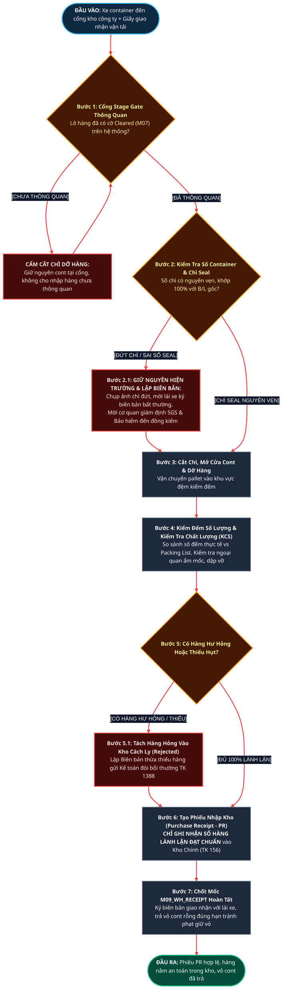

### 7.2. Bảng Đặc tả Nghiệp vụ & Rào chắn Poka-Yoke (Thủ Kho)
* **Chứng từ ERPNext:** `Purchase Receipt` (PR), `Stock Entry`, `Quality Inspection` (KCS).
* **Rào chắn 1 (Blind Financial Protection):** Giao diện của Thủ kho bị ẩn hoàn toàn các cột: Đơn giá mua (Rate), Số tiền (Amount), Chi phí phân bổ (Landed Cost) và Lợi nhuận. Thủ kho chỉ tập trung kiểm soát **Số lượng thực đếm (Accepted Qty)** và **Số lượng từ chối (Rejected Qty)**.
* **Rào chắn 2 (Stage Gate Physical Unload):** Thủ kho bị cấm dỡ hàng nếu hệ thống chưa ghi nhận cờ `Customs Cleared`. Điều này bảo vệ doanh nghiệp tuyệt đối khỏi rủi ro bị cơ quan hải quan xử phạt về hành vi tiêu thụ hàng hóa đang chịu sự giám sát hải quan.

---

# 🟢 PHẦN II: QUY TRÌNH TÁC NGHIỆP PHÂN VAI LUỒNG XUẤT KHẨU (OUTBOUND SALES & GLOBAL TRADE)
*(Standard Operating Procedures for International Sales, Export Logistics & LC Settlement)*

---

## 8. TỔNG QUAN DÒNG CHẢY BÀN GIAO GIỮA 6 VỊ TRÍ XUẤT KHẨU (OUTBOUND HIGH-LEVEL HANDSHAKE)

Sơ đồ mô tả dòng bàn giao liên vị trí mức cao giữa 6 bộ phận tác nghiệp trong luồng Xuất khẩu. Dòng màu xanh lục thể hiện tiến trình thuận chiều chuẩn; các đường nét đứt màu đỏ thể hiện các phản hồi trả ngược về khi phát sinh sự cố cần điều chỉnh:

```mermaid
%%{init: {
  'theme': 'base',
  'themeVariables': {
    'fontFamily': 'Segoe UI, Arial, sans-serif',
    'fontSize': '13px',
    'primaryColor': '#1E293B',
    'primaryTextColor': '#F8FAFC',
    'primaryBorderColor': '#10B981',
    'lineColor': '#10B981',
    'edgeLabelBackground': '#0F172A'
  }
}}%%
flowchart LR
    classDef default fill:#1E293B,stroke:#64748B,stroke-width:1.5px,color:#F8FAFC,font-family:Segoe UI,Arial,sans-serif;
    classDef role fill:#064E3B,stroke:#10B981,stroke-width:2px,color:#ECFDF5,font-family:Segoe UI,Arial,sans-serif;

    R1["<b>1. SALES QUỐC TẾ</b><br>Hợp đồng & Đơn SO"]:::role
    R2["<b>2. GIÁM ĐỐC / CFO</b><br>Duyệt SO & Tín dụng"]:::role
    R3["<b>3. KẾ TOÁN</b><br>Check cọc & Mở L/C"]:::role
    R4["<b>4. THỦ KHO</b><br>Đóng cont & Xuất DN"]:::role
    R5["<b>5. LOGISTICS</b><br>SI/VGM & B/L gốc"]:::role
    R6["<b>6. HẢI QUAN</b><br>Khai VNACCS & C/O"]:::role

    R1 ==>|"Trình SO"| R2
    R2 ==>|"Lệnh bán"| R3
    R3 ==>|"Xác nhận cọc/LC"| R4
    R4 ==>|"Cont đã seal & Phiếu DN"| R5
    R5 ==>|"SI/VGM & Hạ bãi"| R6
    R6 ==>|"Thông quan & C/O gốc"| R5
    R5 ==>|"Gửi Full set B/L"| R3
    R3 ==>|"Xuất trình đòi tiền L/C"| R2

    %% Các đường trả ngược về khi có biến cố
    R2 -. "[Bác bỏ đơn SO]" .-> R1
    R3 -. "[Khách chưa cọc / L/C lỗi]" .-> R1
    R4 -. "[Vỏ cont thủng/ướt từ chối]" .-> R5
    R5 -. "[Trễ giờ Cut-off SI/VGM]" .-> R1
    R6 -. "[Bị Hải quan luồng Đỏ]" .-> R5

    linkStyle default stroke:#10B981,stroke-width:2px;
```

---

## 9. VỊ TRÍ CHUYÊN VIÊN BÁN HÀNG QUỐC TẾ (INTERNATIONAL SALES SPECIALIST)

### 9.1. Sơ đồ Luồng Tác nghiệp của Sales Xuất Khẩu

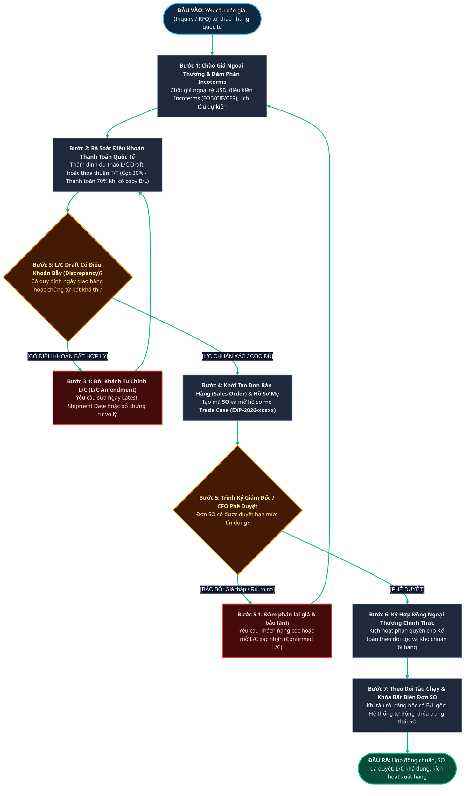

### 9.2. Bảng Đặc tả Nghiệp vụ & Rào chắn Poka-Yoke (Sales Xuất Khẩu)
* **Chứng từ ERPNext:** `Quotation`, `Sales Order` (SO), `Trade Case` (`EXP-.YYYY.-.#####`).
* **Rào chắn 1 (Credit Limit & Payment Term Lock):** Hệ thống khóa cứng không cho phép kích hoạt lệnh xuất hàng nếu khách hàng chưa chuyển đủ 30% tiền cọc hoặc chưa có xác nhận L/C khả dụng từ Ngân hàng.
* **Rào chắn 2 (Immutable SO at Departure):** Ngay khi Chuyến tàu đạt mốc `M04_ETD` (Tàu rời cảng bốc) và đã phát hành Vận đơn gốc B/L, hệ thống tự động khóa đơn bán SO sang trạng thái Read-only, ngăn chặn nhân viên tự ý sửa giá bán hoặc điều khoản Incoterm để trục lợi chênh lệch.

---

## 10. VỊ TRÍ BAN GIÁM ĐỐC / GIÁM ĐỐC TÀI CHÍNH (CFO) - QUẢN TRỊ XUẤT KHẨU

### 10.1. Sơ đồ Luồng Tác nghiệp của CFO

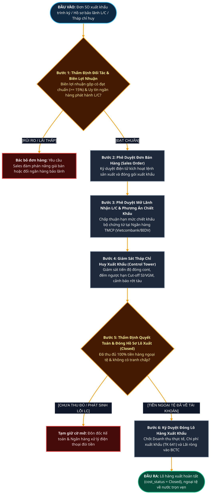

### 10.2. Bảng Đặc tả Nghiệp vụ & Rào chắn Poka-Yoke (CFO Xuất Khẩu)
* **Quyền hạn tối cao:** Duyệt hạn mức tín dụng khách hàng nước ngoài, ký duyệt chiết khấu bộ chứng từ L/C, phê duyệt đóng lô hàng xuất khẩu.
* **Rào chắn 1 (Two-Man Verification for Export Release):** Thủ kho không thể xuất hàng nếu thiếu chữ ký số xác nhận của CFO trên đơn `Sales Order`.
* **Rào chắn 2 (FX Risk Protection):** Hệ thống cảnh báo rủi ro biến động tỷ giá USD/VND vượt quá biên độ dự phòng +/- 2%, kích hoạt khuyến nghị mua Hợp đồng kỳ hạn ngoại tệ (Forward FX Contract) để bảo toàn lợi nhuận.

---

## 11. VỊ TRÍ THỦ KHO XUẤT HÀNG & ĐÓNG CONTAINER (EXPORT WAREHOUSE KEEPER)

### 11.1. Sơ đồ Luồng Tác nghiệp của Thủ Kho Xuất Hàng (Stuffing & Vanning)

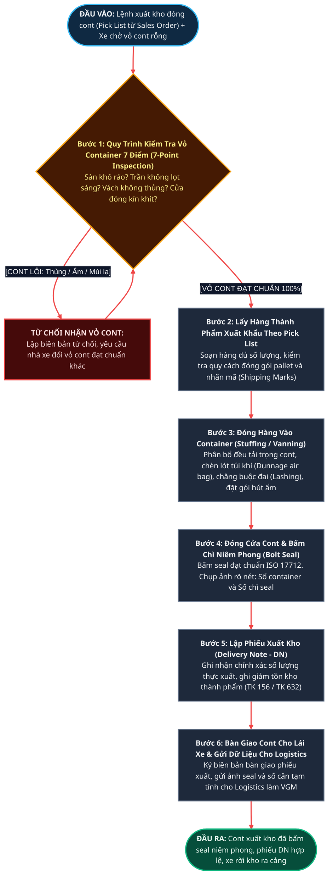

### 11.2. Bảng Đặc tả Nghiệp vụ & Rào chắn Poka-Yoke (Thủ Kho Xuất)
* **Chứng từ ERPNext:** `Pick List`, `Delivery Note` (DN), `Stock Entry`.
* **Rào chắn 1 (7-Point Inspection Compulsory Photo):** Bắt buộc thủ kho phải chụp ảnh 4 góc cont rỗng (đặc biệt là ảnh trần cont từ bên trong đóng kín cửa xem có lỗ lọt sáng hay không) đính kèm vào hệ thống trước khi cho phép lập phiếu `Delivery Note`. Điều này loại bỏ hoàn toàn rủi ro hàng xuất khẩu bị nước mưa ngấm hỏng khi đi biển dài ngày.
* **Rào chắn 2 (Seal Number Integrity Lock):** Số chì niêm phong (Seal No) bắt buộc phải được quét mã barcode hoặc nhập chính xác và khóa bất biến trên phiếu DN. Mọi sai lệch số seal giữa DN và Vận đơn B/L sẽ bị hệ thống báo động đỏ ngay lập tức.

---

## 12. VỊ TRÍ ĐIỀU PHỐI LOGISTICS XUẤT KHẨU (OUTBOUND COORDINATOR)

### 12.1. Sơ đồ Luồng Tác nghiệp của Logistics Xuất Khẩu

```mermaid
%%{init: {
  'theme': 'base',
  'themeVariables': {
    'fontFamily': 'Segoe UI, Arial, sans-serif',
    'fontSize': '13px',
    'primaryColor': '#1E293B',
    'primaryTextColor': '#F8FAFC',
    'primaryBorderColor': '#A855F7',
    'lineColor': '#A855F7',
    'edgeLabelBackground': '#0F172A'
  }
}}%%
flowchart TD
    classDef default fill:#1E293B,stroke:#64748B,stroke-width:1.5px,color:#F8FAFC,font-family:Segoe UI,Arial,sans-serif;
    classDef decision fill:#451A03,stroke:#F59E0B,stroke-width:2px,color:#FEF08A,font-family:Segoe UI,Arial,sans-serif;
    classDef input fill:#0F2942,stroke:#38BDF8,stroke-width:2px,color:#F8FAFC,font-family:Segoe UI,Arial,sans-serif;
    classDef error fill:#450A0A,stroke:#EF4444,stroke-width:2px,color:#FEE2E2,font-family:Segoe UI,Arial,sans-serif;
    classDef success fill:#064E3B,stroke:#10B981,stroke-width:2px,color:#ECFDF5,font-family:Segoe UI,Arial,sans-serif;

    L_IN(["<b>ĐẦU VÀO:</b> Sales Order đã duyệt / Thông báo hàng sẵn sàng xuất (Cargo Ready Date)"]):::input --> L1
    L1["<b>Bước 1: Khởi Tạo Chuyến Tàu Con Trade Shipment (Outbound)</b><br>Mở mã <b>TS-2026-xxxxx</b> liên kết với Trade Case mẹ. Ghi nhận cảng xuất, cảng đích, Incoterms"] --> L2
    
    L2["<b>Bước 2: Tìm Cước & Đặt Chỗ Hãng Tàu (Booking Confirmation)</b><br>Lấy Booking hãng tàu (Maersk, ONE, Cosco...). Ghi nhận 3 mốc Cut-off tử huyệt vào hệ thống"] --> L3
    
    L3["<b>Bước 3: Lấy Lệnh Cấp Vỏ Cont & Điều Xe Đến Kho Đóng Hàng</b><br>Phát hành Empty Release Order, điều xe kéo vỏ cont từ bãi depot về kho nhà máy"] --> L4
    
    L4["<b>Bước 4: Cân Xe Lấy Phiếu Cân Khối Lượng VGM Điện Tử</b><br>Xe chở cont ra trạm cân đạt chuẩn SOLAS ➔ Lấy Phiếu xác nhận khối lượng toàn bộ <b>VGM</b>"] --> L5
    
    L5{"<b>Bước 5: Kiểm Tra Đếm Ngược 3 Giờ Cut-Off Tử Huyệt</b><br>Đã gửi SI & VGM trước giờ đóng sổ hãng tàu?"}:::decision
    
    L5 -- "[CÒN <= 6H CHƯA NỘP]" --> L_WARN["<b>BÁO ĐỘNG ĐỎ CUT-OFF:</b><br>Khẩn cấp truyền SI và VGM qua cổng portal hãng tàu tránh nguy cơ rớt cont (Rolled)"]:::error --> L6
    L5 -- "[ĐÃ TRUYỀN HỢP LỆ]" --> L6["<b>Bước 6: Giám Sát Hạ Bãi Cảng Xuất (Gate-In)</b><br>Theo dõi cont hạ bãi an toàn trước Closing time"] --> L7
    
    L7{"<b>Bước 7: Cổng Stage Gate Hải Quan Xuất:</b><br>Tờ khai hải quan đã có cờ Cleared (M07) để vào sổ tàu?"}:::decision
    
    L7 -- "[CHƯA THÔNG QUAN]" --> L_STOP["<b>HÃNG TÀU TỪ CHỐI XẾP LÊN TÀU:</b><br>Khẩn cấp phối hợp Chuyên viên Hải quan giải quyết thông quan"]:::error --> L7
    L7 -- "[ĐÃ THÔNG QUAN]" --> L8["<b>Bước 8: Cẩu Cont Lên Tàu & Lấy Vận Đơn B/L Gốc</b><br>Tàu khởi hành (M04_ETD) ➔ Hãng tàu phát hành Full set 3/3 Original Clean On Board B/L"] --> L_OUT

    L_OUT(["<b>ĐẦU RA:</b> Hàng đã xếp lên tàu, cầm chắc bộ Vận đơn B/L gốc hợp lệ bàn giao Kế toán"]):::success

    linkStyle default stroke:#A855F7,stroke-width:2px;
```

### 12.2. Bảng Đặc tả Nghiệp vụ & Rào chắn Poka-Yoke (Logistics Xuất)
* **Chứng từ ERPNext:** `Trade Shipment`, `Trade Shipment Container`, `Booking Confirmation`, `VGM Certificate`.
* **Công thức nghiệp vụ bắt buộc:**
  $$\text{VGM} = \text{Tare Weight (Khối lượng vỏ cont rỗng)} + \text{Cargo Net Weight (Khối lượng hàng hóa thực tế)} + \text{Dunnage (Vật liệu chèn lót)}$$
* **Rào chắn 1 (3-Tier Cut-off Auto-Countdown):** Hệ thống thiết lập đồng hồ đếm ngược tự động cho 3 mốc:
  1. *SI Cut-off Deadline:* Hạn chót gửi chi tiết làm B/L.
  2. *VGM Cut-off Deadline:* Hạn chót nộp phiếu cân điện tử SOLAS.
  3. *CY / Gate-in Cut-off Deadline:* Hạn chót xe cont vào bãi cảng xuất.
  Khi `hiện tại >= Cut-off - 6 giờ` mà chưa có xác nhận nộp thành công, hệ thống tự động bắn cảnh báo khẩn cấp đến điện thoại Trưởng phòng Logistics.
* **Rào chắn 2 (Rolled Container Exception Handling):** Nếu cont bị rớt tàu do lỗi hãng tàu hoặc trễ thủ tục, hệ thống tự động sinh phiếu bất thường `Exception Ticket`, tách cont sang chuyến tàu kế tiếp (`TS-2026-xxxxx-B`) mà không làm gián đoạn hồ sơ mẹ `Trade Case`.

---

## 13. VỊ TRÍ CHUYÊN VIÊN HẢI QUAN & C/O XUẤT KHẨU (EXPORT CUSTOMS & COMPLIANCE)

### 13.1. Sơ đồ Luồng Tác nghiệp của Hải Quan Xuất Khẩu

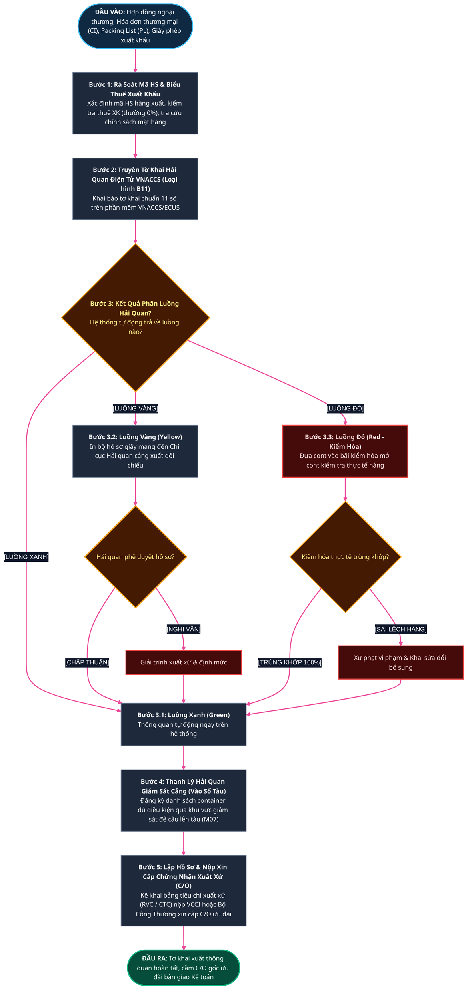

### 13.2. Bảng Đặc tả Nghiệp vụ & Rào chắn Poka-Yoke (Hải Quan Xuất)
* **Chứng từ ERPNext:** `Customs Declaration` (Mã loại hình B11), `Certificate of Origin` (C/O Form B, EUR.1, CPTPP, RCEP, AK...).
* **Rào chắn 1 (Customs Gate-in Clearance Barrier):** Hệ thống không cho phép xác nhận mốc hoàn tất xếp hàng lên tàu (`M04_ETD`) nếu Tờ khai xuất khẩu liên kết chưa đạt trạng thái `clearance_status = "Cleared"`.
* **Rào chắn 2 (Rule of Origin Criterion Validation):** Hệ thống tự động kiểm tra tỷ lệ hàm lượng giá trị khu vực (RVC >= 40%) dựa trên giá trị nguyên liệu nội địa và chi phí nhân công trước khi ký nộp hồ sơ xin cấp C/O ưu đãi, tránh bị cơ quan thẩm quyền bác hồ sơ hoặc bị hải quan nước nhập khẩu truy thu thuế.

---

## 14. VỊ TRÍ KẾ TOÁN THANH TOÁN QUỐC TẾ & DOANH THU (EXPORT ACCOUNTANT)

### 14.1. Sơ đồ Luồng Tác nghiệp của Kế Toán Xuất Khẩu

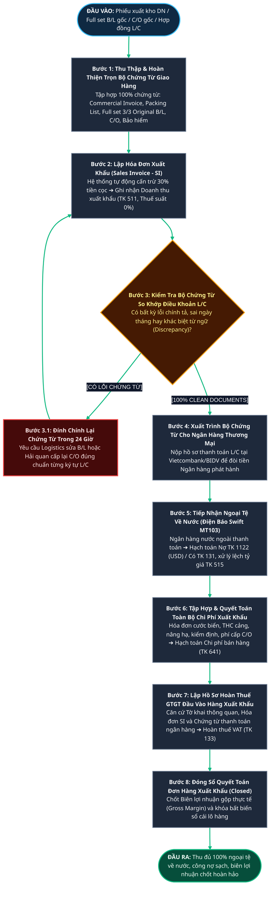

### 14.2. Bảng Hạch Toán Kế Toán Chuẩn Mực & Rào Chắn Poka-Yoke (Kế Toán Xuất)
* **Bảng tài khoản chuẩn mực (Thông tư 200/2014/TT-BTC & VAS):**
  * *Nhận cọc ngoại tệ:* Nợ TK 1122 (VCB USD) / Có TK 131 (Phải thu khách hàng).
  * *Ghi nhận giá vốn xuất kho (khi duyệt DN):* Nợ TK 632 (Giá vốn hàng bán) / Có TK 156 (Thành phẩm/Hàng hóa).
  * *Ghi nhận doanh thu xuất khẩu (khi duyệt SI):* Nợ TK 131 / Có TK 511 (Doanh thu bán hàng, Thuế GTGT 0%).
  * *Thu ngoại tệ còn lại:* Nợ TK 1122 (USD) / Có TK 131; Lãi tỷ giá hạch toán Có TK 515; Lỗ tỷ giá hạch toán Nợ TK 635.
  * *Tập hợp chi phí xuất khẩu (Cước, THC, C/O):* Nợ TK 641 (Chi phí bán hàng) / Có TK 331 (Forwarder/Cảng).
  * *Hoàn thuế VAT đầu vào:* Nợ TK 1121 / Có TK 1331.
* **Rào chắn 1 (Zero Discrepancy L/C Verification):** Trước khi xuất trình cho ngân hàng, hệ thống bắt buộc chạy bộ kiểm tra chéo (Cross-check Automation): Tên người thụ hưởng, số tiền, mô tả hàng hóa, cảng đi/đến trên B/L, Invoice và C/O phải khớp 100% từng chữ so với điều khoản L/C, loại trừ hoàn toàn nguy cơ bị ngân hàng quốc tế từ chối thanh toán.
* **Rào chắn 2 (Bank-Verified Revenue Recognition):** Doanh thu xuất khẩu chỉ được phép ghi nhận chính thức khi đã có xác nhận giao hàng qua biên bản tàu chạy và bộ chứng từ vận tải hợp lệ, ngăn ngừa tuyệt đối hành vi ghi nhận doanh thu khống trước kỳ kế toán.

