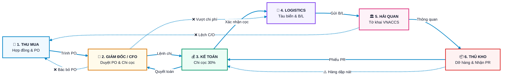
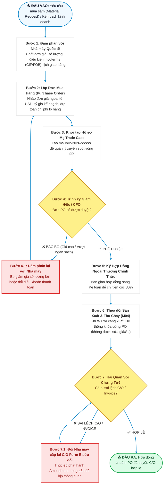
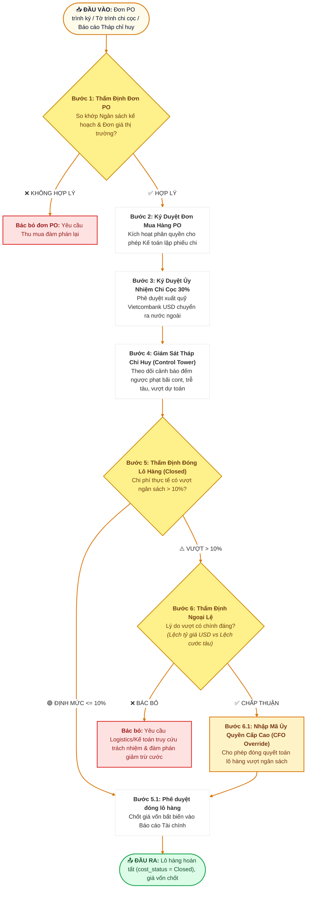
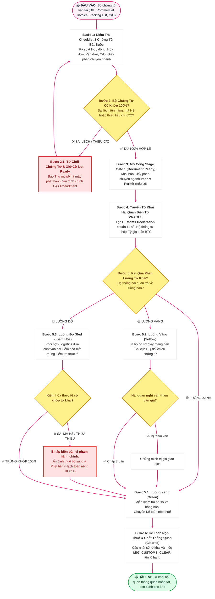
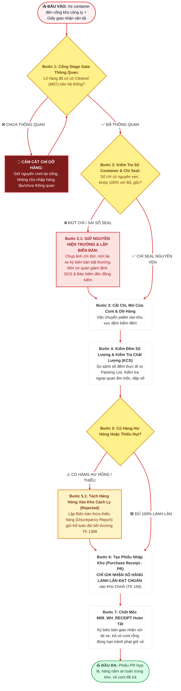

# 📘 QUY TRÌNH TÁC NGHIỆP PHÂN VAI THEO VỊ TRÍ CÔNG VIỆC XUẤT NHẬP KHẨU
*(Role-Based Standard Operating Procedures & Isolated Workflows on ERPNext v15)*

---

## 🧭 1. TỔNG QUAN DÒNG CHẢY BÀN GIAO GIỮA 6 VỊ TRÍ (HIGH-LEVEL HANDSHAKE)

Để không bị rối mắt bởi các đường nối chéo nhau, toàn bộ chuỗi cung ứng được chuẩn hóa thành **Sơ đồ bàn giao liên vị trí mức cao (High-Level Handshake)**. Sau đó, mỗi vị trí công việc có **một chương đặc tả và sơ đồ quy trình độc lập riêng biệt**:

---

## 🛒 MỤC 1: VỊ TRÍ CHUYÊN VIÊN THU MUA (BUYER)

### 1.1. Sơ đồ Luồng Tác nghiệp của Thu Mua

### 1.2. Bảng Đặc tả Nghiệp vụ & Rào chắn Poka-Yoke (Thu Mua)
* **Chứng từ ERPNext tạo ra:** `Material Request`, `Purchase Order` (PO), `Trade Case` (`IMP-.YYYY.-.#####`).
* **Rào chắn 1 (Tolerance Limit):** Hệ thống chặn không cho tạo đơn PO vượt quá hạn mức công nợ tối đa đã cấp cho nhà cung cấp.
* **Rào chắn 2 (Immutable PO at M04):** Ngay khi Chuyến tàu đạt mốc `M04_ETD` (Tàu đã rời cảng bốc), hệ thống tự động khóa trạng thái đơn PO sang Read-only. Thu mua không được tự ý sửa số lượng hoặc đơn giá để che giấu chênh lệch.
* **Xử lý khi bị trả ngược:** Nếu CFO từ chối hoặc Hải quan báo C/O sai tiêu chí, Thu mua là đầu mối duy nhất liên hệ nhà máy nước ngoài để đàm phán lại trong vòng 24 - 48h.

---

## 👑 MỤC 2: VỊ TRÍ BAN GIÁM ĐỐC / GIÁM ĐỐC TÀI CHÍNH (CFO)

### 2.1. Sơ đồ Luồng Tác nghiệp của Giám Đốc / CFO

### 2.2. Bảng Đặc tả Nghiệp vụ & Rào chắn Poka-Yoke (CFO)
* **Quyền hạn tối cao:** Duyệt PO $> 1$ tỷ VND, duyệt chi ngoại tệ, duyệt ngoại lệ chi phí vượt ngân sách $> 10\%$.
* **Rào chắn 1 (Two-Man Rule):** Kế toán viên không thể tự ý chuyển tiền nếu không có chữ ký điện tử / mã OTP của Giám đốc hoặc CFO.
* **Rào chắn 2 (Stage Gate 3 - Over Budget Lock):** Hệ thống phân quyền cứng: Chỉ Role `CFO` hoặc `System Manager` mới có quyền chuyển `cost_status` từ `Pending Review` sang `Closed` khi lô hàng có `cost_variance_pct > 10%`. Nhân viên cấp dưới hoàn toàn bị khóa nút bấm này.

---

## 💰 MỤC 3: VỊ TRÍ KẾ TOÁN GIÁ VỐN & CÔNG NỢ (ACCOUNTANT)

### 3.1. Sơ đồ Luồng Tác nghiệp của Kế Toán

```mermaid
%%{init: {'theme': 'base', 'themeVariables': {'primaryColor': '#FFFFFF', 'lineColor': '#059669'}}}%%
flowchart TD
    A_IN(["📥 <b>ĐẦU VÀO:</b> PO đã duyệt / Tờ khai thuế / Hóa đơn cước / Phiếu nhập kho PR"]) --> A1
    A1["<b>Bước 1: Chi Tạm Ứng Cọc 30% Tiền Hàng</b><br>Lập Payment Entry (Nợ 331 - NCC / Có 1121 - VCB USD). <i>Bắt buộc tích Is Advance</i>"] --> A2
    A2["<b>Bước 2: Nộp Thuế Hải Quan Vào Kho Bạc</b><br>Căn cứ Tờ khai VNACCS ➔ Chi tiền nộp Thuế NK (TK 3333) & Thuế GTGT (TK 33312)"] --> A3
    A3["<b>Bước 3: Thu Thập Hóa Đơn Dịch Vụ Cảng & Forwarder</b><br>Cước biển, phí D/O, nâng hạ, kiểm dịch, cước bộ. Kiểm tra tính hợp lệ e-Invoice"] --> A4
    A4["<b>Bước 4: Chạy Phân Bổ Giá Vốn (Landed Cost Voucher - LCV)</b><br>• Cước tàu biển: Phân bổ theo Thể tích (CBM)<br>• Thuế & Phí khác: Phân bổ theo Trị giá hàng (Customs Value)"] --> A5
    A5["<b>Bước 5: Bóc Tách Chênh Lệch Dự Toán vs Thực Tế</b><br>Hệ thống tự bóc tách: Lệch Giá cước hãng tàu vs Lệch Tỷ giá USD/VND"] --> A6
    
    A6{"<b>Bước 6: Kho Báo Hàng Hư Hỏng / Mất Mát?</b><br>Có biên bản giám định hiện trường?"}
    
    A6 -- "⚠️ CÓ HÀNG HỎNG" --> A_CLAIM["<b>Bước 6.1: Hạch toán Phải Thu Bồi Thường (TK 1388)</b><br>Ghi nợ TK 1388 đòi Bảo hiểm/NCC. <i>Tuyệt đối không gộp vào giá vốn hàng tồn</i>"] --> A7
    A6 -- "🟢 ĐỦ HÀNG" --> A7
    
    A7["<b>Bước 7: Quyết Toán Hóa Đơn Mua Hàng (Purchase Invoice - PI)</b><br>ERPNext tự động cấn trừ 30% tiền cọc ➔ Kế toán lập lệnh chi 70% còn lại"] --> A8
    
    A8{"<b>Bước 8: Kiểm Tra Cổng Ngân Sách Lô Hàng</b><br>Tổng chi phí thực tế có vượt > 10% dự toán?"}
    
    A8 -- "⚠️ VƯỢT > 10%" --> A_REP["<b>Bước 8.1: Lập Tờ Trình Vượt Ngân Sách Trình CFO</b><br>Phân tích rõ nguyên nhân phát sinh chi phí"]
    A_REP --> A9{"<b>CFO Có Duyệt Ngoại Lệ?</b>"}
    A9 -- "❌ BÁC BỎ" --> A_DISPUTE["<b>Bước 8.2: Phối hợp Logistics bắt Forwarder giảm trừ</b><br>Yêu cầu nhà xe/forwarder phát hành hóa đơn điều chỉnh giảm"] --> A4
    A9 -- "✅ PHÊ DUYỆT" --> A_CLOSE
    
    A8 -- "🟢 TRONG ĐỊNH MỨC <= 10%" --> A_CLOSE["<b>Bước 9: Đóng Quyết Toán Lô Hàng (Closed)</b><br>Chốt giá vốn đơn vị vào thẻ kho và sổ cái kế toán"]
    
    A_CLOSE --> A_OUT(["📤 <b>ĐẦU RA:</b> Giá vốn đích thực (Landed Cost) đã chốt, công nợ 0"])

    style A_IN fill:#ECFDF5,stroke:#059669,stroke-width:2px,color:#0F172A
    style A6 fill:#FEF08A,stroke:#CA8A04,stroke-width:2px,color:#713F12
    style A8 fill:#FEF08A,stroke:#CA8A04,stroke-width:2px,color:#713F12
    style A9 fill:#FEF08A,stroke:#CA8A04,stroke-width:2px,color:#713F12
    style A_CLAIM fill:#FEF3C7,stroke:#D97706,stroke-width:2px,color:#78350F
    style A_REP fill:#FEE2E2,stroke:#DC2626,stroke-width:2px,color:#991B1B
    style A_DISPUTE fill:#FEE2E2,stroke:#DC2626,stroke-width:2px,color:#991B1B
    style A_OUT fill:#DCFCE7,stroke:#16A34A,stroke-width:2px,color:#14532D
    linkStyle default stroke:#059669,stroke-width:2px;
```

### 3.2. Bảng Hạch Toán Kế Toán & Rào Chắn Poka-Yoke (Kế Toán)
* **Bảng tài khoản chuẩn mực (VAS 02 / IAS 2):**
  * Tạm ứng cọc: Nợ TK 331 / Có TK 1121 (USD).
  * Nộp thuế: Nợ TK 3333 (Thuế NK), Nợ TK 33312 (VAT) / Có TK 1121 (VND).
  * Hàng hỏng: Nợ TK 1388 (Phải thu bồi thường) / Có TK 331 (Giảm nợ NCC) hoặc Có TK 156.
  * Phân bổ chi phí: Nợ TK 156 (Tăng giá trị hàng tồn kho) / Có TK 331 (Forwarder/Cảng).
* **Rào chắn 1 (Auto Advance Deduction):** Khi mở Purchase Invoice, hệ thống tự động kiểm tra bảng `advances` và cấn trừ đúng số tiền 30% cọc. Kế toán không thể vô tình thanh toán 100% tiền hàng lần thứ hai.
* **Rào chắn 2 (VAS 02 Non-Capitalization):** Tiền phạt lưu bãi (Demurrage) và phạt vi phạm hải quan tuyệt đối không được chọn vào LCV, bắt buộc tống vào chi phí kinh doanh trong kỳ (TK 811 hoặc 642).

---

## 🚢 MỤC 4: VỊ TRÍ ĐIỀU PHỐI LOGISTICS (COORDINATOR)

### 4.1. Sơ đồ Luồng Tác nghiệp của Điều Phối Logistics

```mermaid
%%{init: {'theme': 'base', 'themeVariables': {'primaryColor': '#FFFFFF', 'lineColor': '#7C3AED'}}}%%
flowchart TD
    L_IN(["📥 <b>ĐẦU VÀO:</b> Hợp đồng ngoại thương / Thông báo hàng sẵn sàng (Cargo Ready)"]) --> L1
    L1["<b>Bước 1: Khởi Tạo Chuyến Tàu Con Trade Shipment</b><br>Mở mã <b>TS-2026-xxxxx</b> liên kết với Trade Case mẹ. Ghi nhận Incoterm, Cảng đi/đến"] --> L2
    L2["<b>Bước 2: Thu Thập Vận Đơn (B/L) & Dữ Liệu Container</b><br>Nhận Master B/L, House B/L, cập nhật danh sách Container (Số Cont, Số Seal, CBM, KGS)"] --> L3
    L3["<b>Bước 3: Theo Dõi 9 Mốc Hành Trình Chuẩn (M01 ➔ M05)</b><br>Giám sát ngày tàu chạy thực tế (M04_ETD) và ngày tàu dự kiến cập cảng (M05_ETA)"] --> L4
    
    L4{"<b>Bước 4: Tàu Có Bị Delay / Rớt Tàu (Rolled)?</b><br>Hãng tàu thông báo trễ lịch?"}
    
    L4 -- "⚠️ TÀU BỊ TRỄ" --> L_REVISE["<b>Bước 4.1: Cập nhật ETA mới & Tính lại Hạn Bãi</b><br>Hệ thống tự cộng thêm ngày dỡ mới vào Demurrage Deadline.<br>Logistics gửi công văn xin hãng tàu nới thêm Free-time"] --> L5
    L4 -- "🟢 ĐÚNG LỊCH" --> L5
    
    L5["<b>Bước 5: Kích Hoạt Đếm Ngược Miễn Phí Lưu Bãi (Free-Time)</b><br>Tàu cập cảng (M05) ➔ Hệ thống đếm ngược 7 ngày miễn phí bãi cảng Cát Lái/Hải Phòng"] --> L6
    
    L6{"<b>Bước 6: Kiểm Tra Cảnh Báo Sớm Hạn Bãi?</b><br>Còn <= 3 ngày mà chưa xong thủ tục?"}
    
    L6 -- "🔴 CÒN <= 3 NGÀY" --> L_WARN["<b>Bắn Chuông Báo Động Khẩn Cấp (Alarm):</b><br>Thúc ép Hải quan và Kế toán nộp thuế giải phóng hàng ngay để tránh phạt > 100$/ngày/cont"] --> L7
    L6 -- "🟢 AN TOÀN > 3 NGÀY" --> L7
    
    L7{"<b>Bước 7: Cổng Stage Gate Rút Hàng:</b><br>Tờ khai Hải quan đã có cờ Cleared (M07)?"}
    
    L7 -- "❌ CHƯA THÔNG QUAN" --> L_BLOCK["🚫 <b>CHẶN LẠI:</b> Tuyệt đối không điều xe kéo cont ra khỏi cảng<br><i>(Tránh xe đầu kéo chờ tại bãi phát sinh phí lưu ca xe)</i>"]
    L_BLOCK --> L7
    
    L7 -- "✅ ĐÃ THÔNG QUAN" --> L8["<b>Bước 8: Phát Lệnh Điều Xe Đầu Kéo (Delivery Order)</b><br>Điều xe ra cảng nâng cont và vận chuyển về kho nhà máy an toàn"] --> L_OUT
    
    L_OUT(["📤 <b>ĐẦU RA:</b> Container về tới cổng kho nguyên vẹn số seal"])

    style L_IN fill:#F5F3FF,stroke:#7C3AED,stroke-width:2px,color:#0F172A
    style L4 fill:#FEF08A,stroke:#CA8A04,stroke-width:2px,color:#713F12
    style L6 fill:#FEF08A,stroke:#CA8A04,stroke-width:2px,color:#713F12
    style L7 fill:#FEF08A,stroke:#CA8A04,stroke-width:2px,color:#713F12
    style L_REVISE fill:#FEF3C7,stroke:#D97706,stroke-width:2px,color:#78350F
    style L_WARN fill:#FEE2E2,stroke:#DC2626,stroke-width:2px,color:#991B1B
    style L_BLOCK fill:#7F1D1D,stroke:#F87171,stroke-width:2px,color:#FFFFFF
    style L_OUT fill:#DCFCE7,stroke:#16A34A,stroke-width:2px,color:#14532D
    linkStyle default stroke:#7C3AED,stroke-width:2px;
```

### 4.2. Bảng Đặc tả Nghiệp vụ & Rào chắn Poka-Yoke (Logistics)
* **Chứng từ ERPNext:** `Trade Shipment` (`TS-.YYYY.-.#####`), `Trade Shipment Container`, `Trade Shipment Milestone`.
* **Công thức tự động hóa:**
  $$\text{Demurrage Deadline} = \text{ETA Actual} + \text{demurrage\_free\_days}$$
  $$\text{Detention Deadline} = \text{ETA Actual} + \text{detention\_free\_days}$$
* **Rào chắn 1 (Stage Gate Trucking Lock):** Hệ thống chặn không cho phép nhân viên logistics in Phiếu điều xe hoặc xác nhận mốc dỡ hàng nếu Tờ khai liên kết chưa đạt `clearance_status = "Cleared"`.
* **Rào chắn 2 (Demurrage 3-Day Early Warning):** Khi `today() >= Demurrage Deadline - 3 ngày`, hệ thống tự động đổi màu dòng container sang ĐỎ và bắn email cảnh báo trực tiếp đến Trưởng phòng Logistics.

---

## 🏛️ MỤC 5: VỊ TRÍ CHUYÊN VIÊN HẢI QUAN (CUSTOMS)

### 5.1. Sơ đồ Luồng Tác nghiệp của Chuyên Viên Hải Quan

### 5.2. Bảng Đặc tả Nghiệp vụ & Rào chắn Poka-Yoke (Hải Quan)
* **Chứng từ ERPNext:** `Trade Document Item`, `Import Permit`, `Customs Declaration` (`1058249xxxxx`).
* **Rào chắn 1 (11-Digit Strict Validation):** Bắt buộc số tờ khai VNACCS phải đúng 11 chữ số nguyên vẹn. Hệ thống tự động từ chối lưu bản ghi nếu số ký tự khác 11.
* **Rào chắn 2 (Customs Rate Auto-Lookup):** Khóa cứng không cho nhân viên tự gõ tỷ giá tính thuế, bắt buộc hàm `fetch_customs_exchange_rate` tự động lấy từ bảng công bố hàng tuần của Bộ Tài chính.

---

## 📦 MỤC 6: VỊ TRÍ THỦ KHO VẬT LÝ (WAREHOUSE KEEPER)

### 6.1. Sơ đồ Luồng Tác nghiệp của Thủ Kho

### 6.2. Bảng Đặc tả Nghiệp vụ & Rào chắn Poka-Yoke (Thủ Kho)
* **Chứng từ ERPNext:** `Purchase Receipt` (PR), `Stock Entry`, `Quality Inspection` (KCS).
* **Rào chắn 1 (Blind Financial Protection):** Giao diện của Thủ kho bị ẩn hoàn toàn các cột: Đơn giá mua (Rate), Số tiền (Amount), Chi phí phân bổ (Landed Cost) và Lợi nhuận. Thủ kho chỉ tập trung kiểm soát **Số lượng thực đếm (Accepted Qty)** và **Số lượng từ chối (Rejected Qty)**.
* **Rào chắn 2 (Stage Gate Physical Unload):** Thủ kho bị cấm dỡ hàng nếu hệ thống chưa ghi nhận cờ `Customs Cleared`. Điều này bảo vệ doanh nghiệp tuyệt đối khỏi rủi ro bị cơ quan hải quan xử phạt hình sự về hành vi "Tự ý tiêu thụ hàng hóa đang chịu sự giám sát hải quan".
