# 🌊 SƠ ĐỒ LUỒNG NGHIỆP VỤ PHÂN THEO VAI TRÒ VÀ VỊ TRÍ XUẤT NHẬP KHẨU
*(Role-Based Cross-Functional Business Workflow & Operational Swimlanes on ERPNext v15)*

---

## 🧭 LỜI DẪN KIẾN TRÚC

Nếu **Bản vẽ Kiến trúc Hệ thống (Chương 2)** là bản quy hoạch hạ tầng tổng thể (phân tầng, cơ sở dữ liệu, động cơ chính sách), thì **Sơ đồ Luồng Nghiệp vụ (Role-Based Workflow)** này chính là **"Hành trình phối hợp tác nghiệp liên phòng ban"**.

Sơ đồ mô tả chính xác: **Ai làm việc gì? Vào thời điểm nào? Bằng chứng từ gì? Bị chặn bởi điều kiện nào trước khi bàn giao dữ liệu sang vị trí tiếp theo?**

---

## 🏊‍♂️ SƠ ĐỒ LUỒNG TÁC NGHIỆP PHÂN VAI (SWIMLANE WORKFLOW)

```mermaid
%%{init: {'theme': 'base', 'themeVariables': { 'fontFamily': 'Arial, sans-serif', 'fontSize': '12px'}}}%%
flowchart TD

    %% ==========================================
    %% KHU VỰC 1: THU MUA (BUYER)
    %% ==========================================
    subgraph LANE_BUY["🛒 VAI TRÒ 1: PHÒNG THU MUA (BUYER)"]
        direction TB
        B1["<b>1.1 Tạo Yêu Cầu & Đàm Phán</b><br>Material Request ➔ Hợp đồng ngoại thương (Sales Contract)"]
        B2["<b>1.2 Khởi Tạo Hồ Sơ Mẹ</b><br>Mở <b>Trade Case (IMP-2026-xxxxx)</b> & Đơn mua hàng PO ngoại tệ"]
        B3["<b>1.3 Đề Xuất Mã HS & Incoterms</b><br>Thiết lập CIF/FOB, Dự toán ngân sách Case"]
        B4["<b>1.4 Khóa Bất Biến Đơn Hàng PO</b><br>Khi tàu chạy (M04), khóa đơn giá & số lượng PO"]
        B1 --> B2 --> B3 --> B4
    end

    %% ==========================================
    %% KHU VỰC 2: GIÁM ĐỐC / CFO
    %% ==========================================
    subgraph LANE_CFO["👑 VAI TRÒ 2: BAN GIÁM ĐỐC / CFO"]
        direction TB
        C1{"<b>2.1 Duyệt PO Ngoại Tệ</b><br>Hạn mức ngân sách hợp lệ?"}
        C2["<b>2.2 Ký Duyệt Ủy Nhiệm Chi</b><br>Duyệt chi tạm ứng cọc 30% và thanh toán quốc tế"]
        C3["<b>2.3 Giám Sát Control Tower</b><br>Theo dõi cảnh báo phạt cont, trễ tàu, vượt dự toán"]
        C4{"<b>2.4 Phê Duyệt Vượt Ngân Sách</b><br>Lô hàng phát sinh chi phí vượt > 10%?"}
        C1 -- "✅ Đạt" --> C2
    end

    %% ==========================================
    %% KHU VỰC 3: ĐIỀU PHỐI LOGISTICS
    %% ==========================================
    subgraph LANE_LOG["🚢 VAI TRÒ 3: ĐIỀU PHỐI LOGISTICS"]
        direction TB
        L1["<b>3.1 Tạo Chuyến Tàu Con</b><br>Mở <b>Trade Shipment (TS-2026-xxxxx)</b> gắn vào Trade Case mẹ"]
        L2["<b>3.2 Thu Thập B/L & Booking</b><br>Nhận Master/House B/L, cập nhật số Cont/Seal"]
        L3["<b>3.3 Cập Nhật 9 Mốc Hành Trình</b><br>Theo dõi M01 ➔ M05 (ETD/ETA Cảng đến)"]
        L4["<b>3.4 Kiểm Soát Hạn Free-Time</b><br>Đếm ngược hạn phạt bãi/cont (Demurrage Deadline)"]
        L5["<b>3.5 Điều Xe Kéo Cont Về Kho</b><br>Chỉ kéo cont khi Hải quan đã đóng dấu Thông quan"]
        L1 --> L2 --> L3 --> L4 --> L5
    end

    %% ==========================================
    %% KHU VỰC 4: CHUYÊN VIÊN HẢI QUAN
    %% ==========================================
    subgraph LANE_CUS["🏛️ VAI TRÒ 4: CHUYÊN VIÊN HẢI QUAN (CUSTOMS)"]
        direction TB
        H1["<b>4.1 Kiểm Tra Checklist Chứng Từ</b><br>C/O gốc, Hóa đơn thương mại, Packing list"]
        H2["<b>4.2 Xin Giấy Phép Chuyên Ngành</b><br>Lập <b>Import Permit</b> (Kiểm định thiết bị viễn thông/y tế)"]
        H3["<b>4.3 Khai Báo Hải Quan VNACCS</b><br>Mở <b>Customs Declaration</b> (11 chữ số chuẩn)"]
        H4["<b>4.4 Tự Động Áp Tỷ Giá Tuần BTC</b><br>Tính Thuế NK (0%) & Thuế GTGT (10%)"]
        H5["<b>4.5 Chốt Thông Quan (Cleared)</b><br>Cập nhật mốc M07, bàn giao tờ khai cho Kế toán"]
        H1 --> H2 --> H3 --> H4 --> H5
    end

    %% ==========================================
    %% KHU VỰC 5: THỦ KHO (WAREHOUSE)
    %% ==========================================
    subgraph LANE_WH["📦 VAI TRÒ 5: THỦ KHO (WAREHOUSE)"]
        direction TB
        W1{"<b>5.1 Kiểm Tra Cổng Stage Gate</b><br>Hàng đã được Hải quan Thông quan?"}
        W2["<b>5.2 Tiếp Nhận & Cắt Chì Cont</b><br>Kiểm tra số Seal nguyên vẹn, dỡ hàng vào bãi"]
        W3["<b>5.3 Kiểm Đếm Số Lượng Thực Nhập</b><br>Tạo <b>Purchase Receipt (PR)</b> theo số đếm thực"]
        W4["<b>5.4 Lập Biên Bản Hàng Hỏng/Thiếu</b><br>Tách phần hỏng sang khiếu nại bảo hiểm (TK 1388)"]
        W1 -- "✅ Đã thông quan" --> W2 --> W3 --> W4
    end

    %% ==========================================
    %% KHU VỰC 6: KẾ TOÁN GIÁ VỐN & CÔNG NỢ
    %% ==========================================
    subgraph LANE_ACC["💰 VAI TRÒ 6: KẾ TOÁN GIÁ VỐN & THANH TOÁN (ACCOUNTANT)"]
        direction TB
        A1["<b>6.1 Chi Tạm Ứng Cọc 30%</b><br>Lập Payment Entry cấn trừ tài khoản Vietcombank USD"]
        A2["<b>6.2 Nộp Thuế Hải Quan</b><br>Thanh toán tiền thuế vào Kho bạc Nhà nước theo Tờ khai"]
        A3["<b>6.3 Thu Thập Hóa Đơn Dịch Vụ</b><br>Nhận hóa đơn cước biển, nâng hạ, THC, CIC"]
        A4["<b>6.4 Phân Bổ Giá Vốn (Landed Cost)</b><br>Chạy <b>LCV</b>: cước chia CBM, thuế/phí chia Trị giá"]
        A5["<b>6.5 Bóc Tách Lệch Giá vs Tỷ Giá</b><br>Phân tích biến động chi phí thực tế vs dự toán"]
        A6["<b>6.6 Quyết Toán Hóa Đơn Mua Hàng</b><br>Purchase Invoice: Khấu trừ 30% cọc ➔ Chi 70% còn lại"]
        A7["<b>6.7 Đóng Quyết Toán Lô Hàng</b><br>Chuyển cost_status sang Closed (Chốt giá vốn)"]
        A1 --> A2 --> A3 --> A4 --> A5 --> A6 --> A7
    end

    %% ==========================================
    %% DÒNG LIÊN KẾT PHỐI HỢP GIỮA CÁC VAI TRÒ
    %% ==========================================
    B3 ==>|"Trình ký đơn hàng"| C1
    C2 ==>|"Ủy nhiệm chi cọc"| A1
    B4 ==>|"Chuyển thông tin đợt giao"| L1
    
    L2 ==>|"Gửi bộ chứng từ vận tải"| H1
    H4 ==>|"Báo số thuế cần nộp"| A2
    H5 ==>|"Cờ tín hiệu: Hàng đã thông quan"| W1
    
    L5 ==>|"Kéo cont về tới cửa kho"| W2
    W3 ==>|"Bàn giao phiếu nhập kho PR"| A4
    A3 ==>|"Chi phí thực tế"| A4
    
    A5 ==>|"Kiểm tra định mức vượt ngân sách"| C4
    C4 -- "❌ Vượt > 10% (Chặn đóng)" --> C3
    C4 -- "✅ Ban Giám Đốc Phê duyệt ngoại lệ" --> A7
    
    %% ==========================================
    %% MÀU SẮC ĐỘ TƯƠNG PHẢN CAO THEO TỪNG VAI TRÒ
    %% ==========================================
    style LANE_BUY fill:#0B192C,stroke:#1E3E62,stroke-width:2px,color:#FFFFFF
    style LANE_CFO fill:#1A120B,stroke:#D97706,stroke-width:2px,color:#FFFFFF
    style LANE_LOG fill:#082032,stroke:#00ADB5,stroke-width:2px,color:#FFFFFF
    style LANE_CUS fill:#1C0A35,stroke:#9333EA,stroke-width:2px,color:#FFFFFF
    style LANE_WH fill:#06283D,stroke:#2563EB,stroke-width:2px,color:#FFFFFF
    style LANE_ACC fill:#064E3B,stroke:#10B981,stroke-width:2px,color:#FFFFFF

    style B1 fill:#1E3E62,stroke:#00ADB5,color:#FFFFFF
    style B2 fill:#1E3E62,stroke:#00ADB5,color:#FFFFFF
    style B3 fill:#1E3E62,stroke:#00ADB5,color:#FFFFFF
    style B4 fill:#1E3E62,stroke:#F87171,color:#FFFFFF

    style C1 fill:#B45309,stroke:#FCD34D,color:#FFFFFF
    style C2 fill:#B45309,stroke:#FCD34D,color:#FFFFFF
    style C3 fill:#B45309,stroke:#FCD34D,color:#FFFFFF
    style C4 fill:#991B1B,stroke:#FCA5A5,color:#FFFFFF

    style L1 fill:#0F4C75,stroke:#38BDF8,color:#FFFFFF
    style L2 fill:#0F4C75,stroke:#38BDF8,color:#FFFFFF
    style L3 fill:#0F4C75,stroke:#38BDF8,color:#FFFFFF
    style L4 fill:#B91C1C,stroke:#F87171,color:#FFFFFF
    style L5 fill:#0F4C75,stroke:#38BDF8,color:#FFFFFF

    style H1 fill:#581C87,stroke:#C084FC,color:#FFFFFF
    style H2 fill:#581C87,stroke:#C084FC,color:#FFFFFF
    style H3 fill:#581C87,stroke:#C084FC,color:#FFFFFF
    style H4 fill:#581C87,stroke:#C084FC,color:#FFFFFF
    style H5 fill:#047857,stroke:#34D399,color:#FFFFFF

    style W1 fill:#B45309,stroke:#FCD34D,color:#FFFFFF
    style W2 fill:#1D4ED8,stroke:#60A5FA,color:#FFFFFF
    style W3 fill:#1D4ED8,stroke:#60A5FA,color:#FFFFFF
    style W4 fill:#1D4ED8,stroke:#F87171,color:#FFFFFF

    style A1 fill:#047857,stroke:#34D399,color:#FFFFFF
    style A2 fill:#047857,stroke:#34D399,color:#FFFFFF
    style A3 fill:#047857,stroke:#34D399,color:#FFFFFF
    style A4 fill:#047857,stroke:#34D399,color:#FFFFFF
    style A5 fill:#047857,stroke:#34D399,color:#FFFFFF
    style A6 fill:#047857,stroke:#34D399,color:#FFFFFF
    style A7 fill:#065F46,stroke:#6EE7B7,color:#FFFFFF
```

---

## 📑 BẢNG CHI TIẾT ĐẶC TẢ TÁC NGHIỆP TỪNG VAI TRÒ (RACI BREAKDOWN)

Bảng phân rã chi tiết từng bước, chứng từ ERPNext tương ứng, rào chắn kiểm soát (Poka-Yoke) và liên kết đầu ra:

| Bước | Vai Trò Thực Hiện | Chứng Từ / Thao Tác ERPNext | Mục Tiêu & Dữ Liệu Tạo Ra | 🛡️ Rào Chắn Poka-Yoke & Điểm Kiểm Soát | Bàn Giao Sang Vị Trí Kế Tiếp |
| :-: | :--- | :--- | :--- | :--- | :--- |
| **1** | 🛒 **Thu Mua (Buyer)** | • `Trade Case` (`IMP-2026-xxxxx`) • `Purchase Order` (PO) | • Đàm phán Hợp đồng ngoại thương • Thiết lập điều kiện Incoterms & Ngân sách tối đa | • **Tolerance Lock:** Chặn đặt hàng vượt quá hạn mức tín dụng của NCC | 👑 Giám đốc duyệt PO |
| **2** | 👑 **Giám Đốc / CFO** | • `Purchase Order` (Phê duyệt) • `Payment Entry` (Ký duyệt) | • Ký duyệt chính thức đơn đặt hàng ngoại thương • Cho phép xuất quỹ chi tiền cọc 30% | • **Two-Man Rule:** Mọi PO giá trị trên 1 tỷ bắt buộc phải có chữ ký điện tử CFO | 💰 Kế toán chi cọc 30% |
| **3** | 💰 **Kế Toán (Accountant)** | • `Payment Entry` (Tạm ứng cọc) • Tài khoản: VCB USD (1121) | • Chuyển 30% giá trị hợp đồng cho nhà máy • Ghi nhận nợ tạm ứng NCC (TK 331) | • **Auto Advance Tag:** Buộc phải tick chọn cờ "Is Advance" để tự động cấn trừ về sau | 🚢 Logistics nhận lệnh ship hàng |
| **4** | 🚢 **Logistics Coordinator** | • `Trade Shipment` (`TS-2026-xxxxx`) • `Trade Shipment Container` | • Tạo chuyến tàu con liên kết Trade Case mẹ • Lưu trữ B/L, số container, số seal, tải trọng CBM/KGS | • **Partial Shipment Guard:** Cho phép 1 Case tạo nhiều Shipment mà không vỡ ngân sách | 🏛️ Hải quan rà soát chứng từ |
| **5** | 🏛️ **Hải Quan (Customs)** | • `Trade Document Item` • `Import Permit` | • Kiểm tra Checklist 8 chứng từ bắt buộc • Khai báo giấy phép chuyên ngành (Bộ TTTT/Y tế) | • **Stage Gate 1:** Chưa đủ 100% chứng từ bắt buộc $\rightarrow$ Giữ trạng thái `Not Ready` | 🏛️ Mở tờ khai VNACCS |
| **6** | 🏛️ **Hải Quan (Customs)** | • `Customs Declaration` (`1058249xxxx`) • `Customs Exchange Rate` | • Đăng ký tờ khai điện tử VNACCS chuẩn 11 số • Khớp tự động tỷ giá tuần Bộ Tài chính • Tính Thuế NK và Thuế GTGT hàng nhập khẩu | • **11-Digit Validator:** Chặn mọi chuỗi số tờ khai sai quy cách quốc gia • **Fx-Lock:** Khóa ô nhập tỷ giá thủ công | 💰 Kế toán nộp thuế 📦 Thủ kho chờ tín hiệu |
| **7** | 💰 **Kế Toán (Accountant)** | • `Payment Entry` (Nộp thuế Kho bạc) • Hạch toán: Nợ 33312/3333, Có 1121 VND | • Nộp đầy đủ nghĩa vụ thuế vào Ngân sách Nhà nước • Cập nhật số chứng từ nộp thuế (Giấy nộp tiền) | • **Tax Match:** Tiền nộp thuế phải khớp chính xác đến từng đồng so với Tờ khai | 🏛️ Hải quan chốt thông quan |
| **8** | 🚢 **Logistics Coordinator** | • `Trade Shipment Milestone` (M05, M06, M07) • Cảnh báo Free-time bãi | • Theo dõi ngày tàu cập cảng (M05) • Giám sát đếm ngược hạn miễn phí lưu bãi container • Điều phối xe đầu kéo ra cảng lấy cont | • **Early Alarm:** Hệ thống tự động bắn chuông cảnh báo trước 3 ngày trước khi cont bị phạt lưu bãi | 📦 Thủ kho tiếp nhận cont |
| **9** | 📦 **Thủ Kho (Warehouse)** | • `Purchase Receipt` (Phiếu nhập kho PR) • `Quality Inspection` (KCS) | • Kiểm tra số niêm phong chì (Seal) nguyên vẹn • Kiểm đếm số lượng thực nhập, tạo phiếu PR | • **Stage Gate 2 (Thông quan):** Chặn tạo phiếu PR nếu lô hàng chưa đạt mốc `Customs Cleared` • **Blind Price:** Ẩn toàn bộ đơn giá mua và giá vốn | 💰 Kế toán giá vốn |
| **10** | 💰 **Kế Toán Giá Vốn** | • `Landed Cost Voucher` (LCV) • Thuật toán phân bổ đa tiêu chí | • Tập hợp hóa đơn cước tàu biển, cước bộ, phí cảng • Phân bổ: Cước biển chia theo CBM, Thuế/phí chia theo Trị giá | • **VAS 02 / IAS 2 Invariant:** Cấm tuyệt đối không được phân bổ tiền phạt lưu bãi vào giá vốn | 💰 Kế toán thanh toán & CFO |
| **11** | 💰 **Kế Toán Công Nợ** | • `Purchase Invoice` (Hóa đơn mua hàng) • `Payment Entry` (Thanh toán 70%) | • Khấu trừ tự động 30% tiền cọc đã trả ở Bước 3 • Chi trả 70% giá trị hợp đồng còn lại cho NCC | • **Auto-Deduction:** Không cho phép kế toán thanh toán 100% nếu đã có tiền cọc trước đó | 👑 CFO phê duyệt đóng Case |
| **12** | 👑 **Giám Đốc / CFO** | • `Trade Shipment` (`cost_status = Closed`) • Báo cáo Lãi/Lỗ đích thực (True Margin) | • Kiểm tra chênh lệch chi phí thực tế vs dự toán • Ký phê duyệt đóng lô hàng vĩnh viễn | • **Stage Gate 3 (Over-budget Lock):** Nếu chi phí thực tế vượt dự toán $> 10\%$, nhân viên bị khóa quyền đóng, bắt buộc CFO ký duyệt | 🎉 Hoàn tất vòng đời lô hàng |

---

## 🎯 5 NGUYÊN TẮC BẤT DI BẤT DỊCH TRONG VẬN HÀNH LUỒNG

1. **Một Nguồn Chân Lý Duy Nhất (Single Source of Truth):**
   Mọi phòng ban đều nhìn vào cùng một thực thể `Trade Case` và `Trade Shipment`. Thu mua không dùng Excel riêng, Logistics không dùng Zalo báo lịch tàu, Kế toán không ghi sổ tay.
2. **Ủy Thác & Trách Nhiệm Rõ Ràng (Strict Handshake):**
   Dữ liệu từ bước trước là điều kiện tiên quyết (Prerequisite) của bước sau. Thủ kho không thể tự ý nhập hàng nếu Chuyên viên Hải quan chưa nạp xong số tờ khai thông quan.
3. **Poka-Yoke Ngăn Chặn Gian Lận & Sai Sót:**
   Không tin tưởng vào trí nhớ hay sự cẩn thận của con người; hệ thống lập trình sẵn các chốt chặn (validation) khóa cứng hành vi sai quy trình.
4. **Bóc Tách Rạch Ròi Lệch Giá vs Lệch Tỷ Giá:**
   Khi chi phí vượt ngân sách, hệ thống bóc tách rõ nguyên nhân là do hãng tàu tăng giá cước (trách nhiệm Logistics) hay do đồng USD tăng giá (trách nhiệm thị trường/tài chính).
5. **Đóng Sổ Bất Biến (Immutable Audit Trail):**
   Sau khi CFO ký duyệt `Closed`, toàn bộ dữ liệu giá vốn, tờ khai, chi phí bị đóng băng vĩnh viễn, phục vụ công tác thanh kiểm tra thuế sau 3 đến 5 năm mà không sợ bị sai lệch số liệu.
