# 🌊 SƠ ĐỒ LUỒNG TÁC NGHIỆP PHÂN VAI & CƠ CHẾ VÒNG LẶP TRẢ NGƯỢC (FEEDBACK LOOPS)
*(Role-Based Interactive Business Workflow with Explicit Backward Loops, Decision Logic & Exception Handling)*

---

## 🧭 1. TỔNG QUAN VỀ DÒNG CHẢY NGHIỆP VỤ LIÊN PHÒNG BAN

Quy trình quản trị ngoại thương và logistics thực tế **tuyệt đối không phải là một đường xuôi thẳng một chiều**. Ở mỗi vị trí, nhân sự liên tục phải đối mặt với các chốt chặn điều kiện (Checkpoints) và các tình huống phát sinh ngoại lệ:
* Nếu dữ liệu hoặc chứng từ không đạt chuẩn $\rightarrow$ **Hệ thống bắt buộc phải có đường TRẢ NGƯỢC VỀ (Backward Return Loop)** để vị trí trước đó đàm phán lại hoặc sửa đổi, không cho phép "nhắm mắt cho qua".
* Màu sắc trong sơ đồ được thiết kế theo chuẩn **High-Contrast Technical Blueprint (Nền sáng tương phản cao)**:
  * 🔵 **Đường màu Xanh Dương (Solid Blue `==>`):** Dòng tác nghiệp thuận chiều (Forward Happy Path).
  * 🔴 **Đường nét đứt màu Đỏ (Dashed Red `-.->`):** Dòng **TRẢ NGƯỢC VỀ (Backward Loops / Rejections)** khi phát sinh sự cố, yêu cầu sửa đổi hoặc khiếu nại.
  * 🟡 **Hình Thoi Vàng (Decision Diamonds):** Chốt kiểm tra điều kiện (Stage Gate / Kiểm toán nghiệp vụ).

---

## 🗺️ 2. SƠ ĐỒ LUỒNG PHÂN THEO 6 VAI TRÒ (SWIMLANES VỚI ĐƯỜNG TRẢ NGƯỢC VỀ)

```mermaid
%%{init: {
  'theme': 'base',
  'themeVariables': {
    'primaryColor': '#FFFFFF',
    'primaryTextColor': '#0F172A',
    'primaryBorderColor': '#0284C7',
    'lineColor': '#0284C7',
    'secondaryColor': '#F8FAFC',
    'tertiaryColor': '#F1F5F9',
    'edgeLabelBackground':'#FFFFFF',
    'fontFamily': 'Segoe UI, Arial, sans-serif',
    'fontSize': '12px'
  }
}}%%
flowchart TD

    %% ==========================================
    %% VAI TRÒ 1: THU MUA (BUYER)
    %% ==========================================
    subgraph VAI_TRO_1["🛒 1. PHÒNG THU MUA (BUYER)"]
        direction TB
        B_START["<b>B1. Đàm Phán & Dự Thảo Hợp Đồng</b><br>Material Request ➔ Dự thảo PO & Incoterm"]
        B_PO["<b>B2. Lập Đơn Mua Hàng PO (USD)</b><br>Thiết lập giá trị hợp đồng & ngân sách dự toán"]
        B_CASE["<b>B3. Khởi Tạo Trade Case Mẹ</b><br>Mã <b>IMP-2026-xxxxx</b> (Quản lý hồ sơ thương mại)"]
        B_LOCK["<b>B4. Khóa Bất Biến Đơn PO</b><br>Khi tàu chạy (mốc M04), khóa đơn giá & số lượng"]
        
        B_REVISE["<b>B_FIX1. Đàm Phán Lại Điều Khoản</b><br>Đàm phán lại giá/Incoterms với Nhà máy quốc tế"]
        B_AMEND["<b>B_FIX2. Đòi C/O & Invoice Sửa Đổi</b><br>Yêu cầu Nhà máy cấp lại C/O Form E / Bill sửa đổi"]
        
        B_START --> B_PO
        B_PO --> B_CASE
        B_CASE --> B_LOCK
    end

    %% ==========================================
    %% VAI TRÒ 2: BAN GIÁM ĐỐC / CFO
    %% ==========================================
    subgraph VAI_TRO_2["👑 2. BAN GIÁM ĐỐC / CFO"]
        direction TB
        CFO_CHECK{"<b>C1. Phê Duyệt Đơn PO?</b><br>Đơn giá & Ngân sách hợp lệ?"}
        CFO_DEP["<b>C2. Ký Duyệt Chi Tạm Ứng Cọc</b><br>Ủy quyền Kế toán xuất quỹ 30%"]
        CFO_GATE{"<b>C3. Duyệt Chi Phí Vượt > 10%?</b><br>Phát sinh ngoại lệ có lý do hợp lý?"}
        CFO_REJECT["<b>C_REJECT. Bác Bỏ Ngoại Lệ</b><br>Không duyệt đóng lô ➔ Bắt truy thu chi phí"]
        CFO_OK["<b>C4. Phê Duyệt Đóng Lô Hàng</b><br>Ký đóng quyết toán (cost_status = Closed)"]
        
        CFO_CHECK -- "✅ Duyệt PO" --> CFO_DEP
        CFO_GATE -- "✅ Đồng ý ngoại lệ" --> CFO_OK
        CFO_GATE -- "❌ Bác bỏ" --> CFO_REJECT
    end

    %% ==========================================
    %% VAI TRÒ 3: KẾ TOÁN (ACCOUNTANT)
    %% ==========================================
    subgraph VAI_TRO_3["💰 3. KẾ TOÁN GIÁ VỐN & THANH TOÁN (ACCOUNTANT)"]
        direction TB
        A_DEP["<b>A1. Chi Tạm Ứng Cọc 30%</b><br>Payment Entry từ VCB USD <i>(Đánh cờ Is Advance)</i>"]
        A_TAX["<b>A2. Nộp Thuế Hải Quan</b><br>Nộp Thuế NK + VAT vào Kho bạc Nhà nước"]
        A_LCV["<b>A3. Phân Bổ Landed Cost (LCV)</b><br>Cước tàu chia CBM, phí khác chia Trị giá"]
        A_VAR["<b>A4. Bóc Tách Chênh Lệch</b><br>Tách Lệch Giá cước vs Lệch Tỷ giá USD"]
        A_PINV["<b>A5. Hóa Đơn Mua Hàng (PI)</b><br>Tự động cấn trừ 30% cọc ➔ Chi 70% còn lại"]
        A_CLAIM["<b>A_CLAIM. Đòi Bồi Thường (TK 1388)</b><br>Hạch toán bồi thường hàng hỏng từ Bảo hiểm/NCC"]
        
        A_DEP --> A_TAX --> A_LCV --> A_VAR --> A_PINV
    end

    %% ==========================================
    %% VAI TRÒ 4: ĐIỀU PHỐI LOGISTICS
    %% ==========================================
    subgraph VAI_TRO_4["🚢 4. ĐIỀU PHỐI LOGISTICS"]
        direction TB
        L_SHP["<b>L1. Mở Chuyến Tàu Con</b><br>Tạo <b>Trade Shipment (TS-2026-xxxxx)</b>"]
        L_BOOK["<b>L2. Thu Thập B/L & Theo Dõi Tàu</b><br>Kiểm tra lịch ETD, ETA, số Cont, số Seal"]
        L_DELAY{"<b>L3. Tàu Trễ / Rớt Tàu?</b><br>Có bị biến động lịch trình?"}
        L_WAIVER["<b>L_FIX. Xin Nới Free-Time Bãi</b><br>Gửi công văn xin hãng tàu miễn phạt Demurrage"]
        L_TRUCK["<b>L4. Điều Phối Xe Kéo Cont</b><br>Chỉ phát lệnh kéo cont khi ĐÃ THÔNG QUAN"]
        L_RENEG["<b>L_DISPUTE. Tranh Chấp Cước Phí</b><br>Đàm phán giảm trừ phí phụ thu / Phạt nhà xe"]
        
        L_SHP --> L_BOOK --> L_DELAY
        L_DELAY -- "🟢 Đúng lịch" --> L_TRUCK
        L_DELAY -- "⚠️ Trễ tàu" --> L_WAIVER --> L_TRUCK
    end

    %% ==========================================
    %% VAI TRÒ 5: CHUYÊN VIÊN HẢI QUAN (CUSTOMS)
    %% ==========================================
    subgraph VAI_TRO_5["🏛️ 5. CHUYÊN VIÊN HẢI QUAN (CUSTOMS)"]
        direction TB
        H_DOC{"<b>H1. Soi Chiếu Bộ Chứng Từ?</b><br>C/O gốc, Hóa đơn, Packing List có khớp?"}
        H_VNACCS["<b>H2. Truyền Tờ Khai VNACCS</b><br>Đăng ký tờ khai 11 số, tự khớp Tỷ giá tuần BTC"]
        H_ROUTE{"<b>H3. Kết Quả Phân Luồng?</b><br>Xanh / Vàng / Đỏ?"}
        
        H_GREEN["<b>H_XANH. Luồng Xanh</b><br>Thông quan tự động"]
        H_YELLOW["<b>H_VANG. Luồng Vàng</b><br>Nộp hồ sơ giấy kiểm tra"]
        H_RED["<b>H_DO. Luồng Đỏ</b><br>Mở cont kiểm hóa thực tế"]
        
        H_CHECK{"<b>H4. Kiểm Hóa Khớp Hàng?</b><br>Có sai mã HS hoặc thừa thiếu?"}
        H_FINE["<b>H_FINE. Biên Bản Xử Phạt</b><br>Phạt hành chính ➔ Chuyển Kế toán nộp phạt"]
        H_CLEAR["<b>H5. Chốt Thông Quan Hoàn Tất</b><br>Cập nhật mốc M07 (Customs Cleared)"]
        
        H_VNACCS --> H_ROUTE
        H_ROUTE -- "Luồng Xanh" --> H_GREEN --> H_CLEAR
        H_ROUTE -- "Luồng Vàng" --> H_YELLOW --> H_CLEAR
        H_ROUTE -- "Luồng Đỏ" --> H_RED --> H_CHECK
        H_CHECK -- "✅ Trùng khớp" --> H_CLEAR
        H_CHECK -- "❌ Sai lệch" --> H_FINE --> H_CLEAR
    end

    %% ==========================================
    %% VAI TRÒ 6: THỦ KHO (WAREHOUSE)
    %% ==========================================
    subgraph VAI_TRO_6["📦 6. THỦ KHO (WAREHOUSE)"]
        direction TB
        W_GATE{"<b>W1. Cổng Stage Gate Kho:</b><br>Đã có cờ Thông Quan M07?"}
        W_SEAL{"<b>W2. Kiểm Tra Chì Seal Cont?</b><br>Chì có nguyên vẹn, khớp B/L?"}
        W_SURVEY["<b>W_SURVEY. Lập Biên Bản Hiện Trường</b><br>Mời Giám định SGS & Bảo hiểm đồng kiểm"]
        W_COUNT["<b>W3. Cắt Chì & Đếm Hàng Thực Tế</b><br>So sánh số đếm vs Packing List"]
        W_CHECK{"<b>W4. Hàng Có Hỏng / Thiếu?</b><br>Có kiện bị móp méo, rách vỡ?"}
        W_QUARANTINE["<b>W_ISOLATE. Kho Cách Ly (Rejected)</b><br>Cách ly hàng hỏng, không cho nhập kho"]
        W_PR["<b>W5. Lập Phiếu Nhập Kho (PR)</b><br>CHỈ GHI NHẬN HÀNG LÀNH LẶN (TK 156)"]
        
        W_COUNT --> W_CHECK
        W_CHECK -- "🟢 Đủ 100%" --> W_PR
        W_CHECK -- "⚠️ Có hỏng" --> W_QUARANTINE --> W_PR
    end

    %% =========================================================================
    %% CÁC ĐƯỜNG KẾT NỐI LIÊN PHÒNG BAN & CÁC VÒNG LẶP TRẢ NGƯỢC VỀ (FEEDBACK LOOPS)
    %% =========================================================================

    %% 1. Luồng Thu Mua sang Giám Đốc
    B_PO ==>|"1. Trình ký đơn PO"| CFO_CHECK

    %% 🔴 VÒNG LẶP 1: Giám đốc Bác bỏ PO -> Trả ngược về Thu mua
    CFO_CHECK -. "❌ <b>[VÒNG LẶP 1]</b> Bác bỏ PO: Vượt định mức giá" .-> B_REVISE
    B_REVISE ==>|"Trình lại PO đã sửa"| B_PO

    %% 2. Giám đốc duyệt -> Kế toán chi cọc & Logistics mở chuyến
    CFO_DEP ==>|"2. Lệnh chi tiền cọc"| A_DEP
    B_CASE ==>|"3. Bàn giao hợp đồng"| L_SHP

    %% 3. Logistics gửi chứng từ sang Hải quan
    L_BOOK ==>|"4. Gửi bộ B/L & Invoice"| H_DOC

    %% 🔴 VÒNG LẶP 2: Hải quan phát hiện sai chứng từ -> Trả ngược về Thu mua
    H_DOC -. "❌ <b>[VÒNG LẶP 2]</b> Sai lệch Invoice / Thiếu C/O" .-> B_AMEND
    B_AMEND -. "Cấp lại C/O & Invoice mới" .-> H_DOC
    H_DOC -- "✅ Đủ chứng từ hợp lệ" --> H_VNACCS

    %% 4. Tờ khai thuế -> Kế toán nộp thuế
    H_VNACCS ==>|"5. Thông báo số thuế cần nộp"| A_TAX
    A_TAX ==>|"6. Giấy nộp tiền Kho bạc"| H_CLEAR

    %% 5. Thông quan -> Mở cổng kéo hàng về kho
    H_CLEAR ==>|"7. Đèn xanh Thông Quan (M07)"| W_GATE
    W_GATE -- "❌ Chưa thông quan (Chặn lại)" --> STOP_KHO["🚫 CẤM DỠ HÀNG"]
    W_GATE -- "✅ Đã thông quan" --> L_TRUCK
    L_TRUCK ==>|"8. Kéo cont về tới cửa kho"| W_SEAL

    %% 🔴 VÒNG LẶP 3: Chì Seal bị đứt / đục phá -> Giữ hiện trường mời bảo hiểm
    W_SEAL -. "❌ <b>[VÒNG LẶP 3]</b> Đứt chì Seal / Sai số chì" .-> W_SURVEY
    W_SURVEY ==>|"Biên bản giám định tổn thất"| A_CLAIM
    W_SEAL -- "✅ Seal nguyên vẹn" --> W_COUNT

    %% 🔴 VÒNG LẶP 4: Hàng hỏng / thiếu hụt -> Chuyển Kế toán đòi bồi thường bảo hiểm
    W_QUARANTINE -. "⚠️ <b>[VÒNG LẶP 4]</b> Báo cáo hàng dập nát/thiếu" .-> A_CLAIM

    %% 6. Phiếu nhập kho PR chuyển Kế toán tính giá vốn
    W_PR ==>|"9. Phiếu PR hàng lành lặn"| A_LCV

    %% 7. Kế toán kiểm tra ngân sách
    A_VAR ==>|"10. So sánh Thực tế vs Dự toán"| CFO_GATE

    %% 🔴 VÒNG LẶP 5: Vượt ngân sách > 10% nhưng CFO Bác bỏ ngoại lệ -> Trả ngược về Logistics
    CFO_REJECT -. "❌ <b>[VÒNG LẶP 5]</b> Bác bỏ vượt chi phí: Bắt đàm phán lại" .-> L_RENEG
    L_RENEG -. "Giảm trừ hóa đơn dịch vụ" .-> A_LCV

    %% Hoàn tất
    CFO_OK ==>|"11. Chốt giá vốn vĩnh viễn"| FINISHED["🏁 HOÀN TẤT LÔ HÀNG (CLOSED)"]

    %% =========================================================================
    %% STYLING NỀN SÁNG TƯƠNG PHẢN CAO VÀ ĐƯỜNG NỐI RÕ NÉT (KHÔNG BỊ TỐI)
    %% =========================================================================
    style VAI_TRO_1 fill:#F0F9FF,stroke:#0284C7,stroke-width:2px,color:#0F172A
    style VAI_TRO_2 fill:#FFFBEB,stroke:#D97706,stroke-width:2px,color:#0F172A
    style VAI_TRO_3 fill:#ECFDF5,stroke:#059669,stroke-width:2px,color:#0F172A
    style VAI_TRO_4 fill:#F5F3FF,stroke:#7C3AED,stroke-width:2px,color:#0F172A
    style VAI_TRO_5 fill:#FDF2F8,stroke:#DB2777,stroke-width:2px,color:#0F172A
    style VAI_TRO_6 fill:#FEF2F2,stroke:#DC2626,stroke-width:2px,color:#0F172A

    %% Chốt quyết định
    style CFO_CHECK fill:#FEF08A,stroke:#CA8A04,stroke-width:2px,color:#713F12
    style CFO_GATE fill:#FEF08A,stroke:#CA8A04,stroke-width:2px,color:#713F12
    style L_DELAY fill:#FEF08A,stroke:#CA8A04,stroke-width:2px,color:#713F12
    style H_DOC fill:#FEF08A,stroke:#CA8A04,stroke-width:2px,color:#713F12
    style H_ROUTE fill:#FEF08A,stroke:#CA8A04,stroke-width:2px,color:#713F12
    style H_CHECK fill:#FEF08A,stroke:#CA8A04,stroke-width:2px,color:#713F12
    style W_GATE fill:#FEF08A,stroke:#CA8A04,stroke-width:2px,color:#713F12
    style W_SEAL fill:#FEF08A,stroke:#CA8A04,stroke-width:2px,color:#713F12
    style W_CHECK fill:#FEF08A,stroke:#CA8A04,stroke-width:2px,color:#713F12

    %% Nút xử lý ngoại lệ / trả ngược về (Màu Đỏ nổi bật)
    style B_REVISE fill:#FEE2E2,stroke:#DC2626,stroke-width:2px,color:#991B1B
    style B_AMEND fill:#FEE2E2,stroke:#DC2626,stroke-width:2px,color:#991B1B
    style CFO_REJECT fill:#FEE2E2,stroke:#DC2626,stroke-width:2px,color:#991B1B
    style L_RENEG fill:#FEE2E2,stroke:#DC2626,stroke-width:2px,color:#991B1B
    style W_SURVEY fill:#FEE2E2,stroke:#DC2626,stroke-width:2px,color:#991B1B
    style W_QUARANTINE fill:#FEE2E2,stroke:#DC2626,stroke-width:2px,color:#991B1B
    style STOP_KHO fill:#7F1D1D,stroke:#F87171,stroke-width:2px,color:#FFFFFF
    style H_FINE fill:#FEE2E2,stroke:#DC2626,stroke-width:2px,color:#991B1B

    %% Hoàn tất
    style FINISHED fill:#DCFCE7,stroke:#16A34A,stroke-width:3px,color:#14532D

    %% ĐƯỜNG NỐI: Đảm bảo đường nối Xanh và Đỏ nổi bật 100% trên nền sáng
    linkStyle default stroke:#0284C7,stroke-width:2px;
```

---

## 🔬 3. ĐẶC TẢ CHI TIẾT 5 VÒNG LẶP TRẢ NGƯỢC VỀ (BACKWARD REVISION LOOPS)

Phân tích sâu bản chất kinh tế, lý do trả ngược, vai trò chịu trách nhiệm và hành động khắc phục tại từng vòng lặp:

### 🔄 VÒNG LẶP 1: Giám Đốc / CFO Bác Bỏ Đơn Hàng PO $\rightarrow$ Trả Ngược Về Thu Mua
* **Nguyên nhân kích hoạt:**
  * Đơn giá đàm phán cao hơn mức trần chỉ tiêu của Hội đồng Quản trị.
  * Điều kiện Incoterms quá rủi ro (Ví dụ: Nhà cung cấp mới nhưng áp dụng FOB Cảng bốc, chưa rõ năng lực thuê tàu).
  * Vượt hạn mức ngân sách quý của phòng Thu mua.
* **Luồng trả ngược:** Mũi tên từ `C1 (CFO)` quay ngược về `B_FIX1 (Thu Mua)`.
* **Hành động xử lý bắt buộc:**
  1. Phòng Thu mua mở lại thương lượng với nhà máy: Ép giảm giá số lượng lớn, yêu cầu hỗ trợ cước biển, hoặc chuyển sang điều kiện thanh toán an toàn hơn (L/C thay vì T/T trả trước).
  2. Cập nhật lại số liệu trên Đơn mua hàng PO nháp (Draft PO).
  3. Trình ký lại vòng 2 lên Ban Giám Đốc.

---

### 🔄 VÒNG LẶP 2: Hải Quan Phát Hiện Sai Lệch Chứng Từ $\rightarrow$ Trả Ngược Về Thu Mua & NCC
* **Nguyên nhân kích hoạt:**
  * Tên mặt hàng trên Hóa đơn (`Commercial Invoice`) ghi khác với Vận đơn (`B/L`).
  * Trọng lượng Gross Weight trên Packing List lệch quá $5\%$ so với Phiếu cân điện tử cảng xuất (VGM).
  * Chứng nhận xuất xứ (`C/O Form E / Form D / Form EUR.1`) bị thiếu con dấu, sai mã HS 6 số đầu, hoặc tiêu chí xuất xứ không khớp quy chuẩn.
* **Luồng trả ngược:** Mũi tên từ `H1 (Hải Quan)` quay ngược về `B_FIX2 (Thu Mua & Nhà máy)`.
* **Hành động xử lý bắt buộc:**
  1. Chuyên viên Hải quan bấm nút "Từ chối" trên bảng kiểm soát `Trade Document Item`.
  2. Cổng Stage Gate 1 giữ nguyên cờ `Not Ready`, **khóa cứng không cho truyền Tờ khai VNACCS**.
  3. Thu mua phát công văn khẩn cấp cho nhà máy nước ngoài cấp bản đính chính (Amendment C/O) hoặc phát hành lại Hóa đơn thương mại mới trong vòng 24 - 48 giờ.

---

### 🔄 VÒNG LẶP 3: Container Bị Đứt Chì Seal / Sai Khác Số Chì $\rightarrow$ Kích Hoạt Giám Định Độc Lập
* **Nguyên nhân kích hoạt:**
  * Xe container kéo từ cảng về đến kho công ty nhưng số chì dập trên cửa cont không trùng khớp với số chì in trên B/L gốc, hoặc chì có vết kìm cắt nối lại bằng dây thép.
* **Luồng trả ngược:** Mũi tên từ `W2 (Thủ Kho)` rẽ sang `W_SURVEY (Biên Bản Hiện Trường)` và chuyển thẳng sang `A_CLAIM (Kế Toán Bồi Thường)`.
* **Hành động xử lý bắt buộc:**
  1. **Nguyên tắc Poka-Yoke:** Thủ kho **tuyệt đối không được cắt chì và không được mở cửa cont**.
  2. Lập Biên bản bất thường niêm phong có chữ ký của lái xe đầu kéo.
  3. Mời công ty giám định độc lập (SGS / Vinacontrol) và đại diện bảo hiểm đến hiện trường chứng kiến mở thùng.
  4. Kế toán lập hồ sơ khiếu nại hãng tàu / công ty bảo hiểm hàng hải đòi bồi thường toàn bộ giá trị hàng thất thoát.

---

### 🔄 VÒNG LẶP 4: Hàng Thiếu Hụt Hoặc Hư Hỏng Cơ Học Khi Dỡ Hàng $\rightarrow$ Cách Ly & Đòi Bồi Thường
* **Nguyên nhân kích hoạt:**
  * Dỡ hàng phát hiện 40 kiện hàng bị nước biển rò rỉ làm mục nát bo mạch, hoặc số lượng thực đếm chỉ có 960 chiếc (thiếu 40 chiếc so với Packing List 1,000 chiếc).
* **Luồng trả ngược:** Mũi tên từ `W4 (Kiểm Hóa Kho)` tách sang `W_ISOLATE (Kho Cách Ly)` $\rightarrow$ Chuyển sang `A_CLAIM (Kế Toán Phải Thu TK 1388)`.
* **Hành động xử lý bắt buộc:**
  1. Phiếu Nhập kho (`Purchase Receipt`) **chỉ được phép ghi nhận đúng 960 chiếc lành lặn** vào Kho Hàng Tồn (TK 156).
  2. **Chuẩn mực Kế toán VAS 02 / IAS 2:** Cấm tuyệt đối không được phân bổ chi phí của 40 cái hỏng vào giá vốn của 960 cái lành (tránh làm sai lệch lợi nhuận gộp).
  3. 40 kiện hàng hỏng được chuyển vào Kho Cách Ly (Rejected Warehouse) để bảo lưu chứng cứ và lập hồ sơ đòi nhà cung cấp cấp bù vào chuyến sau hoặc bảo hiểm đền bù tiền.

---

### 🔄 VÒNG LẶP 5: Chi Phí Vượt Ngân Sách $> 10\%$ Bị CFO Bác Bỏ $\rightarrow$ Trả Ngược Về Logistics
* **Nguyên nhân kích hoạt:**
  * Lô hàng phát sinh phí phạt bãi (Demurrage) và phụ thu mùa cao điểm (PSS) khiến tổng chi phí thực tế đội lên $12\%$ so với dự toán ban đầu.
  * Kế toán lập Tờ trình ngoại lệ nhưng CFO bác bỏ vì cho rằng lỗi do Logistics điều phối xe chậm trễ.
* **Luồng trả ngược:** Mũi tên từ `C_REJECT (CFO Bác Bỏ)` quay ngược về `L_DISPUTE (Logistics)`.
* **Hành động xử lý bắt buộc:**
  1. Trưởng phòng Logistics phải làm việc lại với hãng tàu / forwarder để đàm phán giảm trừ phí phạt bãi (xin Free-time Credit).
  2. Phạt ngược đơn vị vận tải bộ (Trucking vendor) nếu lỗi kéo cont chậm thuộc về nhà xe.
  3. Forwarder phát hành lại hóa đơn điều chỉnh giảm $\rightarrow$ Kế toán cập nhật lại chi phí trên `Trade Shipment Cost Item` để đưa tỷ lệ vượt ngân sách về dưới ngưỡng $\le 10\%$.
  4. Trình lại CFO phê duyệt để đóng quyết toán lô hàng (`cost_status = Closed`).

---

## 📊 4. BẢNG MA TRẬN PHÂN TÍCH TOÀN DIỆN TỪNG VAI TRÒ (DEEP-DIVE RACI & POKA-YOKE)

| STT | Vị Trí / Vai Trò | Đầu Vào (Input) Cần Có | Thao Tác Nghiệp Vụ Chính | Điểm Kiểm Soát Poka-Yoke & Rào Chắn | Đầu Ra (Output) Bàn Giao | Nơi Nhận Tiếp Theo |
| :-: | :--- | :--- | :--- | :--- | :--- | :--- |
| **1** | 🛒 **Thu Mua (Buyer)** | • Báo giá nhà máy • Yêu cầu mua sắm (MR) | • Đàm phán Hợp đồng ngoại thương • Mở `Trade Case` & Đơn mua hàng PO (USD) • Khóa bất biến PO khi tàu rời cảng (M04) | • Chặn đặt hàng vượt hạn mức tín dụng • Khóa sửa giá/số lượng sau khi tàu chạy | • `Trade Case` (`IMP-2026-xxxxx`) • `Purchase Order` (PO) | 👑 Giám Đốc duyệt PO 🚢 Logistics đặt tàu |
| **2** | 👑 **Giám Đốc / CFO** | • Tờ trình mua hàng • Đơn PO trình ký • Báo cáo Tháp chỉ huy | • Phê duyệt ngân sách đơn hàng PO lớn • Ký duyệt xuất quỹ cọc 30% • Giám sát cảnh báo sớm phạt cont • Phê duyệt ngoại lệ khi chi phí vượt $> 10\%$ | • **Two-Man Rule:** PO $> 1$ tỷ bắt buộc chữ ký số CFO • Khóa cứng quyền đóng lô nếu chi phí vượt $> 10\%$ | • PO Đã Phê Duyệt • Ủy nhiệm chi đã ký • Lệnh Đóng Lô Hàng (Closed) | 💰 Kế toán chi tiền 🚢 Logistics điều cont |
| **3** | 💰 **Kế Toán (Accountant)** | • PO đã duyệt của CFO • Tờ khai Hải quan • Hóa đơn cước forwarder | • Chi tạm ứng 30% cọc (VCB USD) • Nộp Thuế NK & VAT vào Kho bạc Nhà nước • Chạy Landed Cost Voucher (LCV) • Bóc tách Lệch Giá vs Lệch Tỷ giá • Cấn trừ cọc 30%, thanh toán 70% còn lại | • Buộc đánh dấu cờ "Is Advance" • Cấm phân bổ tiền phạt vào giá vốn tồn kho • Tự động trừ tiền cọc khi mở hóa đơn PI | • `Payment Entry` (Cọc 30%) • `Payment Entry` (Nộp thuế) • `Landed Cost Voucher` (LCV) • `Purchase Invoice` (Tất toán) | 🚢 Logistics điều tàu 🏛️ Hải quan thông quan 👑 CFO duyệt đóng lô |
| **4** | 🚢 **Điều Phối Logistics** | • Hợp đồng ngoại thương • Lịch sẵn sàng hàng (Cargo Ready) | • Mở chuyến tàu con `Trade Shipment` • Nhận B/L, cập nhật số cont, số seal • Theo dõi 9 mốc tiến độ hành trình (M01-M09) • Đếm ngược hạn Free-time bãi tránh Demurrage • Điều phối xe đầu kéo ra cảng rút cont | • Cảnh báo chuông đỏ trước 3 ngày hết hạn bãi • Chặn điều xe kéo cont nếu CHƯA THÔNG QUAN • Tự động tính lại hạn bãi khi tàu bị delay | • `Trade Shipment` (`TS-2026-xxxxx`) • `Trade Shipment Container` • Lệnh điều xe đầu kéo (Delivery Order) | 🏛️ Hải quan soi chứng từ 📦 Thủ kho đón xe cont |
| **5** | 🏛️ **Hải Quan (Customs)** | • Bộ chứng từ gốc (B/L, Inv, PKL, C/O) • Giấy phép chuyên ngành | • Kiểm tra Checklist 8 chứng từ bắt buộc • Mở `Customs Declaration` (chuẩn 11 số) • Khớp tự động Tỷ giá tuần Bộ Tài chính • Xử lý phân luồng: Xanh, Vàng, Đỏ • Bàn giao Tờ khai thông quan (Cleared) | • Khóa truyền tờ khai nếu thiếu C/O Form E • Bắt buộc số tờ khai đúng 11 chữ số VNACCS • Khóa ô nhập tỷ giá thủ công | • `Trade Document Item` • `Import Permit` • `Customs Declaration` (Cleared) | 💰 Kế toán nộp thuế 📦 Thủ kho mở cửa dỡ hàng |
| **6** | 📦 **Thủ Kho (Warehouse)** | • Cờ tín hiệu M07 Cleared • B/L gốc đối chiếu seal • Xe cont đến cổng kho | • Kiểm tra tính nguyên vẹn của Chì Seal • Cắt chì, kiểm đếm số lượng thực tế dỡ hàng • Kiểm tra KCS phân loại hàng lành lặn vs hỏng • Lập `Purchase Receipt` (PR) cho hàng chuẩn • Tách hàng hỏng vào Kho Cách Ly (Rejected) | • **CẤM CẮT CHÌ** nếu seal bị đứt/sai số • **Ẩn đơn giá mua & giá vốn** (Blind Price) • Chỉ cho nhập kho số lượng hàng thực tế lành lặn | • `Purchase Receipt` (PR chuẩn) • Biên bản bất thường Seal (nếu có) • Biên bản hư hỏng chuyển đòi bảo hiểm | 💰 Kế toán giá vốn 👑 Ban Giám đốc |
