# 🌊 SƠ ĐỒ LUỒNG NGHIỆP VỤ THỰC CHIẾN PHÂN VAI & XỬ LÝ NGOẠI LỆ XUẤT NHẬP KHẨU
*(Comprehensive Cross-Functional Flowchart with Decision Logic, Feedback Loops & Exception Handling on ERPNext v15)*

---

## 🧭 BẢN CHẤT CỦA LUỒNG TÁC NGHIỆP NGOẠI THƯƠNG THỰC TẾ

Quy trình XNK ngoài đời thực **không bao giờ là đường thẳng xuôi một chiều (Happy Path)**. Nó là một mạng lưới tương tác đa chiều giữa **6 vai trò nghiệp vụ**, liên tục đối mặt với các biến cố:
* Hợp đồng bị Lãnh đạo bác bỏ vì vượt định mức chi phí.
* Bộ chứng từ bị lệch thông tin (Invoice vs B/L vs Packing List) hoặc thiếu C/O Form E ưu đãi thuế.
* Tờ khai bị rơi vào **Luồng Đỏ** (Kiểm hóa thực tế tại cảng, nguy cơ phạt vi phạm hành chính).
* Tàu trễ, rớt tàu (Rolled cargo), đếm ngược nguy cơ phạt lưu bãi (Demurrage) $> 100$ USD/ngày/cont.
* Mở container phát hiện đứt chì seal, hàng bị dập nát, thiếu hụt số lượng (Kích hoạt luồng đòi bảo hiểm).
* Hóa đơn cước phát sinh vượt ngân sách $> 10\%$ (Kích hoạt luồng chặn đóng sổ & Trình duyệt ngoại lệ CFO).

---

## 🗺️ SƠ ĐỒ DÒNG CHẢY NGHIỆP VỤ LIÊN PHÒNG BAN (CROSS-FUNCTIONAL WORKFLOW)

```mermaid
%%{init: {'theme': 'base', 'themeVariables': { 'fontFamily': 'Arial, sans-serif', 'fontSize': '11px'}}}%%
flowchart TD

    %% ==============================================================
    %% KHÂU 1: ĐÀM PHÁN & PHÊ DUYỆT ĐƠN MUA HÀNG (PO)
    %% ==============================================================
    subgraph KHAU_1["🛒 KHÂU 1: ĐÀM PHÁN, DUYỆT ĐƠN HÀNG & MỞ TRADE CASE"]
        direction TB
        B_REQ["<b>1. Thu Mua:</b> Lập Material Request & Đàm phán Hợp đồng ngoại thương"]
        B_PO["<b>2. Thu Mua:</b> Lập Đơn mua hàng PO (USD) & Dự toán ngân sách Case"]
        CFO_PO{"<b>3. CFO / Giám Đốc:</b><br>Phê duyệt đơn PO?<br><i>(Ngân sách, Đơn giá, NCC)</i>"}
        B_RENEG["<b>4. Thu Mua:</b> Đàm phán lại điều khoản giá / Incoterms với Nhà máy"]
        B_CASE["<b>5. Thu Mua:</b> Ký Hợp đồng chính thức ➔ Khởi tạo <b>Trade Case (IMP-2026-xxxxx)</b>"]
        
        B_REQ --> B_PO --> CFO_PO
        CFO_PO -- "❌ BÁC BỎ" --> B_RENEG --> B_PO
        CFO_PO -- "✅ PHÊ DUYỆT" --> B_CASE
    end

    %% ==============================================================
    %% KHÂU 2: ĐẶT CỌC 30% & QUẢN TRỊ HÀNH TRÌNH TÀU
    %% ==============================================================
    subgraph KHAU_2["💰 & 🚢 KHÂU 2: TẠM ỨNG CỌC 30% & ĐIỀU PHỐI VẬN TẢI QUỐC TẾ"]
        direction TB
        ACC_DEP["<b>6. Kế Toán:</b> Lập Payment Entry chi 30% cọc từ VCB USD <i>(Đánh cờ Is Advance)</i>"]
        LOG_SHP["<b>7. Logistics:</b> Tạo <b>Trade Shipment (TS-2026-xxxxx)</b> gắn vào Trade Case mẹ"]
        LOG_BOOK["<b>8. Logistics:</b> Nhận Booking, Bill of Lading (B/L) & Cập nhật Container/Seal"]
        LOG_M04["<b>9. Logistics:</b> Cập nhật mốc M04 (Tàu rời cảng xuất) ➔ <b>Khóa bất biến đơn PO</b>"]
        LOG_DELAY{"<b>10. Logistics:</b><br>Tàu có bị trễ lịch /<br>Rớt tàu (Rolled)?"}
        LOG_REVISE["<b>11. Logistics:</b> Cập nhật ETA mới, gửi công văn xin nới Free-time bãi"]
        LOG_ETA["<b>12. Logistics:</b> Mốc M05 (Tàu cập cảng đến) ➔ Kích hoạt đếm ngược Free-time"]
        
        B_CASE ==> ACC_DEP
        B_CASE ==> LOG_SHP
        LOG_SHP --> LOG_BOOK --> LOG_M04 --> LOG_DELAY
        LOG_DELAY -- "⚠️ CÓ DELAY" --> LOG_REVISE --> LOG_ETA
        LOG_DELAY -- "🟢 ĐÚNG LỊCH" --> LOG_ETA
    end

    %% ==============================================================
    %% KHÂU 3: CHỨNG TỪ & PHÂN LUỒNG HẢI QUAN VNACCS
    %% ==============================================================
    subgraph KHAU_3["🏛️ KHÂU 3: RÀ SOÁT CHỨNG TỪ & THÔNG QUAN VNACCS"]
        direction TB
        CUS_DOC{"<b>13. Hải Quan:</b><br>Kiểm tra Checklist 8 chứng từ?<br><i>(C/O gốc, Hóa đơn, Packing List)</i>"}
        CUS_AMEND["<b>14. Hải Quan:</b> Báo Thu mua/Nhà máy phát hành C/O sửa đổi (Amendment)"]
        CUS_VNACCS["<b>15. Hải Quan:</b> Truyền tờ khai VNACCS 11 số ➔ Tự động áp Tỷ giá tuần BTC"]
        CUS_ROUTE{"<b>16. Phân Luồng Hải Quan:</b><br>Phân vào luồng nào?"}
        
        ROUTE_GREEN["<b>17A. LUỒNG XANH:</b><br>Miễn kiểm tra chứng từ & hàng hóa"]
        ROUTE_YELLOW["<b>17B. LUỒNG VÀNG:</b><br>Xuất trình hồ sơ giấy cho Hải quan cửa khẩu soi"]
        ROUTE_RED["<b>17C. LUỒNG ĐỎ:</b><br>Kéo cont vào bãi kiểm hóa thực tế (Mở thùng 5-100%)"]
        
        RED_CHECK{"<b>18. Kết Quả Kiểm Hóa:</b><br>Hàng thực tế có khớp Tờ khai?"}
        RED_PENALTY["<b>19. Hải Quan:</b> Bị phạt vi phạm hành chính, ấn định thuế bổ sung"]
        
        ACC_TAX["<b>20. Kế Toán:</b> Nộp Thuế Nhập Khẩu & Thuế GTGT vào Kho bạc Nhà nước"]
        CUS_CLEARED["<b>21. Hải Quan:</b> Chốt trạng thái <b>Cleared</b> ➔ Cập nhật mốc M07 trên Shipment"]
        
        LOG_BOOK ==> CUS_DOC
        CUS_DOC -- "❌ SAI LỆCH / THIẾU" --> CUS_AMEND --> CUS_DOC
        CUS_DOC -- "✅ ĐỦ CHỨNG TỪ" --> CUS_VNACCS --> CUS_ROUTE
        
        CUS_ROUTE -- "🟢 Luồng Xanh" --> ROUTE_GREEN --> ACC_TAX
        CUS_ROUTE -- "🟡 Luồng Vàng" --> ROUTE_YELLOW --> ACC_TAX
        CUS_ROUTE -- "🔴 Luồng Đỏ" --> ROUTE_RED --> RED_CHECK
        
        RED_CHECK -- "❌ SAI MÃ / THỪA THIẾU" --> RED_PENALTY --> ACC_TAX
        RED_CHECK -- "✅ TRÙNG KHỚP 100%" --> ACC_TAX
        
        ACC_TAX --> CUS_CLEARED
    end

    %% ==============================================================
    %% KHÂU 4: TIẾP NHẬN KHO, KCS & XỬ LÝ HÀNG HƯ HỎNG
    %% ==============================================================
    subgraph KHAU_4["📦 KHÂU 4: KÉO CONT VỀ KHO, KIỂM ĐẾM & PHÒNG VỆ HÀNG HỎNG"]
        direction TB
        GATE_WH{"<b>22. Cổng Stage Gate Kho:</b><br>Đã thông quan M07?"}
        LOG_TRUCK["<b>23. Logistics:</b> Điều xe đầu kéo ra cảng rút container về kho công ty"]
        WH_SEAL{"<b>24. Thủ Kho:</b><br>Kiểm tra số Container & Chì Seal?<br><i>(So khớp với B/L gốc)</i>"}
        WH_SURVEY["<b>25. Thủ Kho:</b> LẬP BIÊN BẢN HIỆN TRƯỜNG: Mời Giám định SGS & Bảo hiểm lập hồ sơ"]
        WH_UNLOAD["<b>26. Thủ Kho:</b> Cắt chì, dỡ hàng & Kiểm đếm số lượng thực nhập"]
        WH_DEFECT{"<b>27. Thủ Kho & KCS:</b><br>Có hàng vỡ dập / thiếu hụt?"}
        
        WH_SPLIT["<b>28. Thủ Kho:</b> Tách hàng hỏng vào Kho Cách Ly (Rejected Warehouse)"]
        ACC_CLAIM["<b>29. Kế Toán:</b> Hạch toán Phải thu bồi thường bảo hiểm / Nhà cung cấp (TK 1388)"]
        WH_PR["<b>30. Thủ Kho:</b> Tạo <b>Purchase Receipt (PR)</b> CHỈ GHI NHẬN HÀNG LÀNH LẶN"]
        
        CUS_CLEARED ==> GATE_WH
        GATE_WH -- "❌ CHƯA THÔNG QUAN" --> STOP_WH["🚫 CHẶN: Không cho xe kéo cont khỏi cảng"]
        GATE_WH -- "✅ ĐÃ THÔNG QUAN" --> LOG_TRUCK --> WH_SEAL
        
        WH_SEAL -- "❌ ĐỨT CHÌ / SAI SEAL" --> WH_SURVEY --> WH_UNLOAD
        WH_SEAL -- "✅ CHÌ NGUYÊN VẸN" --> WH_UNLOAD --> WH_DEFECT
        
        WH_DEFECT -- "⚠️ CÓ HƯ HỎNG / THIẾU" --> WH_SPLIT --> ACC_CLAIM --> WH_PR
        WH_DEFECT -- "🟢 ĐỦ 100% ĐẠT CHUẨN" --> WH_PR
    end

    %% ==============================================================
    %% KHÂU 5: PHÂN BỔ GIÁ VỐN & ĐÓNG QUYẾT TOÁN LÔ HÀNG
    %% ==============================================================
    subgraph KHAU_5["💰 & 👑 KHÂU 5: PHÂN BỔ LANDED COST, TẤT TOÁN 70% & ĐÓNG SỔ"]
        direction TB
        ACC_LCV["<b>31. Kế Toán:</b> Tập hợp hóa đơn cước/phí cảng ➔ Chạy <b>Landed Cost Voucher (LCV)</b>"]
        ACC_VAR["<b>32. Kế Toán:</b> Bóc tách chênh lệch: Lệch Giá cước tàu vs Lệch Tỷ giá USD"]
        ACC_PINV["<b>33. Kế Toán:</b> Lập Purchase Invoice ➔ Tự trừ 30% cọc ➔ Chi 70% còn lại"]
        
        GATE_BUDGET{"<b>34. Cổng Stage Gate Chi Phí:</b><br>Chi phí thực tế có vượt dự toán > 10%?"}
        
        ACC_REPORT["<b>35. Kế Toán:</b> Lập Tờ trình giải trình nguyên nhân vượt ngân sách"]
        CFO_OVER{"<b>36. CFO / Giám Đốc:</b><br>Xem xét phê duyệt ngoại lệ?"}
        CFO_REJECT["<b>37. CFO Bác Bỏ:</b> Truy cứu trách nhiệm / Đàm phán giảm trừ phí bên thứ 3"]
        
        CLOSED["<b>38. HOÀN TẤT ĐÓNG LÔ HÀNG (CLOSED):</b><br>Chốt giá vốn bất biến vào Báo cáo Tài chính"]
        
        WH_PR ==> ACC_LCV
        ACC_LCV --> ACC_VAR --> ACC_PINV --> GATE_BUDGET
        
        GATE_BUDGET -- "❌ VƯỢT > 10%" --> ACC_REPORT --> CFO_OVER
        CFO_OVER -- "❌ BÁC BỎ" --> CFO_REJECT --> ACC_REPORT
        CFO_OVER -- "✅ PHÊ DUYỆT NGOẠI LỆ" --> CLOSED
        
        GATE_BUDGET -- "✅ ĐỊNH MỨC <= 10%" --> CLOSED
    end

    %% ==============================================================
    %% ĐỊNH DẠNG MÀU SẮC ĐỘ TƯƠNG PHẢN CAO VÀ SẮC NÉT
    %% ==============================================================
    style KHAU_1 fill:#0B192C,stroke:#1E3E62,stroke-width:2px,color:#FFFFFF
    style KHAU_2 fill:#082032,stroke:#00ADB5,stroke-width:2px,color:#FFFFFF
    style KHAU_3 fill:#1C0A35,stroke:#9333EA,stroke-width:2px,color:#FFFFFF
    style KHAU_4 fill:#06283D,stroke:#2563EB,stroke-width:2px,color:#FFFFFF
    style KHAU_5 fill:#064E3B,stroke:#10B981,stroke-width:2px,color:#FFFFFF

    style CFO_PO fill:#B45309,stroke:#FCD34D,color:#FFFFFF,stroke-width:2px
    style LOG_DELAY fill:#B45309,stroke:#FCD34D,color:#FFFFFF,stroke-width:2px
    style CUS_DOC fill:#B45309,stroke:#FCD34D,color:#FFFFFF,stroke-width:2px
    style CUS_ROUTE fill:#6D28D9,stroke:#DDD6FE,color:#FFFFFF,stroke-width:2px
    style RED_CHECK fill:#991B1B,stroke:#FCA5A5,color:#FFFFFF,stroke-width:2px
    style GATE_WH fill:#B45309,stroke:#FCD34D,color:#FFFFFF,stroke-width:2px
    style WH_SEAL fill:#B45309,stroke:#FCD34D,color:#FFFFFF,stroke-width:2px
    style WH_DEFECT fill:#B45309,stroke:#FCD34D,color:#FFFFFF,stroke-width:2px
    style GATE_BUDGET fill:#991B1B,stroke:#FCA5A5,color:#FFFFFF,stroke-width:2px
    style CFO_OVER fill:#991B1B,stroke:#FCA5A5,color:#FFFFFF,stroke-width:2px

    style ROUTE_GREEN fill:#047857,stroke:#34D399,color:#FFFFFF
    style ROUTE_YELLOW fill:#B45309,stroke:#FCD34D,color:#FFFFFF
    style ROUTE_RED fill:#991B1B,stroke:#F87171,color:#FFFFFF
    style RED_PENALTY fill:#7F1D1D,stroke:#FCA5A5,color:#FFFFFF

    style B_RENEG fill:#7F1D1D,stroke:#FCA5A5,color:#FFFFFF
    style CUS_AMEND fill:#7F1D1D,stroke:#FCA5A5,color:#FFFFFF
    style LOG_REVISE fill:#78350F,stroke:#FDE68A,color:#FFFFFF
    style STOP_WH fill:#7F1D1D,stroke:#FCA5A5,color:#FFFFFF
    style WH_SURVEY fill:#7F1D1D,stroke:#FCA5A5,color:#FFFFFF
    style WH_SPLIT fill:#78350F,stroke:#FDE68A,color:#FFFFFF
    style ACC_CLAIM fill:#78350F,stroke:#FDE68A,color:#FFFFFF
    style ACC_REPORT fill:#78350F,stroke:#FDE68A,color:#FFFFFF
    style CFO_REJECT fill:#7F1D1D,stroke:#FCA5A5,color:#FFFFFF

    style CLOSED fill:#065F46,stroke:#6EE7B7,color:#FFFFFF,stroke-width:3px
```

---

## 🔍 CHI TIẾT 6 NGÃ RẼ BIẾN CỐ NGUY HIỂM & CÁCH HỆ THỐNG XỬ LÝ (POKA-YOKE)

### 💥 Biến cố 1: Bộ chứng từ bị lệch thông tin hoặc thiếu C/O Form E (Bước 13 ➔ 14)
* **Thực tế:** Tên hàng trên B/L ghi khác Commercial Invoice, hoặc C/O thiếu mã tiêu chí xuất xứ RVC/CTC. Nếu cố tình mở tờ khai, doanh nghiệp sẽ mất quyền hưởng thuế ưu đãi 0%, bị áp thuế thông thường lên tới 10% - 15%.
* **Phản ứng của Hệ thống:**
  1. Chuyên viên Hải quan bấm nút "Từ chối bộ chứng từ" trên `Trade Document Item`.
  2. Cổng Stage Gate giữ nguyên trạng thái `Not Ready`, **khóa cứng không cho phát hành Tờ khai VNACCS**.
  3. Hệ thống gửi thông báo khẩn yêu cầu Thu mua và Forwarder thúc ép nhà máy tại nước ngoài phát hành bản sửa đổi (Amendment) trong vòng 48h.

---

### 💥 Biến cố 2: Tờ khai bị phân vào LUỒNG ĐỎ — Kiểm hóa thực tế tại cảng (Bước 17C ➔ 18 ➔ 19)
* **Thực tế:** Hệ thống rủi ro của Tổng cục Hải quan tự động điều hướng lô hàng vào kiểm tra thực tế (soi chiếu container hoặc cắt chì kiểm tra từng kiện).
* **Phản ứng của Hệ thống:**
  1. Tờ khai chuyển sang trạng thái `Inspected`.
  2. Bảng cảnh báo Container tự động đếm ngược: Nếu quá 48h chưa kiểm hóa xong, hệ thống kích hoạt **Vé Sự Cố (Exception Ticket)** gửi đến Trưởng phòng Logistics để điều động nhân sự bám sát hiện trường tại Cảng Cát Lái/Hải Phòng.
  3. Nếu kiểm hóa phát hiện sai khác số lượng/mã HS: Hải quan lập biên bản phạt $\rightarrow$ Số tiền phạt được hạch toán riêng vào **Chi phí phạt vi phạm (TK 811)**, **tuyệt đối không được gộp vào giá vốn hàng hóa**.

---

### 💥 Biến cố 3: Tàu bị Delay / Rớt Tàu — Nguy cơ phạt lưu bãi Demurrage (Bước 10 ➔ 11 ➔ 12)
* **Thực tế:** Thời tiết xấu hoặc tắc nghẽn cảng trung chuyển (Singapore/Thượng Hải) khiến tàu đến muộn 5 ngày, làm xáo trộn toàn bộ lịch giải phóng hàng và lịch xe đầu kéo.
* **Phản ứng của Hệ thống:**
  1. Khi Logistics nhập ngày ETA mới, hệ thống tự động chạy lại công thức:
     $$\text{Demurrage Deadline} = \text{Ngày ETA mới} + \text{Số ngày Free-time}$$
  2. Hệ thống tự động phát hành **Báo cáo Lịch tàu Biến động** gửi Kế toán và Kho bãi để lùi lịch tiếp nhận hàng, đồng thời xuất mẫu đơn gửi hãng tàu xin cấp thêm "Free-time Waiver".

---

### 💥 Biến cố 4: Container bị Đứt Chì / Sai Số Seal khi đến kho (Bước 24 ➔ 25)
* **Thực tế:** Xe container về đến cổng kho công ty nhưng số chì dập trên cửa cont không trùng khớp với số chì ghi trên Vận tải đơn (B/L), hoặc chì có dấu hiệu bị kìm cắt nối lại.
* **Phản ứng của Hệ thống:**
  1. **Quy tắc Poka-Yoke bắt buộc:** Thủ kho KHÔNG ĐƯỢC PHÉP CẮT CHÌ VÀ KHÔNG ĐƯỢC MỞ CỬA CONT.
  2. Thủ kho bấm nút "Kích hoạt Biên bản Bất thường Seal" trên mobile app ERPNext, chụp ảnh hiện trường.
  3. Hệ thống giữ nguyên trạng thái container, gửi thông báo khẩn cấp mời công ty bảo hiểm và giám định độc lập đến đồng kiểm chứng kiến mở thùng.

---

### 💥 Biến cố 5: Hàng Thiếu Hụt hoặc Hư Hỏng Cơ Học khi dỡ cont (Bước 27 ➔ 28 ➔ 29 ➔ 30)
* **Thực tế:** Mở container phát hiện nước biển rò rỉ làm ướt hỏng 50 chiếc iPhone, hoặc số lượng thực đếm chỉ có 950 cái (thiếu 50 cái so với hóa đơn 1,000 cái).
* **Phản ứng của Hệ thống:**
  1. Phiếu Nhập kho (`Purchase Receipt`) **chỉ được phép ghi nhận đúng 950 chiếc lành lặn** vào Kho Hàng Bán Được (TK 156).
  2. Hệ thống cấm tuyệt đối không được phân bổ chi phí của 50 cái hỏng vào giá vốn của 950 cái lành (tránh làm đội khống giá vốn).
  3. 50 chiếc hỏng được tự động tách sang một dòng phụ ghi nhận vào **Phải thu bồi thường bảo hiểm / Nhà cung cấp (TK 1388)**.

---

### 💥 Biến cố 6: Chi Phí Thực Tế Vượt Ngân Sách Dự Toán $> 10\%$ (Bước 34 ➔ 35 ➔ 36 ➔ 37)
* **Thực tế:** Do phát sinh cước phụ thu mùa cao điểm (PSS) và tiền lưu vỏ cont, chi phí thực tế đội lên 28 tỷ VND (vượt dự toán ban đầu 25.5 tỷ VND, tức vượt $9.8\% \rightarrow 12\%$).
* **Phản ứng của Hệ thống:**
  1. **Cổng Stage Gate 3 kích hoạt:** Nút bấm "Đóng Quyết toán (Closed)" của nhân viên Kế toán bị **vô hiệu hóa hoàn toàn**.
  2. Hệ thống tự động bóc tách nguyên nhân thành 2 dòng:
     * *Lệch do đơn giá dịch vụ hãng tàu:* $+1.5$ Tỷ VND (Trách nhiệm của Logistics).
     * *Lệch do tỷ giá USD biến động:* $+1.0$ Tỷ VND (Trách nhiệm thị trường).
  3. Kế toán lập Tờ trình điện tử gửi Giám đốc / CFO.
  4. **Chỉ duy nhất tài khoản có quyền `CFO` hoặc `System Manager` mới có thể bấm nút "Phê duyệt Ngoại lệ Vượt Ngân Sách"** để hoàn tất đóng sổ lô hàng!

---

## 🏆 KẾT LUẬN VỀ TÍNH BẢO VỆ CỦA KIẾN TRÚC

| Tiêu Chí | ❌ Quy trình đơn giản xuôi một chiều | 🛡️ Kiến trúc Quản trị Ngoại lệ ERPNext v15 |
| :--- | :--- | :--- |
| **Xử lý khi có sự cố** | Bế tắc, nhân viên tự ý lách luật hoặc sửa bậy số liệu ngoài Excel | Hệ thống có sẵn đường rẽ nhánh, tự động kích hoạt vé sự cố & biên bản hiện trường |
| **Bảo vệ dòng tiền** | Dễ bị trả trùng tiền cọc, phân bổ khống giá vốn vào hàng hỏng | Tự động cấn trừ 30% cọc; tách hàng hỏng sang TK 1388 đòi bảo hiểm |
| **Bảo vệ lãnh đạo** | Nhận báo cáo khi "sự đã rồi", tiền phạt lưu bãi đã mất cả trăm triệu | Cảnh báo trước 3 ngày; khóa cứng quyết toán nếu chi phí đội $> 10\%$ |
| **Tuân thủ pháp lý** | Nguy cơ bị cơ quan thuế bóc giá vốn sau 3 năm vì thiếu chứng từ C/O | Audit Trail lưu vết bất biến; bắt buộc đủ chứng từ mới cho thông quan |
