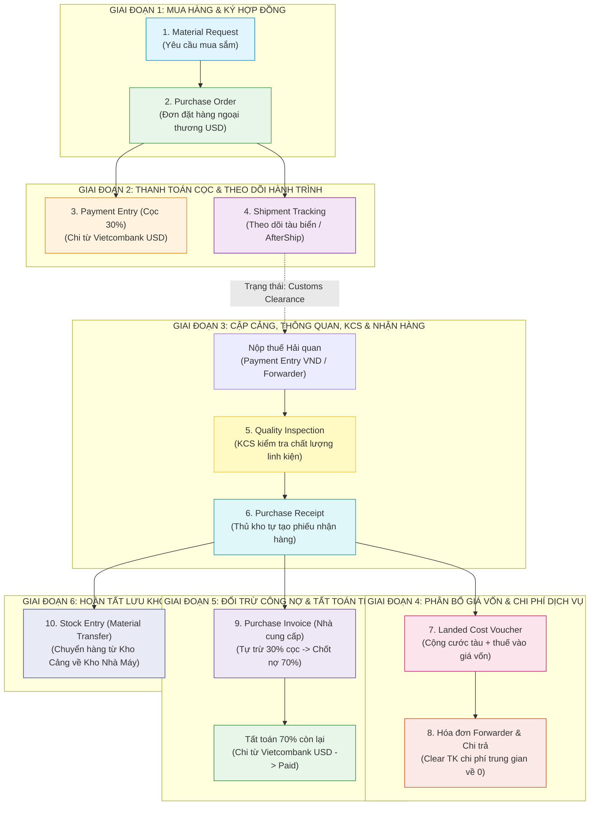
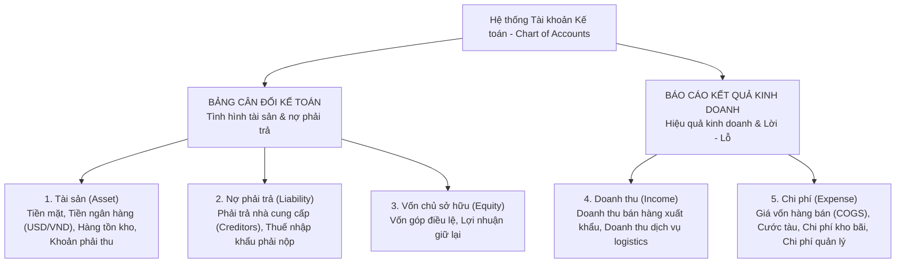
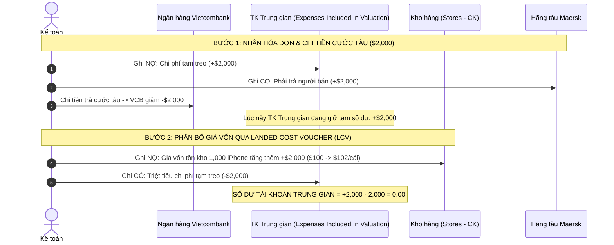

# 📘 CẨM NANG QUY TRÌNH CHUẨN HOÁ XUẤT NHẬP KHẨU & KHO VẬN TOÀN DIỆN TRÊN ERPNEXT
*(Standard Operating Procedure - End-to-End Import Logistics, Quality & Accounting Lifecycle)*

---

## 📌 1. TỔNG QUAN DÒNG CHẢY NGHIỆP VỤ (MASTER WORKFLOW)

Quy trình khép kín 10 bước kết hợp song song giữa **Dòng hàng thực tế (Physical Goods Flow)** và **Dòng tiền kế toán (Financial & Cashflow Flow)**:

---

## ⚙️ 2. THIẾT LẬP NỀN TẢNG (CHỈ LÀM 1 LẦN DUY NHẤT)

### 2.1. Cấu hình Tài khoản Ngân hàng đa tiền tệ:
* Đường dẫn: **Accounts** *(Kế toán)* $\rightarrow$ **Bank Account** *(Tài khoản ngân hàng)*:
  * **Vietcombank VND**: Dùng chi trả cước tàu nội địa, nộp thuế hải quan (Tiền tệ: `VND`, Linked GL: `1121`).
  * **Vietcombank USD**: Dùng thanh toán ngoại tệ cho nhà sản xuất nước ngoài (Tiền tệ: `USD`, Linked GL: `1122`).

### 2.2. Mẫu điều khoản thanh toán (Payment Terms Template):
* Đường dẫn: **Accounts** $\rightarrow$ **Payment Terms Template**:
  * Tên mẫu: `30% Advance, 70% on Delivery` *(30% đặt cọc trước, 70% thanh toán khi giao hàng)*.
  * Bảng chi tiết:
    * Dòng 1: **Invoice Portion** = `30%`, Loại = `Advance` *(Tạm ứng/Đặt cọc)*.
    * Dòng 2: **Invoice Portion** = `70%`, Loại = `On Receiving` *(Khi nhận hàng)*.

### 2.3. Cấu hình kiểm tra chất lượng KCS (Item Master):
* Trên sản phẩm giá trị cao (Item): Tích chọn checkbox **`Inspection Required before Purchase`** *(Bắt buộc KCS trước khi mua)*.
* Định nghĩa tiêu chí tại [Quality Inspection Template](http://localhost:2828/app/quality-inspection-template) (VD: Điện áp, Ngoại quan, Kích thước).

---

## 🚀 3. HƯỚNG DẪN CHI TIẾT 10 BƯỚC THAO TÁC TRÊN PHẦN MỀM

---

### BƯỚC 1: ĐỀ XUẤT NHU CẦU MUA HÀNG — `Material Request`
* **Người thực hiện:** Bộ phận Kho / Kế hoạch sản xuất.
* **Mục đích:** Báo cáo nhu cầu cần mua thêm linh kiện, máy móc phục vụ vận hành.
* **Thao tác:**
  1. Vào menu [Material Request](http://localhost:2828/app/material-request) $\rightarrow$ Nhấn **Add Material Request** *(Thêm yêu cầu)*.
  2. **Purpose** *(Mục đích)*: Chọn `Purchase` *(Mua sắm)*.
  3. Bảng **Items** *(Hàng hóa)*: Chọn mã hàng, điền số lượng cần mua (VD: `100`).
  4. Nhấn **Save** *(Lưu)* $\rightarrow$ Nhấn **Submit** *(Duyệt phiếu)*.

---

### BƯỚC 2: HỢP ĐỒNG ĐẶT HÀNG NGOẠI THƯƠNG — `Purchase Order (PO)`
* **Người thực hiện:** Phòng Xuất Nhập Khẩu / Thu mua.
* **Mục đích:** Ký kết hợp đồng quốc tế, chốt giá USD và điều khoản thanh toán 30% cọc - 70% khi nhận hàng.
* **Thao tác:**
  1. Mở phiếu `Material Request` đã duyệt ở Bước 1.
  2. Góc trên bên phải, nhấn nút **Create** *(Tạo tiếp)* $\rightarrow$ Chọn **Purchase Order** *(Đơn đặt hàng)*.
  3. Điền thông tin:
     * **Supplier** *(Nhà cung cấp)*: Chọn đối tác nước ngoài (VD: `Apple Inc.`).
     * **Currency** *(Tiền tệ)*: Chọn `USD` (tỷ giá ví dụ: `1 USD = 25,400 VND`).
     * **Payment Terms Template** *(Điều khoản thanh toán)*: Chọn `30% Advance, 70% on Delivery`.
  4. Nhấn **Save** $\rightarrow$ Nhấn **Submit**.
  * *(Hệ thống sinh mã đơn hàng, ví dụ: `PUR-ORD-2026-00003`)*.

---

### BƯỚC 3: CHI TIỀN ĐẶT CỌC 30% NGOẠI TỆ — `Payment Entry (Advance)`
* **Người thực hiện:** Kế toán thanh toán quốc tế.
* **Mục đích:** Mở L/C hoặc điện chuyển tiền T/T cọc 30% từ tài khoản USD để nhà cung cấp đóng hàng vào container.
* **Thao tác:**
  1. Ngay trên đơn hàng `Purchase Order` vừa duyệt $\rightarrow$ Nhấn **Create** $\rightarrow$ Chọn **Payment** *(Thanh toán)*.
  2. Điền thông tin:
     * **Payment Type** *(Loại thanh toán)*: `Pay` *(Chi tiền)*.
     * **Account Paid From** *(Tài khoản trích tiền)*: Chọn **Vietcombank USD** (`1122`).
     * **Paid Amount** *(Số tiền chi)*: Nhập đúng **30% giá trị hợp đồng** (VD: $440,000 $\rightarrow$ nhập `$132,000 USD`).
  3. Nhấn **Save** $\rightarrow$ Nhấn **Submit**.
  * *(Tài khoản Vietcombank USD bị trừ $132,000, ghi nhận một khoản tạm ứng trước cho nhà cung cấp)*.

---

### BƯỚC 4: THEO DÕI HÀNH TRÌNH TÀU BIỂN — `Shipment Tracking`
* **Người thực hiện:** Phòng Logistics / Điều vận.
* **Mục đích:** Theo dõi vị trí tàu trên biển theo thời gian thực để chuẩn bị tiền thuế và kho bãi tiếp nhận.
* **Thao tác:**
  1. Vào menu [Shipment Tracking](http://localhost:2828/app/shipment-tracking) $\rightarrow$ Nhấn **Add Shipment Tracking** *(Thêm vận đơn)*.
  2. Điền thông tin:
     * **Purchase Order** *(Đơn hàng)*: Chọn mã PO ở Bước 2.
     * **Shipment Method** *(Phương thức)*: Chọn `Ocean` *(Đường biển)* hoặc `Air` *(Hàng không)*.
     * **Tracking Number** *(Mã vận đơn B/L / Container)*: Nhập mã (VD: `MAEU123456789`).
     * **Departure Port** *(Cảng đi)*: VD `USOAK` *(Cảng Oakland - Mỹ)*.
     * **Destination Port** *(Cảng đến)*: VD `VNDAN` *(Cảng Tiên Sa - Đà Nẵng)*.
     * **Status** *(Trạng thái)*: Chọn `In Transit` *(Đang trên biển)*.
  3. Nhấn **Save**.
  * 💡 *Trải nghiệm:* Bấm vào **nút phao tròn xanh** góc dưới màn hình $\rightarrow$ Chọn 🚚 **Hành trình**: Bản đồ Leaflet sẽ hiển thị hải trình Great-Circle/Searoute với tàu chuyển động theo thời gian thực.

---

### BƯỚC 5: THÔNG QUAN, NỘP THUẾ & KIỂM TRA CHẤT LƯỢNG — `Quality Inspection (KCS)`
* **Người thực hiện:** Nhân viên Hiện trường Hải quan & Phòng KCS/QC.
* **Mục đích:** Nộp thuế để được phép lấy hàng ra khỏi cảng; kiểm tra chất lượng linh kiện tránh nhận phải hàng hỏng.
* **Thao tác:**
  1. **Cập nhật Vận đơn:** Mở `Shipment Tracking` $\rightarrow$ Đổi **Status** sang `Customs Clearance` *(Đang làm thủ tục thông quan)* $\rightarrow$ **Save**.
  2. **Nộp thuế thông quan:** Kế toán tạo [Payment Entry](http://localhost:2828/app/payment-entry) chi nộp thuế vào Kho bạc Nhà nước từ tài khoản `Vietcombank VND` (VD: `30,000,000 VND`).
  3. **Kiểm tra KCS:** Khi mở seal container, mở [Quality Inspection](http://localhost:2828/app/quality-inspection):
     * Chọn mã hàng, nhập các thông số kỹ thuật đo được thực tế.
     * Nếu đạt chuẩn $\rightarrow$ Chọn **Accepted** *(Đạt)* $\rightarrow$ **Submit**.
     * Nếu phát hiện hàng lỗi $\rightarrow$ Lập biên bản tách riêng hàng hỏng để bắt đền bảo hiểm hoặc trừ tiền khi trả 70% còn lại.

---

### BƯỚC 6: THỦ KHO TỰ TẠO PHIẾU NHẬP KHO — `Purchase Receipt`
* **Người thực hiện:** Thủ kho của bên Nhập Khẩu *(Chính công ty bạn tự tạo trên hệ thống)*.
* **Mục đích:** Căn cứ vào Biên bản giao nhận ký với tài xế container, Thủ kho lập phiếu nhập kho để tăng số lượng tồn kho trên phần mềm.
* **Thao tác:**
  1. Mở lại đơn hàng `Purchase Order` ở Bước 2 $\rightarrow$ Nhấn **Create** $\rightarrow$ Chọn **Receipt** *(Tạo biên lai nhận hàng)*.
  2. ⚠️ **Chốt kiểm soát tự động:** Nếu ở Bước 5 bạn chưa đổi trạng thái vận đơn (tàu vẫn còn `In Transit`), hệ thống sẽ **báo đỏ từ chối Submit** để ngăn ngừa ghi nhận hàng khống.
  3. Kiểm tra số lượng:
     * **Accepted Quantity** *(Số lượng đạt)*: VD `90 chiếc` $\rightarrow$ Nhập vào kho `Kho Cảng Tạm`.
     * **Rejected Quantity** *(Số lượng hỏng)*: VD `10 chiếc` $\rightarrow$ Chuyển vào kho `Kho Hàng Hỏng Cách Ly`.
  4. Nhấn **Save** $\rightarrow$ Nhấn **Submit**.
  * *(Hàng hóa chính thức tăng số lượng trong kho trên hệ thống)*.

---

### BƯỚC 7: CỘNG CƯỚC TÀU & THUẾ VÀO GIÁ VỐN — `Landed Cost Voucher`
* **Người thực hiện:** Kế toán Kho / Kế toán Chi phí.
* **Mục đích:** Đưa chi phí vận chuyển quốc tế và thuế nhập khẩu vào giá gốc của sản phẩm theo đúng chuẩn mực kế toán VAS 02.
* **Thao tác:**
  1. Vào menu [Landed Cost Voucher](http://localhost:2828/app/landed-cost-voucher) $\rightarrow$ Nhấn **Add Landed Cost Voucher**.
  2. Nhấn nút **Get Items from Purchase Receipts** $\rightarrow$ Chọn phiếu `Purchase Receipt` ở Bước 6.
  3. Bảng **Taxes and Charges** *(Thuế và chi phí)*:
     * Dòng 1: Cước tàu biển quốc tế $\rightarrow$ `50,000,000 VND`.
     * Dòng 2: Thuế nhập khẩu $\rightarrow$ `30,000,000 VND`.
  4. Nhấn **Save** $\rightarrow$ Nhấn **Submit**.
  * *(Giá gốc từng linh kiện trong kho được tự động cộng thêm chi phí phụ trợ)*.

---

### BƯỚC 8: THANH TOÁN CHI PHÍ CHO HÃNG TÀU / FORWARDER — `Forwarder Settlement`
* **Người thực hiện:** Kế toán thanh toán nội địa.
* **Mục đích:** Chi tiền thực tế trả cho bên vận chuyển và xóa sổ tài khoản trung gian đang treo.
* **Thao tác:**
  1. Tạo Hóa đơn dịch vụ [Purchase Invoice](http://localhost:2828/app/purchase-invoice) cho bên Forwarder:
     * **Supplier** *(Nhà cung cấp)*: Chọn Công ty Forwarder/Hãng tàu.
     * **Expense Account** *(Tài khoản chi phí)*: Chọn tài khoản trung gian **`Expenses Included In Valuation`** *(Chi phí đã tính vào giá vốn)*.
     * Số tiền: `50,000,000 VND` $\rightarrow$ **Save** $\rightarrow$ **Submit**.
  2. Bấm **Create $\rightarrow$ Payment** $\rightarrow$ Trích tiền từ **Vietcombank VND** chuyển cho Forwarder $\rightarrow$ **Submit**.
  * *(Khoản 80 triệu chi phí tạm treo được xóa sổ cân bằng về 0, tiền ngân hàng VND trừ đúng thực tế)*.

---

### BƯỚC 9: HÓA ĐƠN TIỀN HÀNG & TẤT TOÁN NỐT 70% NGOẠI TỆ — `Final Settlement`
* **Người thực hiện:** Kế toán công nợ ngoại tệ.
* **Mục đích:** Khấu trừ 30% tiền cọc đã trả, thanh toán nốt 70% còn lại cho đối tác nước ngoài để hoàn tất nghĩa vụ hợp đồng.
* **Thao tác:**
  1. **Khấu trừ cọc:** Mở phiếu `Purchase Receipt` ở Bước 6 $\rightarrow$ Nhấn **Create** $\rightarrow$ Chọn **Invoice** *(Tạo Hóa đơn mua hàng)*:
     * Hệ thống tự động nhận diện và trừ khoản cọc 30% ($132,000) đã trả ở Bước 3.
     * **Total Amount** *(Tổng tiền hàng)*: `$440,000 USD`.
     * **Allocated Advance** *(Tiền cọc tự trừ)*: `-$132,000 USD`.
     * **Outstanding Amount** *(Số tiền còn nợ)*: **`$308,000 USD`** (Đúng chuẩn 70%).
     * Nhấn **Save** $\rightarrow$ **Submit**.
  2. **Tất toán 70%:** Ngay trên Hóa đơn vừa duyệt $\rightarrow$ Nhấn **Create** $\rightarrow$ Chọn **Payment**:
     * **Account Paid From**: Chọn `Vietcombank USD`.
     * **Amount**: `$308,000 USD`.
     * Nhấn **Save** $\rightarrow$ **Submit**.
  * *(Hóa đơn chuyển sang trạng thái xanh **Paid** - Đã trả đủ; công nợ với bên nước ngoài cân bằng về 0)*.

---

### BƯỚC 10: ĐIỀU CHUYỂN TỪ KHO CẢNG VỀ KHO NHÀ MÁY — `Stock Entry`
* **Người thực hiện:** Quản lý Kho tổng.
* **Mục đích:** Hàng sau khi kiểm đếm và thông quan tại cảng được xe kéo về cất an toàn trong Kho chính của nhà máy để sẵn sàng lắp ráp/bán hàng.
* **Thao tác:**
  1. Vào menu [Stock Entry](http://localhost:2828/app/stock-entry) $\rightarrow$ Nhấn **Add Stock Entry**.
  2. **Purpose** *(Mục đích)*: Chọn `Material Transfer` *(Điều chuyển kho)*.
  3. Chọn kho:
     * **Default Source Warehouse** *(Kho đi)*: `Kho Cảng Tạm`.
     * **Default Target Warehouse** *(Kho đến)*: `Kho Thành Phẩm / Kho Tổng Nhà Máy`.
  4. Nhập danh sách mặt hàng và số lượng $\rightarrow$ Nhấn **Save** $\rightarrow$ **Submit**.
  * *(Hoàn tất 100% vòng đời nhập khẩu của lô hàng)*.

---

## 📊 4. BẢNG TỔNG HỢP TRA CỨU THUẬT NGỮ (CHEAT SHEET)

| Tên tiếng Anh | Dịch nghĩa Tiếng Việt | Phòng ban thực hiện | Mục đích chính |
| :--- | :--- | :---: | :--- |
| **Material Request** | Phiếu yêu cầu mua hàng nội bộ | Bộ phận Kho / Sản xuất | Báo nhu cầu cần vật tư |
| **Purchase Order (PO)** | Đơn đặt hàng ngoại thương | Phòng Xuất Nhập Khẩu | Chốt hợp đồng mua bán USD |
| **Payment Entry (Advance)** | Phiếu chi tạm ứng / đặt cọc | Kế toán thanh toán | Chuyển cọc 30% bằng USD |
| **Shipment Tracking** | Theo dõi hành trình vận đơn | Phòng Logistics | Giám sát vị trí tàu trên biển |
| **Quality Inspection (QI)** | Phiếu kiểm tra chất lượng (KCS) | Phòng KCS / Kiểm soát | Đo đạc, phân loại hàng tốt/hỏng |
| **Purchase Receipt (PR)** | Phiếu nhập kho hàng mua | Thủ kho công ty | **Bên mua tự lập** để tăng tồn kho |
| **Landed Cost Voucher (LCV)**| Phiếu phân bổ chi phí giá vốn | Kế toán Kho | Đẩy tiền cước tàu & thuế vào giá hàng |
| **Purchase Invoice (PI)** | Hóa đơn mua hàng | Kế toán Công nợ | Khấu trừ 30% cọc, chốt nợ 70% |
| **Payment Entry (Final)** | Phiếu thanh toán tất toán | Kế toán thanh toán | Trả nốt 70% USD để xóa nợ |
| **Stock Entry** | Phiếu điều chuyển kho nội bộ | Thủ kho | Đưa hàng từ kho cảng về kho nhà máy |

---

## 🧠 5. CẨM NANG KẾ TOÁN & CƠ CHẾ DÒNG TIỀN TRONG ERPNEXT (KNOWLEDGE BASE)

### 5.1. Phân biệt: "Tài khoản kế toán" (GL Account) và "Tài khoản ngân hàng" (Bank Account)

| Tiêu chí | Tài khoản ngân hàng (Bank Account) | Tài khoản kế toán (GL Account / Ledger) |
| :--- | :--- | :--- |
| **Bản chất** | Là **thông tin thực tế ngoài đời** của chiếc thẻ / tài khoản tại ngân hàng thương mại. | Là **mã sổ sách kế toán** dùng để hạch toán kép (Double-entry) và lập Báo cáo tài chính theo luật định. |
| **Nội dung quản lý** | Số tài khoản (VD: `0071009876543`), tên ngân hàng (Vietcombank), chi nhánh, mã SWIFT, tên chủ thẻ. | Tên tài khoản (VD: `Vietcombank USD - CK`), tiền tệ ghi sổ (`USD`), tính chất Nợ/Có, nhóm Tài sản (Asset). |
| **Mục đích sử dụng** | In lên hợp đồng/hóa đơn, cung cấp cho đối tác chuyển khoản, đối chiếu sổ phụ ngân hàng hàng tháng. | Phản ánh tăng giảm dòng tiền, cân đối tài sản và xác định kết quả kinh doanh (lãi/lỗ). |
| **Mối liên kết trong ERP** | Khi mở tài khoản thực tế ở Vietcombank $\rightarrow$ Tạo 1 `Bank Account`. Sau đó **liên kết (Link)** vào 1 `GL Account` tương ứng để mỗi khi phát sinh giao dịch chi tiêu, sổ kế toán tự động định khoản. |

---

### 5.2. 5 Nhóm Tài khoản Kế toán chuẩn quốc tế trong ERPNext (Chart of Accounts)

* **Tài khoản Tài sản (Asset):** Phản ánh nguồn lực công ty sở hữu (`Vietcombank USD - CK`, `Stores - CK`). *Tăng ghi Nợ, Giảm ghi Có.*
* **Tài khoản Nợ phải trả (Liability):** Nghĩa vụ phải thanh toán cho đối tác (`Creditors - Apple Inc.`, `Creditors - Maersk Line`). *Tăng nợ ghi Có, Trả hết nợ ghi Nợ.*

---

### 5.3. Bản chất "Tài khoản trung gian" (Clearing / Temporary / Suspense Account)

> **Định nghĩa:** Tài khoản trung gian là một **"trạm dừng chân tạm thời"** của dòng tiền hoặc chi phí. Nó được sinh ra để giữ tạm một con số trong khi các sự kiện kinh tế chưa hoàn tất đồng thời, và **bắt buộc phải triệt tiêu số dư về đúng 0.00** khi quy trình kết thúc.

#### Vì sao bắt buộc phải dùng tài khoản trung gian trong xuất nhập khẩu?
Bởi vì các sự kiện kinh tế diễn ra **lệch pha về mặt thời gian**:
1. Trả tiền cước tàu cho Forwarder hôm nay $\rightarrow$ Nhưng 10 ngày sau hàng mới cập cảng và nhập vào kho.
2. Hàng đã về kho và thông quan $\rightarrow$ Nhưng hóa đơn bên bán gửi bưu điện sang sau cả tháng.

---

### 5.4. Sơ đồ luân chuyển tài khoản trung gian trong Landed Cost (`Expenses Included In Valuation`)

Khi nhập khẩu hàng hóa, ngoài tiền trả cho Apple, doanh nghiệp phải trả cước biển cho Maersk Line:

---

### 5.5. Lưu ý thực chiến: Cơ chế tiền tệ đa quốc gia (Multi-Currency) khi tạo Payment Entry

1. **Cơ chế bốc tài khoản mặc định:**
   * Khi bấm `Create > Payment` từ một hóa đơn ngoại tệ (USD), ERPNext luôn ưu tiên bốc **Tài khoản ngân hàng mặc định** của Công ty (thường là tiền nội tệ VND).
   * Hệ thống sẽ tự động nhân tỷ giá để quy đổi số tiền USD sang VND (VD: `$70,000 \times 25,400 = 1,778,000,000 \text{ VND}`).
2. **Cảnh giác bẫy giao diện (UI Gotcha):**
   * Khi bạn đổi lại tài khoản trích tiền từ VND sang tài khoản USD (`Vietcombank USD - CK`), giao diện ERPNext **không tự xóa con số 1,778,000,000**.
   * Hệ thống sẽ hiểu nhầm bạn muốn chi **1 tỷ 778 triệu USD** $\rightarrow$ Dẫn đến lỗi tràn số MariaDB (`DataError 1264: Out of range value for column 'base_paid_amount'`).
3. **Quy tắc vàng khi thanh toán ngoại tệ:**
   * Luôn kiểm tra lại ô **Paid Amount** sau khi đổi tài khoản ngân hàng để đảm bảo số tiền gõ vào đúng với mệnh giá USD thực chi!

